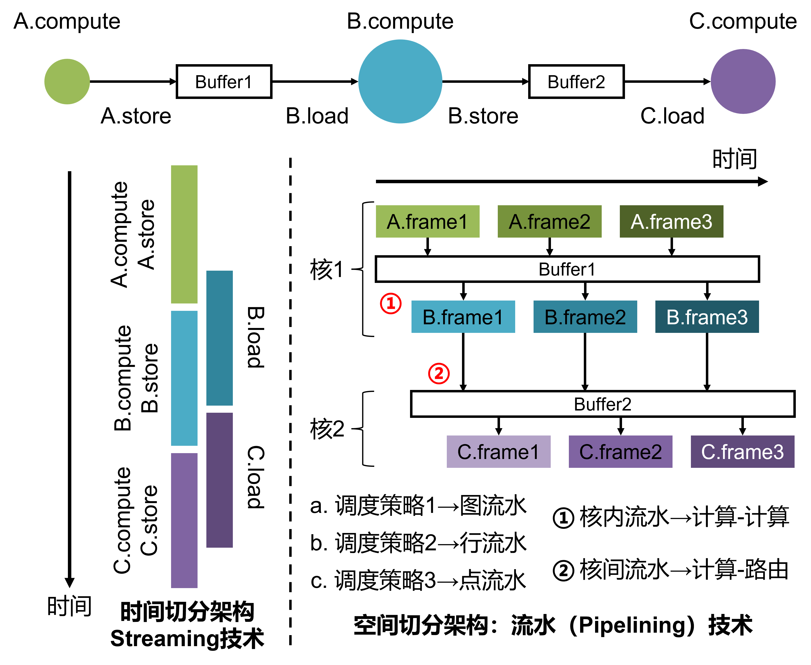
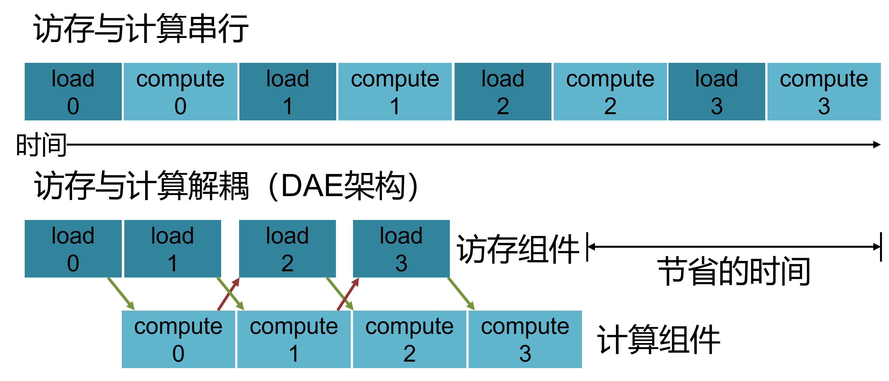
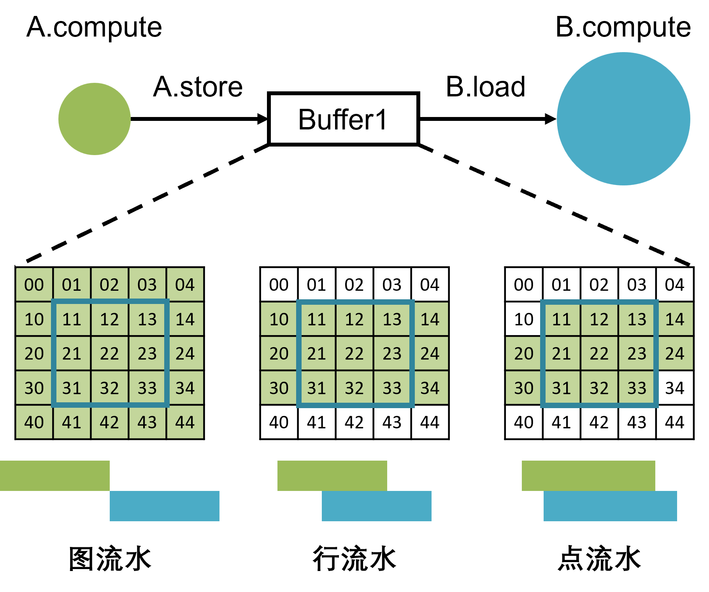
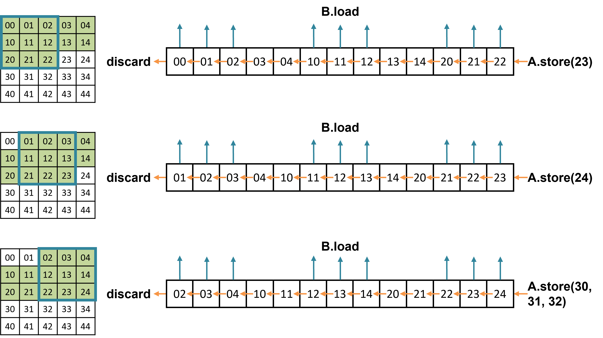
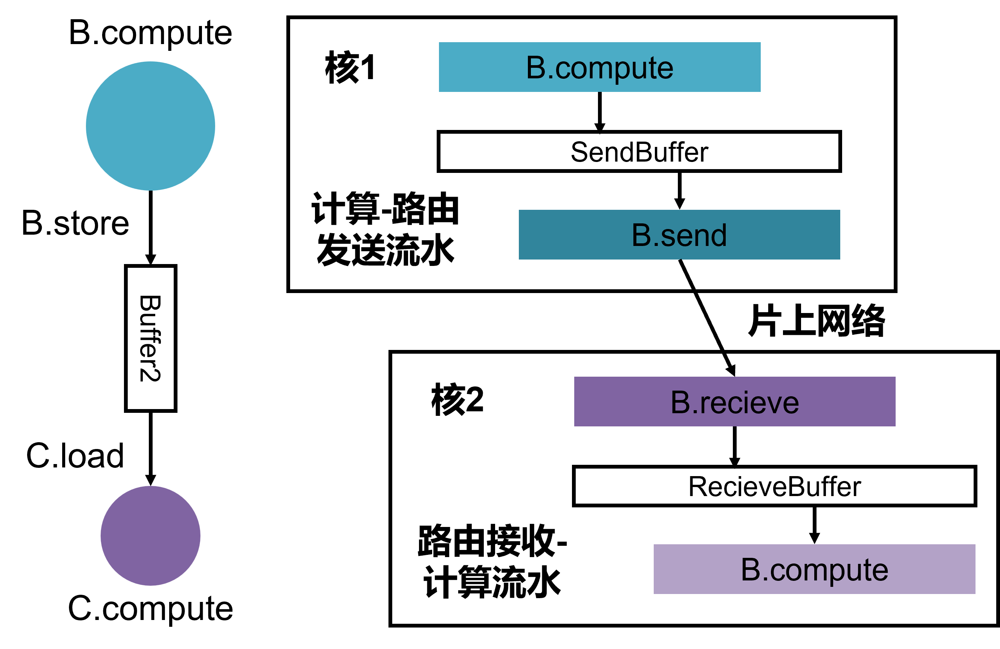
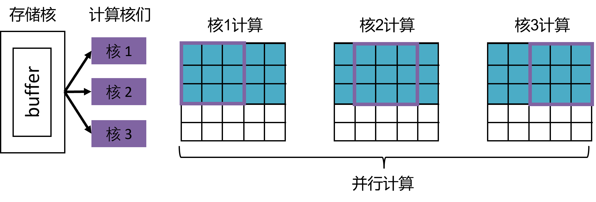
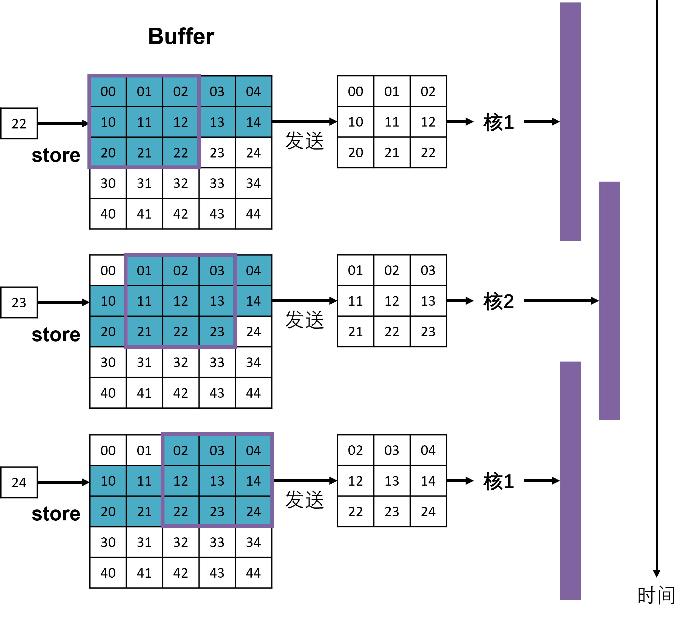

========================================================================
Streaming与Pipelining
========================================================================

管线调度策略
#############################################

神经网络任务可以看作一种管线执行（pipeline processing）任务，即一次输入数据，经过不同的Stage（阶段，网络层），得到最终输出结果。如何利用不同的Stage之间的数据局部性是常见的管线任务调度策略，我们使用 `Halide <https://halide-lang.org/tutorials/tutorial_lesson_08_scheduling_2.html>`_ 中的示例（下面的图片直接来自Halide）介绍一下这些策略。

假设任务管线有两个阶段，Producer阶段与Consumer阶段（如神经网络的前后两层计算），Producer与Consumer之间存在数据依赖关系，即Producer的2×2个相邻的计算结果，经过Comsumer的计算之后，得到Comsumer的一个计算结果，下图中蓝色的矩形表示这种数据依赖关系。一种最直接的调度策略： ``调度策略1``，也如下图所示，即Producer计算得到所有的数据后，Consumer再进行计算。这种调度策略没有利用两个阶段之间的数据局部性，执行过程的中所需的存储量最大。但此调度策略可以最大程度的保证Producer和Consumer的调度独立性，如Consumer可以与Producer有不同的计算顺序，Consumer可以灵活的拆分为几个同时运行的部分等。

.. image::  _static/pipeline1.gif
   :width: 50%
   :align: center

另一种利用数据局部性的调度策略： ``调度策略2``，如下图所示。在此调度方式中，当Producer产生了足够Comsumer计算一行的数据时，Comsumer开始这一行的计算。Producer与Comsumer的计算事实上同时在进行，且只需要存储几行Producer的输出数据。但在该策略中，Producer和Consumer不再有很高的调度独立性，Consumer也需要按照“行优先”的方式进行计算。

.. image::  _static/pipeline2.gif
   :width: 50%
   :align: center

下图所示的 ``调度策略3`` ，将数据局部性发挥到机制，即当Producer产生了足够Comsumer计算一个数据点的数据时，Comsumer便开始计算。如果不使用重计算策略，那么该策略中Producer与Consumer的缓存可以最小。同时，本策略也意味着，Consumer基本需要与Producer采取相同的调度优化策略，相当于Producer和Consumer融合为了一层（后面我们会介绍一种在此策略下Producer和Consumer仍能独立调度的一种方法）。

.. image::  _static/pipeline3.gif
   :width: 50%
   :align: center

``调度策略4`` 可以概括上面的3中调度策略，即将Producer计算分块，并将某一块结果作为缓存，Produce计算完一块之后，Consumer开始里利用这一块的数据进行计算，如下图所示。整体的计算需按照块之间的顺序执行。

.. image::  _static/pipeline4.gif
   :width: 50%
   :align: center

上面的调度策略在时间切分与空间切分架构（见 :ref:`时空模型` ）上会有不同的实现机制，我们在下图中，以一个A→B→C三个阶段的管线处理过程为例。在时间切分架构中，不同的任务交替执行，这时一种常见的优化是计算与访存操作的并行，即Streaming机制，如下图所示。该技术会在计算一个操作同时，加载下一个操作所需要的数据到相应的存储中；或者针对粗粒度的操作（见 :ref:`粗粒度指令集` ），同时进行该操作的计算与访存。

对于空间切分架构，不同阶段可以部署到不同的核，或同一个核的不同组件上。阶段A处理第二个输入样本（第二帧）的时候，阶段B可以并行的处理第一帧。而对于同一帧的处理，分布在核或组件上的不同阶段通过buffer或者片上网络串联在一起，这种执行方式我们称作流水（Pipelining）执行。

类脑众核时空切分架构同时包含Streaming执行机制和流水执行机制。

管线调度策略的实现机制
#############################################

Streaming执行机制
************************************

Streaming执行机制可以体现在计算A的过程中，并行的从外部存储获取B所需的数据，也可以体现在计算B的过程中同时进行B的访存，该机制也可以称作延迟隐藏优化。在一些架构架构中，该机制通过simultaneous multithreading或数据预取相关技术实现。而在神经网络加速硬件中，往往采用decoupled access-execute [DAE]_ 架构实现。 该种方式可以看作是计算组件与访存组件（见 :ref:`执行模型` ）的流水执行机制。在一个计算过程中，访存组件不断从存储中获取数据，整理并发送给并行计算组件进行计算，或接收计算组件的结果，整理并放置入存储中，访存过程与计算过程同时进行，如下图所示 (该图借鉴自 [TVM]_ )。计算组件与访存组件的流水执行机制是后面介绍的计算-计算流水、计算-路由流水的基础。

流水（Pipelining）执行机制
************************************

我们从流水粒度与流水层次两个维度讨论类脑众核流水执行机制。流水粒度方面，分为：

* **图流水：** 对应 ``调度策略1`` 。阶段A完成完整的一帧计算后，阶段B再开始计算。优点：A、B两阶段调度独立；控制、访存与路由逻辑简单。缺点：占用存储空间大，下图中绿色的部分表示buffer需要存储的数据；整个管线执行延迟可能会比较长（并行化A和B会减轻这个问题）。
* **行流水：** 对应 ``调度策略2``。A与B之间缓存多行A的结果。缓存的行数至少够B进行一行的计算，有时为了为了A、B同时读写的性能，以及A产生结果的速率不会直接影响B计算的速率，往往会缓冲更多的行。优点：即节省了缓存空间，也不至于有很高的控制复杂度。缺点：A与B需有相同的执行方向优先级，B的并行度会被限制。下图展示了A和B都按行优先顺序进行计算时的buffer存储区域。
* **点流水：** 对应 ``调度策略3``。缓冲A以产生的，B正在用或即将会用到的数据。下图的示例中，假设A、B都是自上向下、自左向右进行计算。在当前时刻，如果A产生了数据34，则数据34进入buffer，B可以进行下一个滑窗的计算，同时数据11推出buffer。优点：理论上最少缓存空间与延迟的策略（排除重计算）。缺点：A与B调度方式高度依赖；控制复杂（对于大规模并行架构，往往控制会成为瓶颈）；A与B的执行速率需要匹配的比较好。在某些硬件实现中，会使用 ``Linebuffer`` 高效实现点流水，但是往往会在某种程度上降低硬件的灵活性。
* **块流水：** 对应 ``调度策略4``，可以由其他流水机制，以及任务分块机制组合而成。

流水层次方面，分为：

* **核内流水：** 核内不同的计算组件之间的流水执行。一般可以通过两个组件共同访问一个流水缓存实现。流水缓存可以采用循环缓存的方式管理。我们用一个点流水例子展示一下上图中A和B的点流水执行，该逻辑过程如下图所示。当B可以执行第一个滑窗时，缓存中存储00到22的所有数据，B从固定的位置读取所需的数据完成一次滑窗的计算。之后，循环缓存的所有数据向左移动一位，抛弃最左边的数据并读入A产生的新的数据，B仍然可以从同样的位置读取数据完成计算。以此类推，最终A、B完成一帧的计算。如果物理上的缓存就是按照这种移位的方式执行，则这种缓存一般称作 ``Linebuffer`` 或 ``Shift Register``。更一般的，我们在一个更通用的内存模型上通过循环的改变load和store的位置实现上述循环缓存。我们可以发现在点流水的情况下，循环缓存的读写地址控制需要比较精细，比如滑窗在右移和换行时，读写位置的移动距离是不一样的。在行流水的情况下，循环缓存的读写地址的改变会更加规律。且我们可以通过缓存更多行的方式，让读写发生在不同的行，避免A、B速率波动造成的拥塞。

* **核间流水：** 众核架构的核之间有两种通信方式，共享内存与片上网络。采用共享内存的核间流水机制与核内流水的实现方式差不多，而采用片上网络的核间流水机制往往体现为计算组件与路由组件之间的流水。我们以B、C两个阶段的流水执行为例，B、C之间的缓存会被拆分为两个部分：与B同处于核1的发送缓存和与C同处于核2的接收缓存，如下图。核间流水转变为了核内的计算-路由发送流水、路由接收-计算流水。

在 :ref:`Task IR` 中我们介绍了存储与计算分离的任务图表示模型，这种允许我们结合核间流水探索更多样的流水机制。如，我们可以将流水缓存单独放到一个核上作为存储核，缓存的下一阶段计算分配到多个计算核上。这些计算核可以并行的执行一个阶段的计算并共享一个流水缓存，如下图所示。

该技巧应用于点流水的情况，可以一定程度上缓解两个阶段的调度依赖。如下图所示的方法，点流水的缓冲区将滑窗数据交替的发送给核1和核2，核1和核2一定程度并行的执行这一阶段的计算。此方法一定程度缓解了点流水情况下因为前后阶段滑窗计算量不一致带来的负载均衡问题。同样也给我们一个启示，流水缓冲本身可以作为两阶段计算的一种解耦手段，不同的流水缓冲设计可以让我们探索不同的部署策略。

  

* **核组间流水：** 在 :ref:`时空模型` 中我们介绍了核可以组成不同的核组，包括同步组与异步组。同步组之间的流水执行同核间的流水执行，但异步组之间的流水建立往往比较复杂，一般来说，异步组之间直接采用图流水形式。

天机X的流水支持与配置
#############################################

============= ==================== ================ =================
流水层次           流水类型            流水组件          流水粒度
============= ==================== ================ =================
核内流水        计算-访存流水        Axon-Dendrite       点流水
核内流水        计算-计算流水        Axon-Soma1          行流水
核内流水        计算-计算流水        Axon-Soma2          图流水
核间流水        计算-路由发流水      Soma1-Router        点流水  
核间流水        路由收-计算流水      Router-Soma2        图流水     
============= ==================== ================ =================

天机X的Soma与Router模块也包含可并行执行的访存逻辑。天机X核间只能实现图流水，无论是Phase Group内的同步核间传输还是Step Group间的异步核间传输。下面详细介绍天机X的各种组件间流水及相应配置方法。

Axon-Dendrite流水
************************************

简单介绍一下机制即可，不需要给出Dendrite参数配置（就是那些step）

Axon-Soma流水
************************************

当Axon-Soma1之间存在数据依赖时，可看做是Axon的输出数据是Soma的输入数据，此时需要配置流水运行。Axon-Soma间的流水是以"行流水"模式运行，简单来说，假设Axon的输出是一个多维张量，每当Axon完成输出若干行，Soma启动计算，否则Soma模块将等待。

在硬件设计上，协同交互是依靠核内的控制器协调的，Axon每计算完1行，控制器给Soma一个S_row_trigger信号。Soma每收到一个S_row_trigger信号，pipepline_cnt加1，同时Soma每计算完（输出的）一行，pipeline_cnt减去一个列方向的stride值Sy（或1），即再等待Sy行输入Soma才能开始计算。当pipeline_cnt大于卷积核行数（或0）时，Soma可以才计算。

Axon和Soma之间的数据交换，认为是一个输入缓存区间，Soma中有表示Axon-Soma缓存区可以存储的行数的参数pipeline_num（in_row_max）。只有在pipeline_cnt小于缓存区行数大小pipeline_num的情况下，Soma反馈给控制器数据可以继续写入的信号。

Axon-Soma2之间不支持行流水。

**Axon-Soma1流水的细节和参数配置**

在介绍具体的参数配置前，事先说明几个要点：

1. Axon-Soma的流水功能开关及行流水行数（缓冲区）均在Soma相应模块进行配置。Axon模块中无和Soma流水相关的参数配置接口。
2. 只要Axon和Soma存在数据依赖（Axon输出和Soma输入地址重叠），则必须配置Soma流水开关开启，否则Soma将会和Axon并行执行，产生运行失序和数据冲突错误。
3. 行流水的行数配置，也就是决定的是缓冲区大小，即Axon输出数据的地址范围和Soma输入数据的地址范围（这两者相同），Axon的输出将会动态刷新这一区域。 
4. 缓冲区大小最大可设置为完整的Axon输出的特征图大小，此时行流水变为图流水。
5. 除了MLP（VVM向量矩阵乘）外，硬件设计的Axon和Soma是依靠Axon的最外层循环运行情况来交互的，硬件Axon的最外层循环是 :ref:`Task IR` 中的ny方向，Axon每完成一行的输出，ny_cnt计数就+1，控制器进而控制Soma运行。而MLP原语的最外层循环是nf方向，此时Axon每完成一次呼出，nf_cnt计数+1，控制器进而控制Soma运行。
6. Soma的move merge原语是双输入的，被设计为X1向量输入数据块是Axon的输出，且配置不可更改（ **ciso向量不可作为流水输入** ）。
7. Soma的lif+原语被设计为Uin输入数据块是Axon的输出，仅有这一种流水配置情况。

.. hint::
  仿真器中的Soma06的in_ciso_pipe_sel接口可以删去，或者永远配置成0

* 如何计算流水区占用的内存大小：

  通常情况下，设Axon的输出数据块的Shape(ny, nx, nf) ，在Soma1配置时流水行数为pipeline_num，则流水去占用的内存大小为 \ :math:`nx \times nf \times pipeline\_num \times int32`\  （因为天机X的Axon输出只有int32一种精度）。

* Axon-Soma流水的重定向问题（两个模块相互约束的问题）：

  1. Axon的输出和Soma的输入地址范围应该相同
  2. Soma的原语参数中pipeline_num是配置缓冲区大小的，接上条，Axon的输出被当作是三维张量，但是Soma06/26/07/08将输入是按照二维向量处理， **因此Soma计算的数据量需要与Axon进行匹配** ，才能完成流水操作：

* 下列Soma参数值与Axon输出shape.ny值（当Axon是MLP原语时， **nf//32** 的值）需要相同：
  
  * SomaX5中的niy配置
  * Soma06/26中的num_in（或num_ciso）配置
  * Soma07中group_num
  * Soma08中group_num

* 下列Soma参数值与Axon输出的\ :math:`shape.nx \times shape.nf`\ 的乘积值m（当Axon是MLP原语时，**m相当于是32** ）相同：

  * Soma06/26 \ :math:`length\_in / length\_ciso`\ 
  * Soma07/08 neuron_num

  **但需上述注意原语参数范围不能超界**   

* 如何设置流水区大小（pipeline_num）：

  1. 绝大多数情况下， **pipeline_num = 1** 即可
  2. SomaX5（CMPB和CMPS模式）时，且存在pooling window情况下，即Ky > 1时，此时配置要求 **pipeline_num >= Ky** （物理芯片有bug，仿真器没有，讨论后可以写成两个pass备选）

* 关于Axon和Soma2模块间时序设置问题：

  在天机X的设计中，每个phase最多可以运行四条原语，即Axon-Soma1-Router-Soma2，虽然模块间可以并行运算，但是由于只有一套Soma资源，通常情况下Axon-Soma1-Router三个原语并行流水运行结束后，Soma2再启动运行，表现为Axon和Soma2是串行运行的，但是Axon原语参数中保留了控制开关A2S2-mode，通过此开关控制Soma2的运行时间，A2S2-mode参数默认是0。Axon计算完毕才允许启动Soma2运算，但当出现Axon和Soma2没有数据依赖互不影响时或者想要依靠Axon来抻phase时长时 ，可以配置为1，此时Soma2可以和Axon并行执行。

Soma-Router流水
************************************

在天机X的每一个phase内，Soma1输出的数据可以让Router以点流水方式发送出去，以节省动态存储空间。Soma和Router之间的数据交换，同样可以认为是一个输入缓存区间，Router中有表示Soma-Router缓存区可以存储的16B数据区间的参数Addr_Dout_length。只有在存储的未发送的数据小于Addr_Dout_length的时候，Router反馈给控制器数据Soma可以继续写入的信号。

**Soma1-Router流水的细节和参数配置**

在介绍具体的参数配置前，事先说明几个要点：

1. 流水实现原理基本与Axon-Soma类似，只是在硬件原语参数配置上，Soma1和Router都有参数需要进行配置。
2. 一般情况下，直接设置为mem3（16B寄存器）发送流水。当Soma的输出数据需要额外保存一份（可能会有额外处理的情况），再选择mem2流水。

  * mem3流水： Soma原语只需要配置memory_select，[1]数据写入mem3，此时与输出相关地址配置参数都无效Router原语只需要配置开启流水开关Soma_in_en=1，选择mem3发送的配置开关Dout_Mem_sel=1，此时Router发送数据地址参数都无效。
  * mem2流水： Soma原语配置memory_selct=0，以及需要输出数据相关地址参数Router原语配置Soma_in_en=1，Dout_Mem_sel=0，配置Addr_Dout_base与Addr_Dout_length与Soma输出进行匹配，但注意Router的地址配置是相当于mem2起始位置配置的，所以与Soma配置不能完全相同。

3. Soma26 move split原语是双输出，可以通过原语参数out_ciso_sel配置选择out向量还是ciso向量流水（默认是0，out向量流水）
4. Soma08 lif原语是spike输出与Router发送流水（Addr_S_start/end）

* 如何计算流水区占用的内存大小：
  
  mem2流水时按需要配置（此情况不常见），基本上只有需要保留Soma输出数据（即使保留部分，也其实是要配置成保存全部）时才需要用到mem2流水，内存大小即为Soma完整输出数据尺寸大小 \ :math:`shape.ny \times shape.nx \times shape.nx \times precision`\ 。

* Soma1-Router流水的重定向问题：

  * mem3流水： Soma原语只需要配置memory_select=1，数据写入mem3，此时与输出相关地址配置参数都无效。Router原语只需要配置开启流水开关Soma_in_en=1，选择mem3发送的配置开关Dout_Mem_sel=1，此时Router发送数据地址参数都无效。
  * mem2流水： Soma原语配置memory_selct=0，以及需要输出数据相关地址参数Router原语配置Soma_in_en=1，Dout_Mem_sel=0，配置Addr_Dout_base与Addr_Dout_length与Soma输出进行匹配，但注意Router的地址配置是相当于mem2起始位置配置的，所以与Soma配置不能完全相同。
       
**设计考虑**

Soma2被设计通常用来搬运Router接收到的数据，但由于Soma1输出和Router发送本身就是流水运行，在仅有一套Soma物理资源的情况下，再设计一个Router-Soma2流水会很复杂，简单起见，Soma2原语被设计为Router原语结束后再启动运行（由控制器控制）。即使一个phase里只配置了Router（接收）-Soma2两条原语，Soma2也要在Router完成接收之后才能运行。

.. [DAE] Decoupled access/execute computer architectures
.. [TVM] TVM: An Automated End-to-End Optimizing Compiler for Deep Learning
