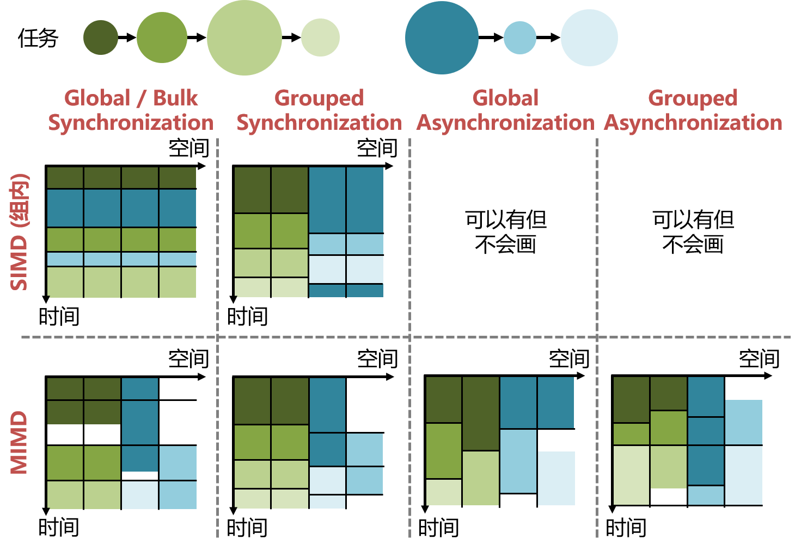
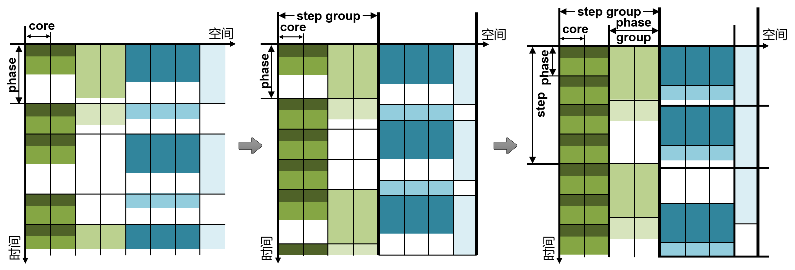
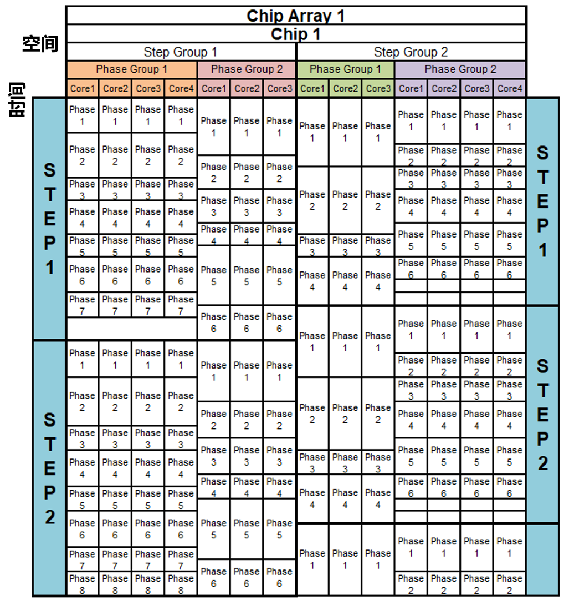
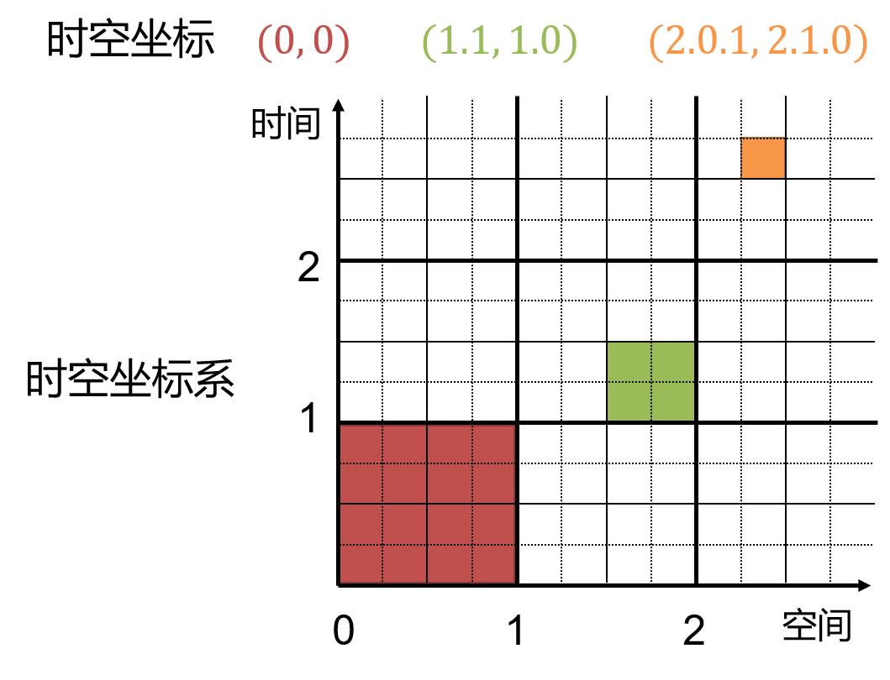
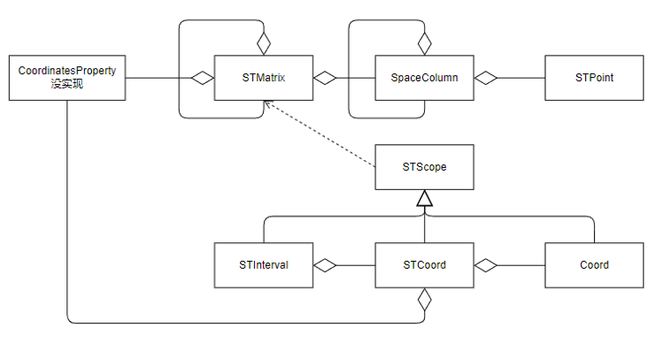

========================================================================
时空模型
========================================================================

类脑众核的时空模型需求
########################################

为了尽可能时的资源级仿真器中的时空模型通用，我们考虑了多种众核系统可能有的时空组织方式，并按照两个维度，分为了8类：

- **SIMD, Global/Bulk Synchronization：** 全局同步或块同步，所有的核再一个时刻只能执行同样的指令。常见于神经网络加速器。
- **MIMD, Global/Bulk Synchronization：** 全局同步或块同步，不同的核可以有独立的指令控制流。
- **SIMD, Grouped Synchronization：** 对核进行分组，组内同步，组间异步，但组内所有核同一时刻只能执行同样的命令。
- **SIMD, Grouped Synchronization：** 对核进行分组，组内同步，组间异步，不同的核可以有独立的指令控制流。
- **SIMD, Global Asynchronization：** 全局异步（但是可以有软件插入的同步点），所有的核再一个时刻只能执行同样的指令，异步可以有数据驱动的方式产生（即所有核部署一样的指令，每个核自己的数据来了就开始计算）。
- **MIMD, Global Asynchronization：** 全局异步（但是可以有软件插入的同步点），不同的核可以有独立的指令控制流，核的计算可以由数据驱动也可以由指令驱动。
- **SIMD, Grouped Asynchronization：** 对核进行分组，组内异步，组间同步，但组内所有核同一时刻只能执行同样的命令。（块同步如果块内异步的化，和这个基本一样）
- **MIMD, Grouped Asynchronization：** 对核进行分组，组内异步，组间同步，不同的核可以有独立的指令控制流。

而类脑时空模型往往是层次化，所以除了上图的2个维度分类外，我们可以增加时空模型的层次，如下图。

不同的层次之间和内部，可能存在不同的同步异步机制，这进一步增加了类脑时空模型的多样性。一般而言，在硬件设计好之后，其时空模型也固定了。下面我们直接给出天机X的时空模型。

天机X时空模型
************************************

**空间维度：** 由高层到低层依次是，芯片阵列（Chip Array）→芯片（Chip）→Step Group→Phase Group→核。因为核内部的MAC阵列使用方式已由原语设计固定，所以这里我们不考虑这一层次。

**时间维度：** 由高层到低层依次是，Step→Phase→流水阶段（Pipeline Stage）。其中，流水阶段表示，核内执行到哪个组件，所以这里我们就索性把任务在核内组件的分布看作是时间维度。

**同步与异步：** 在一个Phase Group内，所有核以Phase单位进行同步。在一个Step Group内，所有Phase Group以Step为单位进行同步。在一个Chip内，不同的Step Group完全异步。所有的核之间都可以设置触发式同步点。

**指令控制：** 所有核有单独的指令队列及指令控制器，即核粒度MIMD。每个Step执行的操作类型及顺序相同（即Step循环执行指令序列），但也有特殊的情况导致触发式的执行一个不在循环规划内的操作（时原语机制）。核内部的高度并行计算组件采用SIMD控制。

下图为天机X的 :term:`时空图` 。

通用时空坐标系的设计与实现
########################################

层次化坐标理论
************************************

为了更规范的、更形式化的构建时空模型，我们首先建立一个简洁的层次化时空坐标理论。

**层次化坐标系：** 在二维直角坐标系中，可以用一个2元组 :math:`(x, y)` 表示一个坐标。我们一般的坐标系扩展为层次化坐标系。在该坐标系中，只看最高层次的话，其是一个整数二维直角坐标系，:math:`(x_1, y_1)` 表示最好层次的一个坐标。:math:`(x_1, y_1)` 可以进一步的看做一个子坐标系，即把 :math:`(x_1, y_1)` 再延伸为无数个整数格子，这个子坐标系下的 :math:`(x_2, y_2)` 也表示一个坐标。这个坐标在整体的坐标系中，记为 :math:`(x_1.x_2, y_1.y_2)` 。以此类推，构建多层的坐标系。:math:`(x, y)` 和 :math:`(x_1.x_2, y_1.y_2)` 都是该坐标系中的一个点，且 :math:`(x_1.x_2, y_1.y_2)∈(x_1, y_1)` 。坐标系中两个没有包含关系的点可以构成平面上的一个区间。下图展示了一个三层时空坐标系的示例，:math:`(0, 0)` 、 :math:`(1.1, 1.0)` 、 :math:`(2.0.1, 2.1.0)` 分别是该坐标系上的三个点。

**层次化坐标系上的运算与比较：** 没啥用，比较好玩。或许可以在此基础上建立层次化多面体编译方法。

- 运算： :math:`(a_1.a_2, b_1)+(c_1.c_2, d_1.d_2)=((a_1+c_1).(a_2+c_2), (b_1+d_1).b_2)` 
- 比较：逐层次比较。如， :math:`3.2 > 2.4.3` ，   :math:`1.\infty < 2` 

层次化时空坐标类图设计
************************************

该部分实现了一个通用的时空坐标架构，应该可以各种众核时空模型。

- **CoordinatesProperty：** 定义时空坐标系的源信息，如空间维度层数和时间维度层数。
- **STMatrix：** 实现时空坐标系，其相当于一个容器，时空坐标系中可以放各种各样的内容。整个时空坐标系的实现采用了 `组合模式 <https://www.runoob.com/design-pattern/composite-pattern.html>`_ 。 假设一个时空坐标系的空间层次有3层，则最顶层的 ``STMatrix`` 包含 多个第二层的 ``STMatrix``， 第二层的 ``STMatrix`` 包含多个 ``SpaceColumn``。
- **SpaceColumn：** 空间维度上的最底层，包含时间维度上的所有层次。假设一个时空坐标系的时间层次有3层，则最顶层的 ``SpaceColumn`` 包含 多个第二层的 ``SpaceColumn``， 第二层的 ``SpaceColumn`` 包含多个 ``STPoint``。
- **STPoint：** 时空坐标系中的最底层的一个点。但实际实现上为了方便， ``STPoint`` 仍然包含了代表一个核中具体组间的时间维度。
- **STScope：** 表示时空坐标系上的一个范围，可以认为是 ``STMatrix`` 这个容器的索引。
- **Coord：** ``STScope`` 的子类，表示一个维度上的坐标，同样也是python tuple的子类，如 :math:`x_1.x_2` ，则在程序中用元组表示为 :math:`(x_1, x_2)` 。
- **STCoord：** ``STScope`` 的子类，表示时空坐标，由表示时间的 ``Coord`` ，和表示空间的 ``Coord`` 组成。
- **STInterval：** ``STScope`` 的子类，表示时空坐标系上的一个区间，两个 ``STScope`` 组成。

层次化时空坐标接口使用
************************************

等到文档主题写得差不多了再完成这部分。

