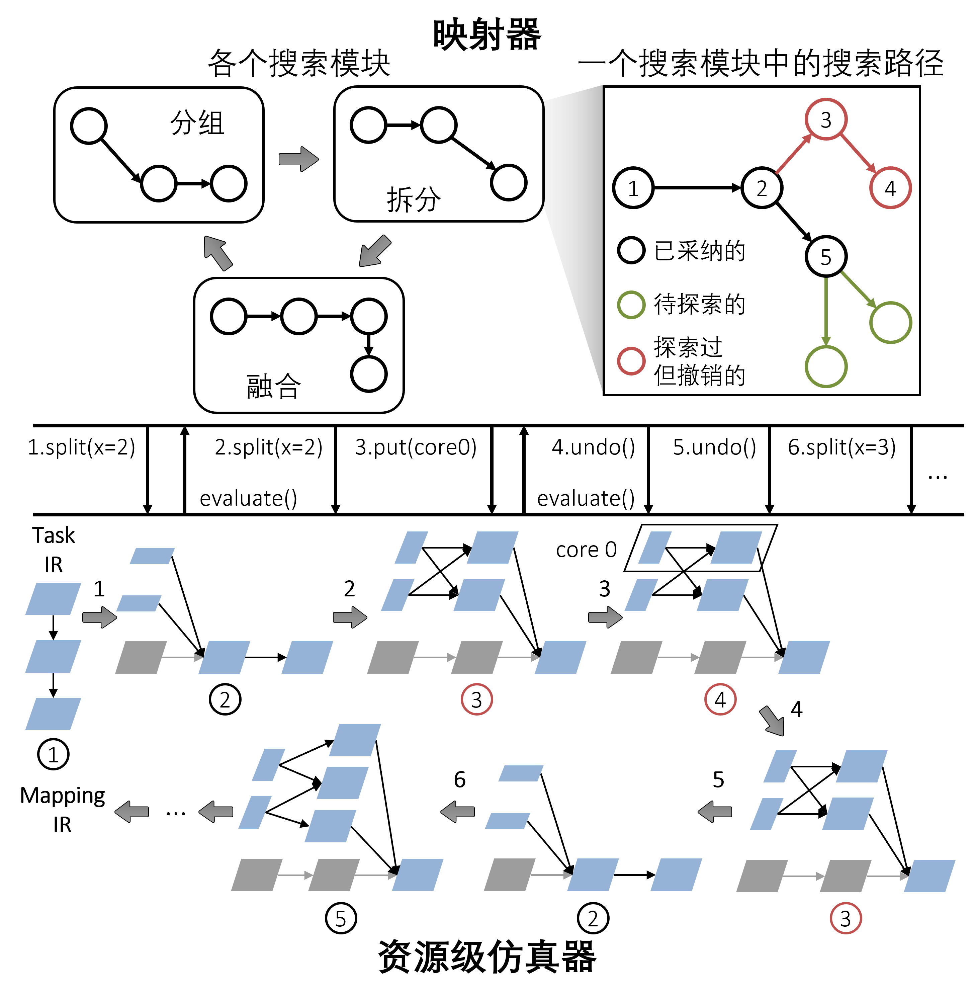
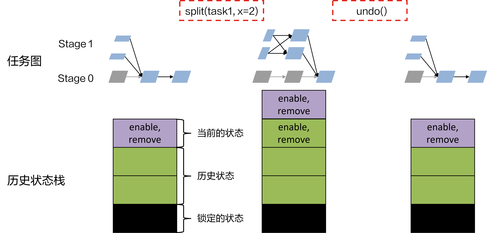
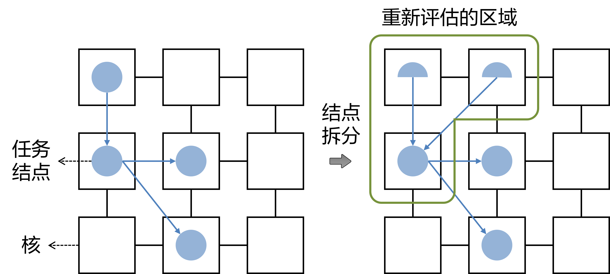
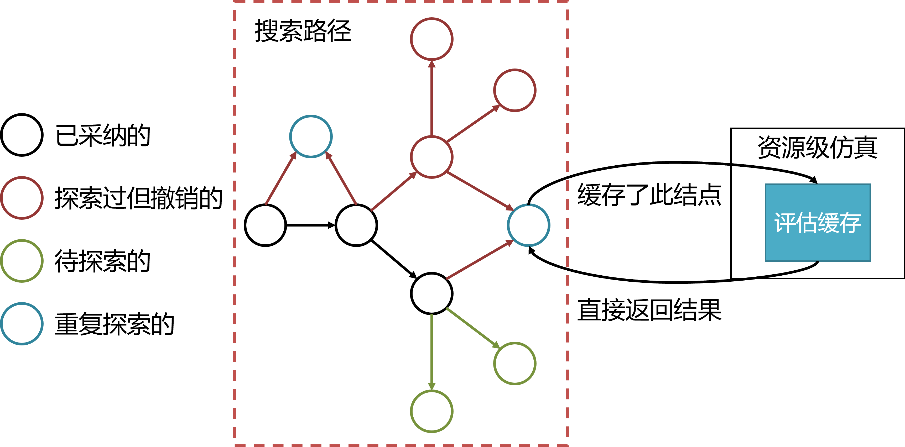
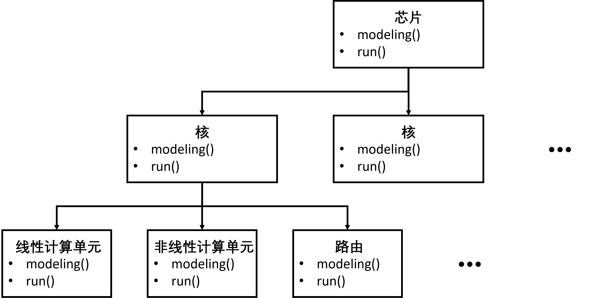

========================================================================
资源级仿真器整体介绍
========================================================================

多核调度/映射类似于一个的NP完全问题: `Quadratic Assignment Problem` ，所以不存在一个通用调度规则（即基于规则的部署算法）对所有的情况都高效。针对这类问题，我们常常采用领域特定的启发式搜索算法或非线性优化通用的元启发式算法（即基于代价的部署算法）。这类算法的执行流程大致是，产生一个或多个调度部署策略，评估策略的约束满足情况和各种执行性能（部署需求），根据评估结果进行下一阶段的策略搜索。

众核常见的部署需求包括，部署策略是否合法，主要体现在策略所需资源（包括内存大小、核数量等）是否满足硬件限制、吞吐、延时、功耗等等。我们可以根据这些需求，构造搜索过程的代价函数（惩罚函数）。如，一种简单的构造方法如下：

**资源满足：** 用 :math:`RC` 表示资源满足情况，资源满足则 :math:`RC=1` ， 否则 :math:`RC=0`。

**延时代价：** 用 :math:`AL` 表示策略实际的延时，用 :math:`RL` 表示延时需求，则延时代价函数 :math:`LC` 可设置为：

.. math::

   LC(AL) = e^{AL - RL} - e^{RL}

其中使用幂指数是考虑到，延迟需求很多时候并不是硬性需求（软实时系统），所以即便实际的延时超过了需求的延迟，策略仍然可以使用，但代价大幅增加。吞吐与功耗代价同理。

**吞吐代价：** 用 :math:`AT` 表示策略实际的吞吐，用 :math:`RT` 表示吞吐需求，则吞吐代价函数 :math:`TC` 可设置为：

.. math::

   TC(AT) = e^{AT - RT} - e^{RT}

**功耗代价：** 用 :math:`AP` 表示策略实际的功耗，用 :math:`RP` 表示功耗需求，则功耗代价函数 :math:`PC` 可设置为：

.. math::

   PC(AP) = e^{AP - RP} - e^{RP}

综合代价 :math:`Loss` 可设置为：

.. math::

   Loss = \frac{\alpha LC + \beta TC + \gamma PC}{RC + \epsilon}

其中 :math:`\alpha` 、 :math:`\beta` 、 :math:`\gamma` 为权重，:math:`\epsilon` 为一个极小量。

这些代价函数往往又更加 “分析性” 的硬件运行指标影响，搜索算法也应该看到这些运行指标，从而找到更好的搜索方向。典型的运行指标包括：计算复杂均衡、计算利用率、存储利用率、访存时间、路由量等等。因为众核执行的复杂性，运行指标也很难通过部署策略简单计算得出，需要一定的仿真过程。

资源级仿真器是针对给定调度与映射策略，给出代价函数与运行指标的仿真器。提供这些评估功能的接口为 :ref:`映射交互语言-评估接口` 。

Just-in-time Evaluation
########################################

调度搜索往往要尝试成千上万次不同的策略，这要求资源仿真器的评估不仅要准，还要快。为此，我们设计了一种映射器与资源级仿真器交互完成调度映射任务的模式，如下图所示。

JiE在映射器的搜索过程中维护一个上下文（Context），该上下文包含当前任务图与任务图在时空坐标系上的映射。全局上下文的设计将提供一种交互式的编译-流程。Task IR在映射开始时被输入到资源仿真器中，而不是映射器中。 **资源仿真器执行所有的图转换和映射动作** ，这些动作的结果将改变上下文中存储的信息，如变化后的任务图。而映射器则负责生成动作和评估请求，这些请求构成了映射器与资源级仿真器之间的交互接口： **映射交互语言** （Mapping Interactive Language, MiL）。MiL相当于一个由映射器生成并由性能级仿真器执行的解释型语言，它为映射器建立了一个层任务和硬件模型定制的优化环境。

不同于一般基于代价的编译/部署工作每次都评估一个完整的策略，MiL中的语句粒度较细。一个语句可以是，一个结点的拆分，一个结点的映射，一个核的评估等等。这使得资源级仿真器的动作与评估是基于上一次动作的结果，节约了大量重复评估与动作执行的代价。MiL中的动作接口，见 :ref:`映射交互语言-动作接口` 。

为了进一步加速资源级仿真器的速度，我们进一步采用了如下设计。

图备忘录模式
************************************

映射搜索过程往往伴随很多尝试，尝试不成功，就需要退回之前的状态，即资源级仿真器需要支持撤回（undo）。为了支持高效的撤销操作，我们设计了在一种任务图上的 `备忘录模式 <https://m.runoob.com/design-pattern/memento-pattern.html>`_ 。资源级仿真器维持一个历史状态栈来记录每次动作请求的反向操作，以及如果有必要的话存储该请求执行前的某些状态。如果资源级仿真器遇到了映射器发出的撤销请求，则历史状态栈会弹出反向操作，并被资源级仿真器执行。有些动作非常耗时，比如任务图结点拆分。针对这类操作，资源级仿真器不会直接对原任务图结点进行变换，而是将原来的任务结点置为Disable状态，并向图中添加新的任务结点，构建新的连接。任务图在执行时(仿真出结果时)，会当作Disable的结点和边不存在。相应的反向操作是删除这些新的任务结点与连接并Enable原始结点。示意过程如下图所示。

MiL中与历史状态栈相关的接口，见 :ref:`映射交互语言-状态控制接口` 。

局部重评估
************************************

**未实现**

众核架构的“去中心化”也可以体现在性能评估上。在资源级仿真器进行一次动作之后，理论上只需要对该动作影响到的区域重新评估，如下图所示。为了实现这一点，每一个可评估单元（如结点和核）在每次评估会保存下当前的评估结果。每次动作会将涉及到的可评估单元保存的评估结果删除。在下一次评估时，如有可评估单元存储了评估结果，则返回该结果，负责才会进行重新评估。

评估时动作
************************************

**未实现**

资源级仿真器将接收的动作请求放入一个请求队列中，并在收到一个评估请求时，再执行队列中的所有动作请求。

评估缓存
************************************

**未实现**

在策略搜索过程中，可能出现重复探索的点。资源级仿真器可以维持一个近几次评估的缓存，当重复的状态被评估时，如果缓存中有现成的评估结果，则可以直接返回该评估。

提升评估精度
########################################

资源级仿真器的性能评估可以来自于两种方式：

1. **数学建模：** 建立当前负载的数学模型，即通过一套数学公式算出来性能评估。该种方法速度比较快，但复杂的情况精度可能比较低。
2. **执行仿真过程：** 针对给定的负载，仿真执行一下待评估的部分。该种方法评估一般更加准确，但比较耗时。

资源级仿真器可以采用一种而这混合的评估方式（未实现），即每个可评估的硬件单元，都提供两个接口: `modeling()` 和 `run()` ，如下图。 `modeling()` 返回数学公式评估的结果，而 `run()` 则真正运行该单元的仿真过程，并返回仿真性能结果。该两种接口的选择可以由硬件单元的性能评估难度、负载的复杂程度以及用户对于评估精度和评估速度的需求所决定。

