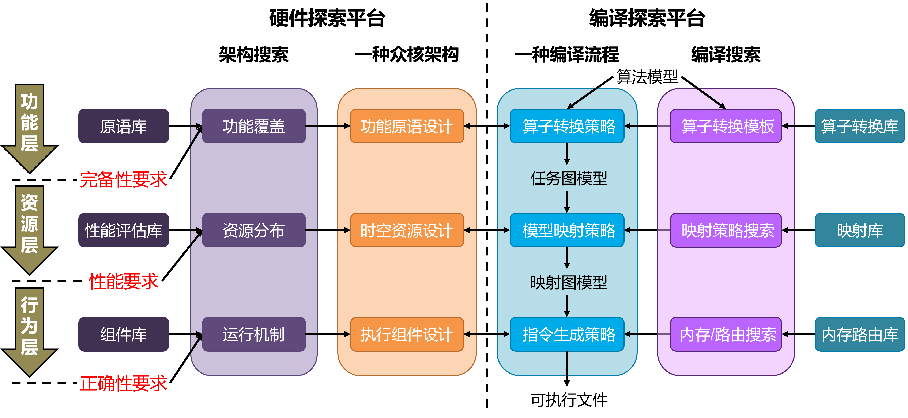
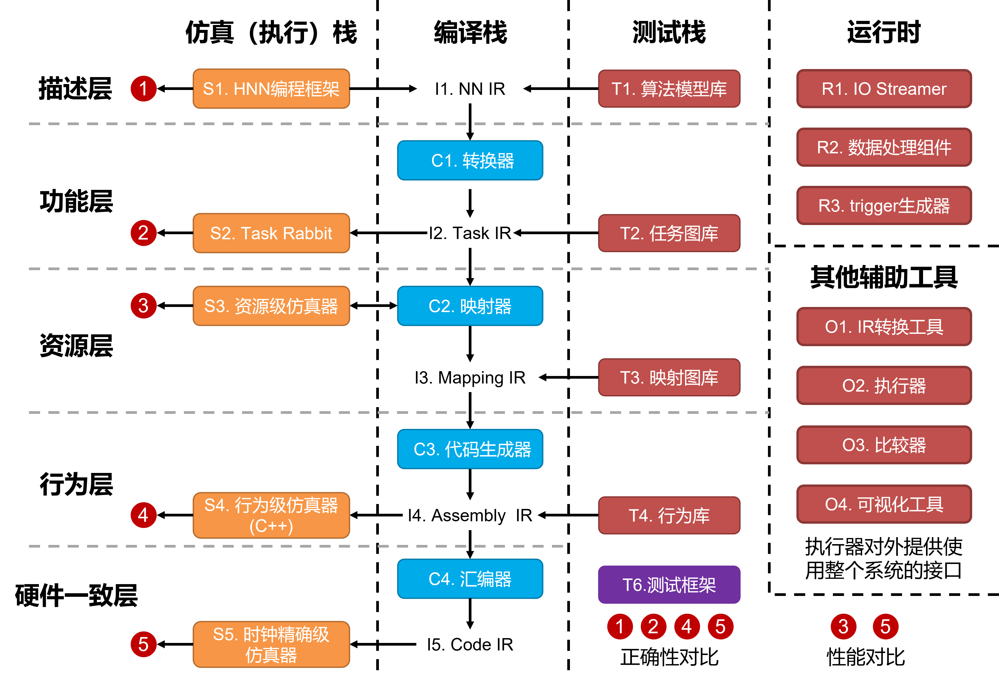
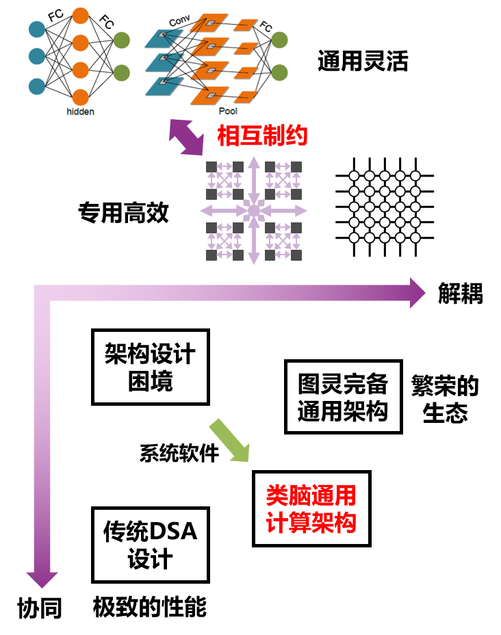
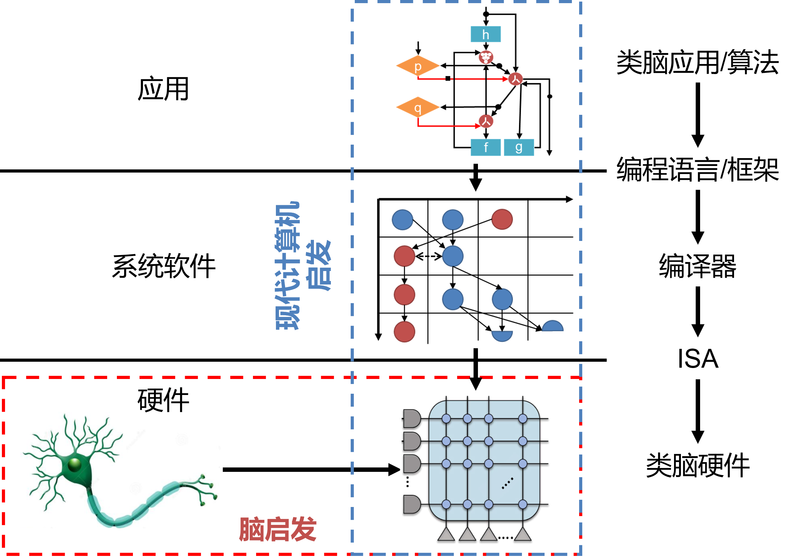
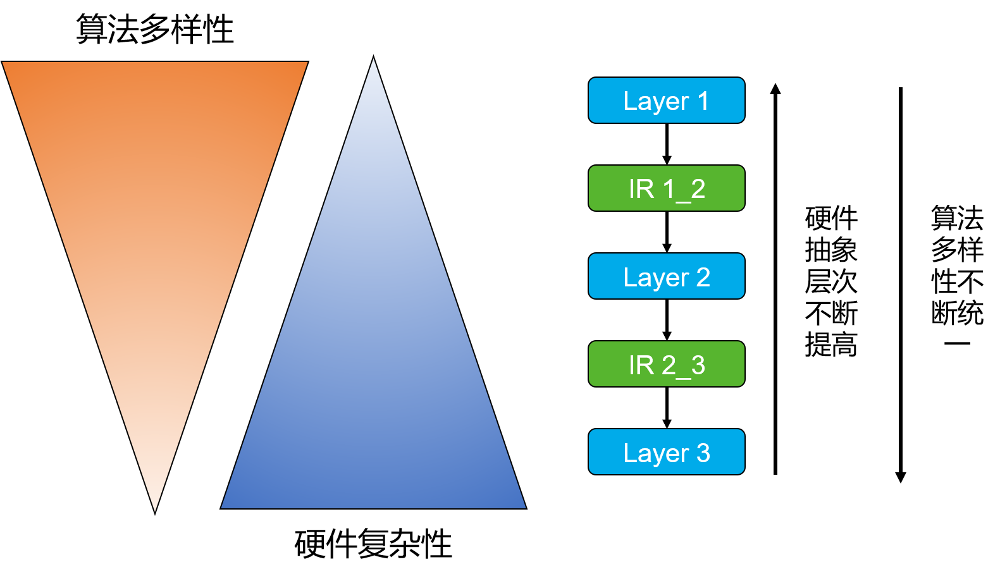
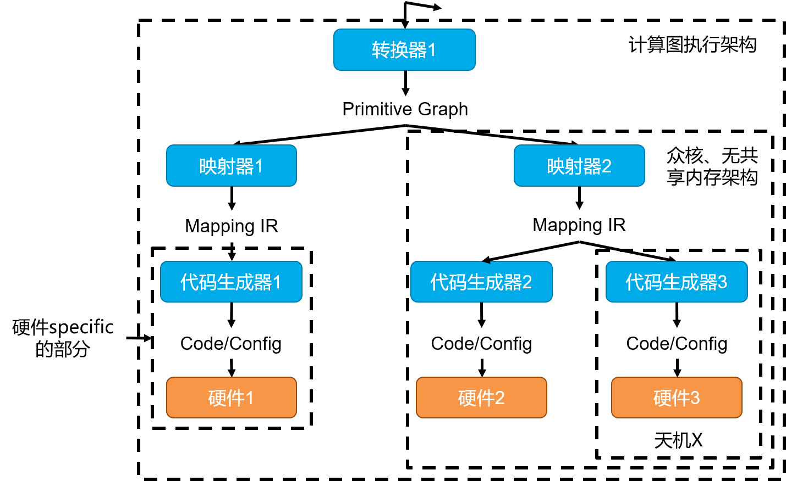
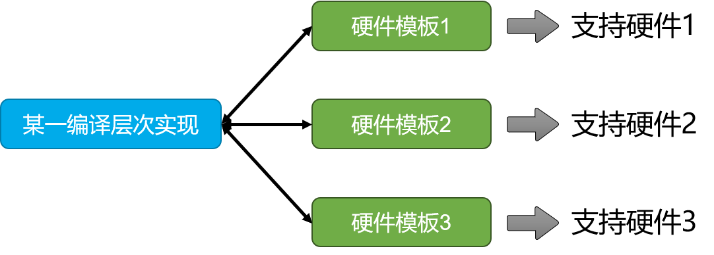

========================================================================
三栈五层协同的众核体系结构探索平台
========================================================================

.. hint::
  本文档除了介绍使用方式、设计方案等比较 `实` 的部分，也希望讨论一些设计思想、实现挑战等比较 `虚` 的部分。但考虑文档本身的作用，本文档一般会采用 `实在虚前` 的组织方式。

整体架构设计
########################################

Bi-Map包含三个**编译-架构探索**层次。

**功能层：** 系统需要支持的算法模型范围，设计完备的功能性原语与编译转换方式。其中的编译转换指编译器将算法模型转换为硬件功能性原语描述的任务图模型。该层次体现系统的功能抽象。

**资源层：** 根据性能要求，探索计算、存储等资源的排布及任务的映射，满足系统基本的性能需求。具体的，架构方面包括芯片要有多少个核，每个核提供多少线性及非线性算力，多大的私有存储，核之间有多大的共享存储,核的任务切换能力，不同核的执行自主性，同步异步规则等等。编译方面探索任务映射策略（包括空间分布与时间调度）。该层次体现众核的时空资源抽象。

**行为层：** 设计探索芯片执行机制及执行模型上的编译优化，使硬件可以得到准确的计算结果，即实现任务执行的完整逻辑过程。具体的，架构方面包括计算、存储、片上网络等组件的逻辑实现，组件间配合的机制，芯片运行控制逻辑等。编译方面探索具体的内存优化、路由优化等方案。该层次体现中心芯片执行的行为抽象。

三个层次覆盖了众核体系结构设计的完备性需求、性能需求和逻辑一致需求。我们可以得到不同层次的芯片架构设计，即仿真栈，与针对这个架构的基本编译流程，即编译栈。针对确定的硬件架构，编译器可以保留编译搜索部分，对不同的算法模型搜索更有效的编译部署策略。进一步的，我们将得到类脑算法模型的层次称为 **描述层**， 芯片的微体系结构成为 **硬件一致层**。在各个层次之间的构建的测试用例与测试框架形成了 **测试栈** ，并将其看作 **类脑体系结构开发数据集**。由此形成了三栈五层协同的类脑众核体系结构平台，下图给出了Bi-Map具体的实现及各部分之间的关系。

**编译栈：** 将算法模型转换为芯片可执行的代码。包括，

- **I1, NN IR (Neural Network Intermediate Representation)：** 统一不同深度学习框架（如PyTorch、TensorFlow等）编写的算法模型的表示，其解耦了计算系统与上层各种各样的编程框架。当前，Bi-Map使用 `ONNX <https://onnx.ai/>`_ 作为NN IR。ONNX对于SNN及HNN的支持效果较差，这个问题我们在这里（TODO: 链接）进行讨论。
- **I2,** :ref:`Task IR` **：** 利用功能性原语表达算法执行任务的IR，其满足类脑系统的功能与精度约束，表达了类脑系统原生的支持范围（如是否支持SNN、是否支持训练、是否支持浮点计算等）。Task IR解耦了计算系统的功能与硬件的众核结构设计。 
- **C1,** :ref:`转换器` **：** 将NN IR转换为Task IR，主要包括等价转换：将ONNX转换为Task IR功能性原语，构造Task IR图结构；非等价转换：将高精度计算量化为低精度计算、使用神经网络或查找表等通用逼近算子逼近非线性操作或非原生支持的操作。
- **I3,** :ref:`Mapping IR` **：** 表示任务在众核架构上的时空分布的IR，由经过图变换的任务图（Task IR）和任务图与硬件资源的时空映射关系组成，解耦了硬件的众核结构设计与具体硬件组件的实现。
- **C2,** :ref:`映射器` **：** 将Task IR转换为Mapping IR，包括任务的空间分配：每个核、每个存储计算组件执行什么任务；时间调度：每个核在什么时间执行什么任务；组织映射策略搜索。
- **I3,** :ref:`Assembly IR` **：** 表示任务在每个硬件组件（计算组件、内存组件、片上网络、控制组件）上执行行为与逻辑的IR，大致相当于传统计算机的汇编程序，其解耦了硬件行为与硬件RTL级实现。
- **C3,** :ref:`代码生成器` **：** 将Mapping IR转换为Assembly IR，根据硬件的执行模型，进行内存地址分配、路由优化、指令参数生成等等步骤。
- **I5,** :ref:`Code IR` **：** 硬件的可执行代码或硬件可直接解析的编码。
- **C4,** :ref:`汇编器` **：** 将Assembly IR转换为Code IR。汇编器同样可以包含链接过程，即将多个芯片或任务的独立编译结果链接起来。

**仿真（执行）栈：** 仿真栈在不同的抽象层次上表达硬件的功能与结构设计，实现执行IR、仿真硬件、评估性能等功能。在探索层面，Bi-Map目前侧重于编译探索部分，仿真栈以天机X芯片为基础构建。包括，

- **S1,** :ref:`HNN编程框架` **：** 编写ANN、SNN及二者混的算法模型的编程框架。如果编写ANN, 可以直接使用PyTorch、TensorFlow等成熟的深度学习编程框架。（编程框架可以不看作是仿真栈的一部分）
- **S2,** :ref:`Task Rabbit` **：** 执行Task IR的程序，相当于硬件的支持功能的模板，不暴露除功能外的其他硬件信息。其实现上是一个简单的图执行引擎，会输出Task IR在给定输入上的运行结果。我们给它起名叫Task Rabbit。
- **S3,** :ref:`资源级仿真器` **：** 评估一个映射策略的资源占用（执行时间、内存量、通信量等）的静态仿真器。同时也是一个可交互仿真器，其暴露一系列映射动作与评估接口，供映射策略搜索使用。
- **S4,** :ref:`行为级仿真器` **：** 仿真硬件计算、控制、内存、路由行为的仿真器，会输出与硬件等价的运行中间结果。其建模了硬件各种组件的执行机制。
- **S5, CModel（时钟精确级仿真器）：** 逐时钟的仿真硬件的执行，包含硬件的时序信息，相当于RTL逻辑。

**测试栈：** 测试栈管理测试用例，组织测试流程，是各个软件模块如期工作的保障，并可以看作类脑体系结构开发的数据集。包括：

- **测试用例库：** 存储各个层次的IR作为测试用例。
- **结果比对框架：** 对比1、2、4、5结果输出点，判断执行结果是否正确。
- **性能评估框架：** 对比2、3、4、5运行效果输出点，分析性能表现。

**运行时** 在芯片执行期间运行的系统协作软件。包括：

- **R1,** :ref:`IO Streamer` **：** 在运行时将外部输入数据打入众核上的特定核；收集众核中特定核的数据到外部输出。
- **R2, 数据处理组件：** 进行数据输入之前的处理，如分块、维度变换等；对处理结果进行处理得到外部输出数据，如合并、维度变换等。
- **R3, trigger生成器：** 生成控制芯片运行的各种触发信号。 

**其他辅助工具** 辅助工程开发或者系统执行的软件工具。包括：

- **O1, IR转换工具：** 因为一些历史原因，IR设计发生过数次版本迭代，为了其余组件正常工作，IR转换工具负责将转换不同的IR设计。（本开源工程不涉及）
- **O2, 执行器：** 封装了各组件执行的高层逻辑，并对外提供使用整个系统的接口。
- **O3, 比较器：** 封装了组件间输出结果的比较逻辑，用于测试框架的正确性判定。
- **O4, 可视化工具：** 可视化某些IR实例和部分组件执行中间状态，主要用于调试。

设计原则
########################################

1. **系统视角、算法-软件-硬件的解耦并协同：** 在传统的类脑系统设计思路中，往往强调算法与硬件协同，这有利于提高系统效率，但不利于适应快速发展的类脑算法和灵活多变的应用生态。我们认为，为了发展适用性更广的类脑通用计算系统，让类脑计算（或类似架构的空间并行计算）真正成为未来社会的计算基础设施，需要像现代计算机那样完善的系统软件解耦硬件与算法。在解耦的基础上，才能发展不同层次的协同，进一步提高效率。通过系统软件传递算法的需求，暴露硬件的计算能力。我们希望利用系统软件设计，实现计算系统的发展过程中，解耦与协同两对矛盾的调和。

类脑系统软件+类脑硬件组成了类脑计算系统，对类脑智能应用和更广阔的并行计算应用提供服务。我们希望从系统的角度看待类脑计算的特点。如高效性，单独强调类脑芯片的高效性意义不大，系统软件的技术突破将极大决定系统的实际性能，也极大影响着硬件的性能优化路线。再比如通用性，传统观点认为硬件表达了计算在通用性上的能力。但从系统视角出发，通用性是系统软件+硬件共同达成的能力。甚至系统软件可以通过如 [通用近似]_ 的方法，扩大硬件实际的支持范围。即希望传递 **专用高效硬件，通用灵活系统** 这样的思想。我们也希望在整个软硬件开发流程中，尽量避免出现“硬件支持什么功能”的描述，而是讨论功能点与特性怎样在系统软件与硬件之间做出职责划分。

2. **软件先行：** 在上面的基本原则指导下，我们认识到类脑众核系统不像现代计算机系统，有完善的软硬件解耦协同方式。以指令集为例，基于CPU的架构基于数十年的磨合，形成了一套稳定的指令集抽象，基于此，指令集之上和之下可以更为独立的开发。但类脑系统的软硬件的职责划分及各层次设计仍有许多需要探索的部分，如果要完成一个较为通用的类脑计算系统，要么尽量融入现有CPU体系架构内，要么现在系统软件的层面先做出足够的探索，再去做硬件。

3. **受计算机启发的层次，受脑启发的实现：** 软件先行发展类脑系统的过程中，可以借鉴利用大量现有的计算机方法论与技术。如从图灵机到冯诺依曼体系架构这样坚实的理论基础、层次化抽象与解耦的方法、编译栈前后端分离的具体技术、众核架构分析方法等等。而在系统的每个层次，可以多借鉴大脑的信息表示与处理范式，突破传统架构的性能瓶颈。类计算机是为了可用与繁荣的生态，类脑是为了新型的计算范式。通用和高效是Bi-Map追求的目标，而不是强调生物相似性。事实上，Bi-Map经过扩展，应该也能服务于传统的众核计算领域及AI加速器领域，开发过程中，我们也借鉴了大量现有的工作，如 `GEM5 <https://www.gem5.org/>`_、 `TimeLoop <http://accelergy.mit.edu/tutorial.html>`_ 、 `TVM <https://tvm.apache.org/>`_ 、 `LAVA <https://lava-nc.org/>`_ 、CGRA（粗粒度可重构架构）的相关仿真器与编译器等。

4. **层次化抽象：** 每一层次抽象的选择尤为重要，基本的指导思想包括：
    (1). 从上到下统一算法模型多样性，从下到上隐藏硬件细节。

    (2). 低层次抽象的执行可以依赖高层次抽象的结果，但反之应尽量避免。即尽量避免需要层次间迭代才能解决的问题。

    (3). 每一层抽象应对应类脑计算系统中的一个大”视角”，如某层抽象是类脑系统支持的应用功能，某层解决类脑系统的主要性能矛盾。

基于层次化抽象的编译器设计，越是高层次，可覆盖的潜在类脑硬件范围越广。与编译层次类似，仿真栈也许按照不同的抽象划分为不同的层次，以完成不同角度与粒度的架构验证与探索。

5. **仿真栈与编译栈互为模板：** 仿真栈会在不同层次上为编译器提供帮助，包括：
    (1). 提供编译所需的硬件信息，帮助编译更高效的进行。如仿真器充当AI编译中常见的Cost model。
   
    (2). 为编译器提供一种硬件模板，实现硬件设计与编译策略的解耦，即同一编译策略可以应用于不同的硬件模板，从而达到”类脑通用编译”。

编译器对于仿真器来说，可以有类似的作用：
   (1). 编译器将为仿真器提供该层次的可执行用例。

   (2). 为仿真器提供一套编译策略模板，可以探索当前仿真架构下执行不同编译策略的高效性。

仿真栈与编译栈的互相配合使得软硬职责有更清晰的划分，各个层次上的协同优化，得出多样的类脑众核计算系统的设计流程。

6. **面向IR编程：**  IR(Intermediate Representation，中间表示) 充当了模块之间的信息传递媒介，定义了各层次的交互协议和功能，并解耦了各组件的实现。IR是层次化抽象的具象表达，IR的设计决定了Bi-Map的整体结构，所以系统的设计与实现将首先从IR开始。

7. **测试驱动开发：** 利用测试用例指导软件平台功能的边界，利用测试栈驱动平台开发。

.. [通用近似] A system hierarchy for brain-inspired computing