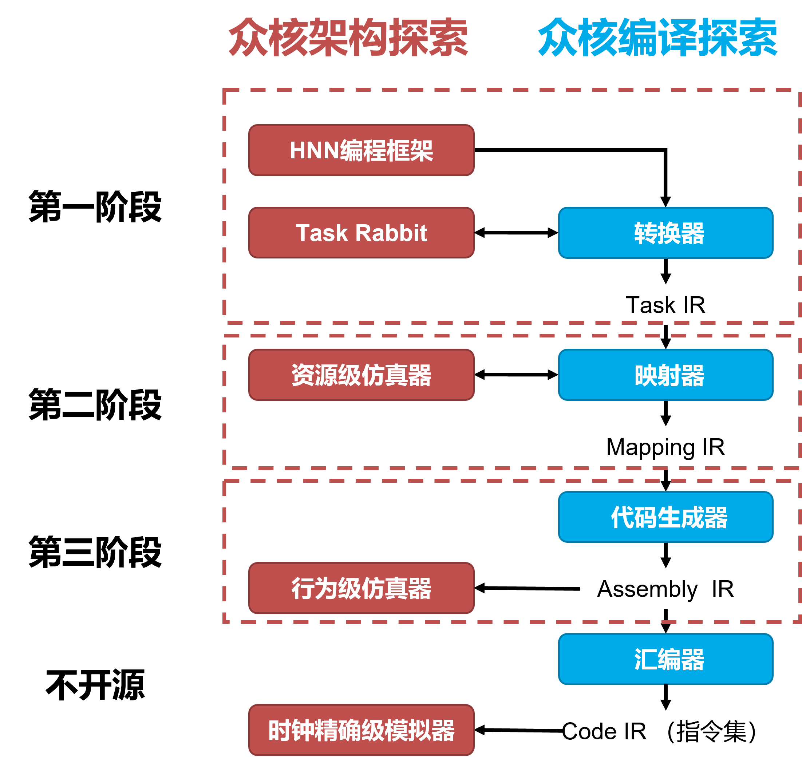

========================================================================
开源规划
========================================================================

Bi-Map将分为三个阶段逐步开源文档、代码，三个阶段的划分如下图所示。

在开源过程中，我们会在测试库中不断地加入回归测试用例，使得Bi-Map不断变得稳定。因为硬件一致层涉及很多芯片核心技术细节，所以不会开源，但可能在之后考虑提供开放使用的途径。

------------------------------------------------------------------------
Licenses
------------------------------------------------------------------------

Bi-Map采用 `Apache 2.0 <https://spdx.org/licenses/>`_ 和 `LGPL2.1 <https://spdx.org/licenses/>`_ 开源协议。 具体到每个部分的协议如下：

HNN编程框架： *Apache 2.0**

IR工程： **Apache 2.0**

转换器： **Apache 2.0**

资源级仿真器： **Apache 2.0**

代码生成器： **LGPL 2.1+**

汇编器： **LGPL 2.1+**

Task Rabbit： **Apache 2.0**

行为级仿真器： **LGPL 2.1+**

时钟精确级仿真器： **LGPL 2.1+**

运行时： **LGPL 2.1+**

开发者可以对已开源部分提出issue或贡献代码，详见 :ref:`开发者指南` 。
