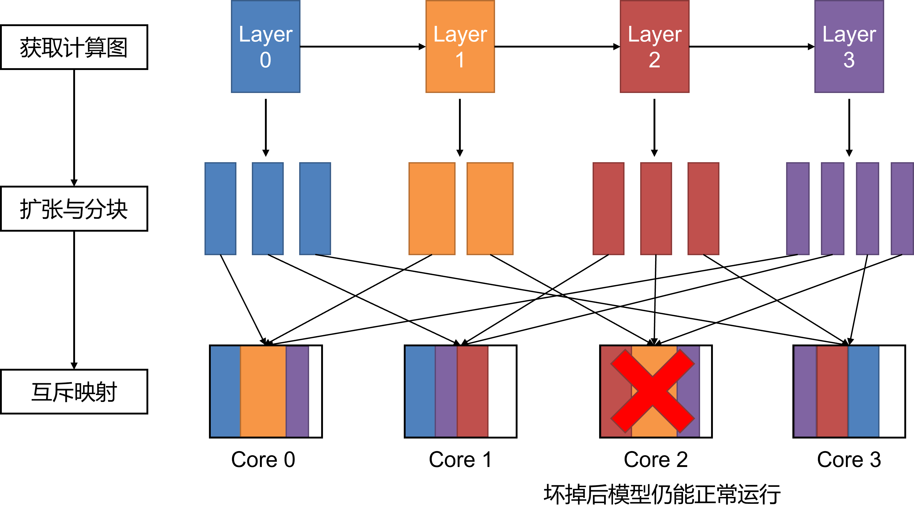
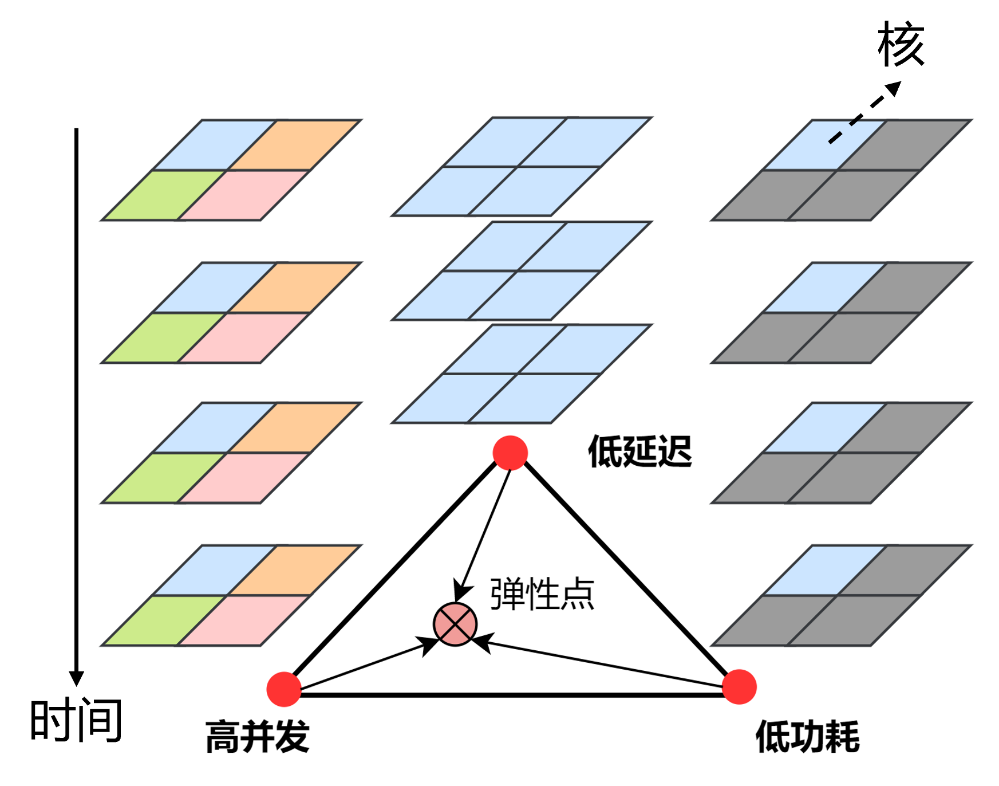
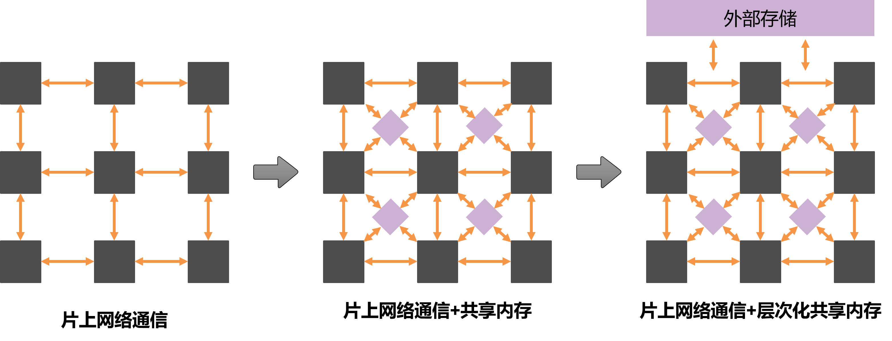

========================================================================
需求
========================================================================

类脑计算指借鉴人脑的结构和机理，以现代电子技术为载体，实现“人脑”和“电脑”的优势互补。类脑计算具有高度并行、事件触发、存算一体、近似计算、运行时可重构等特点，有潜力成为未来智能社会的计算基础设施。类脑计算包含算法应用、系统软件、硬件、器件等多个层次的研究，其中系统软件由编译器、仿真器、操作系统等组成，是部署类脑应用、提供类脑服务的关键，也是开展类脑体系结构研究的重要工具。

类脑众核架构探索平台（Brain-inspired Many-core Architecture exploration Platform, Bi-Map），是旨在提供灵活通用的类脑部署解决方案、进行类脑体系结构关键技术探索的类脑系统软件，为编译与芯片架构设计这两大类脑系统中不可分割的研究方向提供服务。我们希望通过Bi-Map，使用者可以快速高效的将深度学习模型与传统类脑计算模型部署到类脑芯片上，也可以通过编译与仿真的协同优化，探索更好的编译映射策略与类脑架构设计。

硬件架构探索需求
########################################

Bi-Map面向一大类主流的类脑计算架构，即众核类脑架构，该架构可以抽象成如下结构。

.. image::  _static/requirement1.png
   :width: 100%
   :align: center

**类脑计算外围系统：** 类脑芯片可能被CPU或FPGA等较为通用的处理器控制，类脑芯片可以访问外部存储，如DDR。

**类脑众核芯片：** 类脑众核芯片由多个计算核和可能存在的核之间的共享内存组成，核之间存在片上路由网络进行传输数据。

**类脑计算核：** 类脑计算核包含存算一体的线性计算单元和高速私有内存，其可以看作一个存算一体与近存计算的混合系统。核内往往也包含非线性计算单元提升系统的完备性。

类脑众核系统存在大量的设计探索空间，包括： **功能层次：** 类脑系统需要提供哪些算子/原语/指令集。 **资源组织：** 类脑架构如何组织各种计算、存储、路由、控制资源，采取何种同步/异步运行方式。 **运行机制：** 如何设计具体的计算、访存、片上网络传输等机制。 **逻辑电路设计：** 如果高效的实现各种类脑组件。

为了满足上述的架构探索与设计需求，我们需要有一套层次化的、灵活的仿真栈，完成从性能评估到正确性验证的架构设计及量化分析。

编译探索需求
########################################

类脑众核编译将类脑模型转换为类脑众核硬件可以运行的代码或配置。其中类脑模型是我们用各种“高层次”框架（高级语言）描述的类脑模型，包括深度学习模型与计算神经科学模型，即ANN、SNN及二者混合。除了部署任务之外，编译探索平台也强调器协助探索编译方案的功能，即类脑众核编译架构探索平台的主要目标如下：

1. 制作一款出色的针对特定类脑众核硬件的编译器。
2. 探索类脑模型通用的与众核架构通用的编译器。
3. 打造众核编译策略的探索平台。
4. 协助众核芯片架构设计探索平台。

对于第1点，本编译平台以清华大学类脑计算研究中心研发的 [天机X]_ 为硬件目标。针对第2点，本编译编译平台争取在个层次上提供一定的灵活性，凝练类脑众核编译的通用需求。

进一步的，类脑编译需要满足如下特点：

**近似等价性：** 编译后的代码在硬件上运行的结果应该与模型原本执行的结果或行为近似等价（运行结果近似正确）。之所以说近似，是因为类脑模型，如神经网络本身允许有一定的不精确性。比如一个图片识别网络，不一定要求硬件运行结果与原网络结果完全一致，只要求图片识别准确率控制在可接受的范围内。

**合法性：** 编译后的代码可以在硬件上合法的运行。众核硬件往往有很多特定的约束，比如计算精度约束、资源约束等。编译的结果要满足这些约束，才能在芯片上成功运行并满足近似等价性。

**完备性：** 完备性（或通用性）要求是编译系统对上对下支持范围的要求。对上，编译系统应完备的支持立项规划的类脑模型。对下，编译系统应尽可能通用地支持一类众核架构。

**高效性：** 编译后的结果在硬件上的运行性能应足够高效。常见的目标包括：

- 减低延迟：在给定核数上限的情况下尽量提高提高计算利用率。
- 降低功耗：使用尽量少的核数运行。
- 增加并发：多个网络模型同时运行。

现实情况的优化目标可能是复杂的，往往是上面三点的组合。

**自动化：** 编译系统最终要做到自动化。针对一个全新的算法，只要其处于功能性需求的覆盖范围内，编译系统就应当自动化地将其部署到硬件上。编译系统应该保留一些手动控制的接口，比如可以手动给出一套映射方案。自动优化的结果不要求比手动优化的好。

**可扩展性与可移植性：** 编译过程可能涉及众多不同的优化算法，不断变化的组件。编译系统的框架设计应足够灵活，可以方便的替换不同的模块。

**即时性：** 编译过程不能太慢。

类脑模型描述需求
########################################

类脑编译与架构仿真的过程都需要任务描述作为输入，为此我们需要一套编程框架支持类脑模型的快速描述。包括：

**ANN模型：** 可采用PyTorch或Tensorflow成熟的深度学习编程框架进行描述。 

**SNN模型：** 可采用惊蛰（SpikingJelly）等编程框架进行描述

**HNN模型：** [HNN]_ （Hybrid Neural Network）即混合ANN与SNN的神经网络，需要实现特定的编程框架。

实际上，Bi-Map实现了一套专门的编程框架实现ANN、SNN与HNN，ANN实现继承自PTorch,SNN实现部分引用了惊蛰的实现。

针对不同层次的任务抽象，Bi-Map同样需要提供较为便捷的用例构造方式以及用例库（类脑体系结构开发数据集）。

理想与现实
########################################

Bi-Map是长期探索型项目，理想中的支持情况如下表所示。

===============  =======================  ===================
功能类型          完备性要求（可以支持）     性能要求（高效支持）
===============  =======================  ===================
ANN前向           ⭐⭐⭐                  ⭐⭐⭐
ANN反向           ⭐⭐⭐                  ⭐⭐⭐
动态图(控制流)     ⭐⭐                    ⭐
数据重排          ⭐⭐⭐                  ⭐⭐
动态维度          ⭐                       ⭐
SNN前向           ⭐⭐                    ⭐⭐
计算神经科学       ⭐⭐                    ⭐
多网络            ⭐⭐⭐                  ⭐⭐
===============  =======================  ===================

当前版本可能只能做到如下需求。

===============  =======================  ===================
功能类型          完备性要求（可以支持）     性能要求（高效支持）
===============  =======================  ===================
ANN前向           ⭐⭐                    ⭐⭐
ANN反向          不支持                    不支持
动态图(控制流)     不支持                   不支持
数据重排          ⭐⭐                    ⭐
动态维度          不支持                   不支持
SNN前向          ⭐                       ⭐
计算神经科学      不支持                   不支持
多网络           ⭐                       ⭐
===============  =======================  ===================

上表中，数据重排指的是，只改变数据位置不改变数据值的操作，如ReShape、转置等。
动态维度指的事，模型在运行时支持不同维度的数据输入。

.. hint:: 
  理想中的算法模型支持范围，可在未来根据 `算法模型需求列表 <算法模型需求列表.html>`_ 中的需求编号指定。

下面举例几个具体的类脑众核体系结构的研究需求示例。

需求示例1：容错映射
########################################

探索核级别容错的编译部署策略，即要求做到坏了一个核时，被编译的模型仍能正常运行。在这个过程中，需要同时考虑每个核的负载均衡，和核之间的数据通信量。

需求示例2：弹性部署
########################################

一个模型在众核架构上部署往往具有一定的弹性，即可以选择不同的部署策略，有的策略可能延迟低，有的策略吞吐大（或任务并发度高），有的策略用的核数少（运行时所需功率低）。如下图所示，图中展示了高并发、低延迟、低功耗三种比较极端情况的任务部署事宜。其中核上的每一种颜色表示一个任务执行过程，高并发的部署方案中，每个核可以单独执行一个任务，多个任务并发执行；在低延迟的部署方案中，所有核全力执行一个任务；在低功耗的部署方案中，可以只开一个核工作，其他核关闭。我们将延迟-并发-功耗的弹性称为LCP弹性。一个重要的研究课题是，在LCP弹性的范围内找到，找到满足具体的负载需求的任务部署策略。

需求示例3：片上网络与共享内存对比
########################################

类脑众核芯片中的核数据交互可以存在两种方式：直接通过片上网络和通过共享内存。量化分析片上网络数据传输和共享内存数据传输在执行类脑任务的优劣，设计合理的片上网络及层次化共享内存参数，是类脑芯片的重要研究课题。

.. [天机X] Neuromorphic computing chip with spatiotemporal elasticity for multi-intelligent-tasking robots

.. [HNN] A framework for the general design and computation of hybrid neural networks
