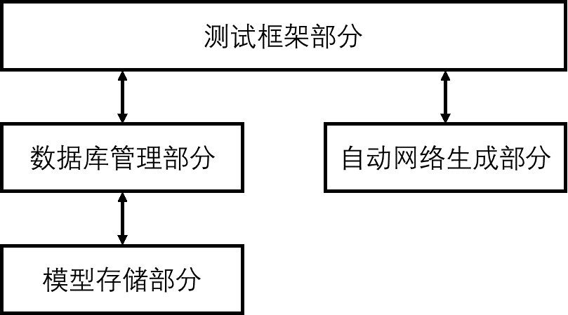

========================================================================
算法模型库
========================================================================

软硬系统的需求确认以及之后的系统测试都需要大量的网络模型示例，我们最好有一个存储模型算法的数据库。可以采用Table+对象存储的形式存储每个模型，举例来说，每个模型可以有如下的属性：

== ======== ======== ==== ======== ==== ======== ======== ====== ====== ======
ID 名字     存储路径 源码 ONNX模型 文档 需求列表 算子列表 计算量 存储量 描述
== ======== ======== ==== ======== ==== ======== ======== ====== ====== ======
1  ResNet18 1        true true     true  [1.1]    [...]                       
== ======== ======== ==== ======== ==== ======== ======== ====== ====== ======

其中，数据库一定要存储网络模型文件，作为网络的准确描述（直观看到有哪些算子和结构），模型文件也可以作为未来系统的输入。

需求列表中的需求点是根据模型特点进一步分析出来的点，就是说我们要指定对一类网络的支持情况，每一个需求点都有一个唯一的编号，下面是一套网络需求点定义的示例。

算法模型库是一个数据库，希望可以像数据库那样提供给增删改查的接口，比如输入命令：

.. code:: shell

    find 1.1.2  # 找出1.1.2需求点的所有网络
    find computation>200M  # 找出计算量大于200M的所有网络

这里也可以直接复用数据库的SQL语句，进一步的，算法模型库可以作为未来顶层测试框架的基础。

