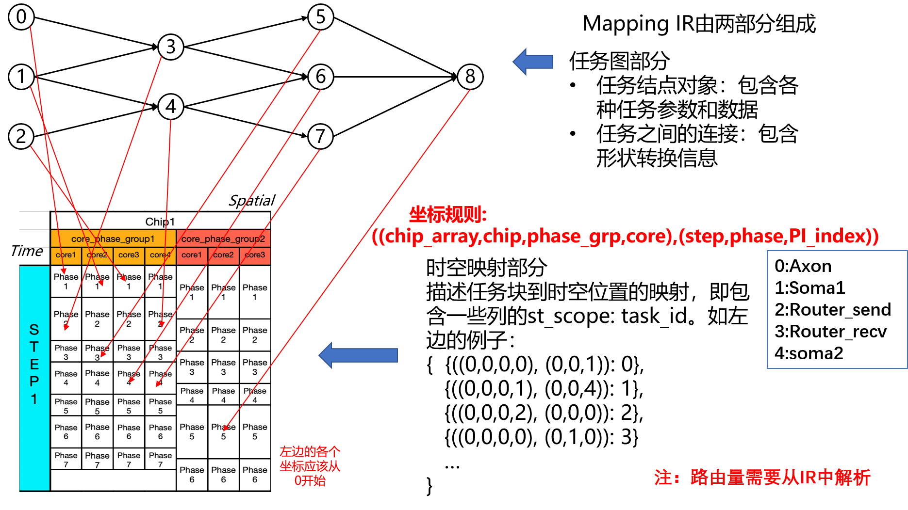

========================================================================
Mapping IR
========================================================================

Mapping IR作为映射器的输出、代码生成器的输入。

Tianjic X映射IR约束
########################################

.. **内存模型造成的约束**

**强约束**，必须满足

1. 不能超过32个phase；不能超过32个Phase group；不能超过4个Step group。
2. 每个核部署的任务占据的内存量最大时不能超过144KB，其中去掉路由接收数据最大时不能超过128KB。
3. 每个计算任务块可以有多个输入边簇，但每个输入边簇只能包含1个interface; 每个计算任务块只能有1个输出边簇，但输出边簇可以有多个interface。
4. 每个存储任务块只能有1个输入边簇，但每个输入边簇可以包含多个interface; 每个存储任务块只能有1个输出边簇，且输出边簇只能有1个输出到计算任务块的interface，但可以有多个输出到输出任务块的interface。
5. 输入任务块没有输入边簇，有1个输出边簇，但输出边簇可以有多个interface。输出任务块没有输出边簇，有1个输入边簇，但输入边簇可以有多个interface。
6. 输入任务块的输出边需要连接到1个或多个存储任务块。计算任务块的输出边需要连接到1个或多个存储任务块。存储任务块的输出边需要连接到1个计算任务块及0个或多个输出任务块。
7. Axon-Soma1可以流水，Axon-Soma2不能流水。
8. 如果Axon输出的存储任务块是多个计算任务块的输入（Axon输出的存储任务块被复制了多份），则不能流水。
9.  不能出现Axon-Axon的情况，除非第二个Axon是CADD。
10. SI2D任务块不能接在其他计算任务块之后。
11. 计算任务块参数限制见 :ref:`Task IR`。
12. 一个或多个核在一个phase内往同一个目的地最多发送数据4096*8B（因为路由表头的A有12bit的限制），32KB。理论上只有往FPGA发数据才有此约束。
13. 一个计算任务块必须与其所有的输入的存储数据块映射到一个核中。

**弱约束**，提升性能或减少代码生成器失败的概率

1. 不超过16个phase（为代码生成器的move生成及相应优化提供足够空间）。
2. 每个核部署的任务占据的内存量最大时不能超过128KB（避免因内存评估误差造成的代码生成失败），1个phase的接收数据最大不能超过12KB（估计原语参数+路由表，即代码区，不超过4KB）。
3. 在可以使用本Phase soma2或下一phase soma1的情况下，优先在下一phase soma1上分配任务。
4. 每个核每个phase只能存在一个计算任务接收其它核的数据。
