========================================================================
Task IR 2.0
========================================================================

IR整体描述
########################################

Task IR 2.0采用图结构表述任务，我们将这种图称为任务图（Task Graph）。任务图由任务结点和边组成。Task IR 2.0的任务结点旨在支持现在常见的神经网络算子：

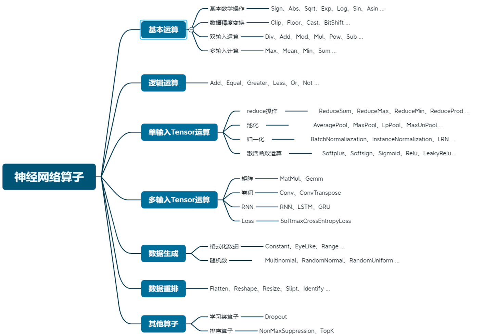

任务结点可以分为如下几类：

- **循环结点：** 表示Tensor操作等主要由循环控制的操作。
- **数据结点：** 表示一块数据的结点。
- **数据重排结点：** 表示如Reshape、Permute、Shift等只改变数据位置而不改变数据值的操作。
- **Multi-switch结点：** 为支持控制流操作设计的结点，即控制部分数据流化的结点。
- **谓词结点：** 做出布尔判断的结点，主要是为了辅助Multi-switch结点。
- **代码结点：** 封装一段标准C代码的结点。
- **转码结点：** 转换编码协议的结点。
- **其他结点：** 支持其他特性类型的结点，如Sort, NSM等。

整体上，任务图的设计如下图。

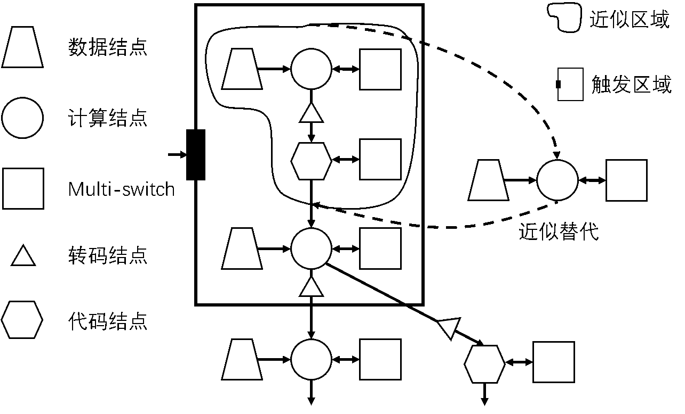

循环结点
########################################

循环算子由如下几部分组成：

- **循环变量：** d1, d2, d3...
- **循环次数：** n1, n2, n3...
- **输入：** In1, In2, In3...
- **输入访问：** In1Access, In2Access, In3Access...
- **输出访问：** OutAccess
- **算子：** Op
- **reduce循环：** r1, r2...
- **reduce算子：** rop1, rop2...
- **不可拆分循环：** up1, up2...

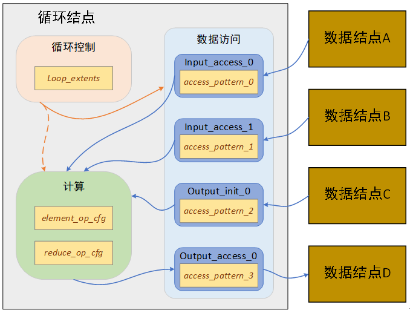

为了简化，循环控制部分设计采用如下的原则：

- 完美的嵌套循环形式：完美指的是for循环间不存在其它操作。
- 每个循环变量对应一层for循环。
- 每层循环从1开始，步长为1，并被指定相应的循环次数。
- 循环顺序的任意交换应不影响循环算子的计算结果（只影响访存，所以我们这里可以有个循环顺序优化）。
- 理论上，任意两层循环都可以融合成一层循环。这里我们倾向于选用访存和循环体尽量简单的循环方案。比如，强行把两层for融合成一层，可能会使得循环体出现if。

数据结点
########################################

转码结点
########################################

代码结点
########################################

动态图机制：Multi-switch结点与谓词结点
########################################

解决的问题
************************************

支持控制流（动态图），我们将加入此机制的任务图称为C-DFG(Control-Data Flow Graph)

-	非图结构或多层结构的控制流方案（例如在MLIR中采用了多层结构），不适合做图相关的优化，例如图的拆分
-	对于图结构的数据流方案，往往会因为引入控制流造成结点数量与边数量的爆炸，增大了编译的难度

C-DFG设计思路
************************************

-	以图的形式表达数据流和控制流
-	将控制流与数据流尽量分离
-	在原本的数据流图的基础上进行修改，适度增加结点的复杂性，以降低图的复杂性

C-DFG基本定义
************************************

C-DFG在TaskGraph的基础上修改，仍然是由任务块和边两类元素组成的有向图，任务块代表相应的计算/存储/控制，边代表任务块与任务块之间构建传递token的通道，任务块分成四类：计算任务块，存储任务块，控制任务块和Switch任务块，对此我们需要在任务块的枚举类型中补充一系列控制任务块基本类型（待确定）和SWITCH（代表Switch任务块）和SS（SSwitch任务块，用来存储 Switch token）这两种任务块基本类型；token分为两类：数据token和Switch token，在下面的示例图中，我们用实心圆表示数据token，用实心正方形表示Switch token。

在TaskGraph部分，我们已经对计算任务块和存储任务块进行了详细地介绍，下面具体介绍控制任务块和Switch任务块。

控制任务块：标准情况下，控制任务块具有m个输入边簇，每个边簇中会有一个和边簇形状相同的接口和一个存储任务块通过一条边相连，同时具有一个输出边簇，执行一个谓词p后，输出一Switch token，这个Switch token同样通过存储任务块存储。谓词p仅包括最基础的控制操作，如下图所示：

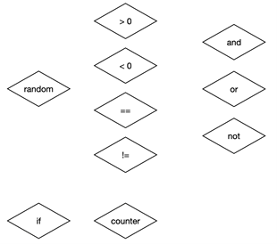

Switch任务块：Switch任务块可以理解为控制token流向的结点，其输入对应着m+1个存储任务块，其中m个存储任务块存储的为数据token，另一个存储任务块存储的是Switch token。任务块执行Switch token所要求的switch操作，然后会产生n个输出边簇，每个边簇对应着一个存储任务块。Switch任务块的执行需要制定一个依赖条件，这一点在下一部分触发条件中具体介绍。我们称有m个输入边簇和n个输出边簇的Switch任务块为m-n switch，一个m-n switch对应的Switch  token为一个m×n的0-1矩阵，下图展示了一个4-3 switch：

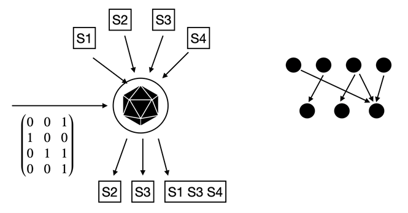

触发规则
************************************

触发规则定义了图的执行规则。

计算任务块的触发规则：所有输入边都存在至少一个数据token时，该结点可以进行计算，在每个输出边放置一个数据token，并在每个输入边上消除掉一个token，如下图所示：

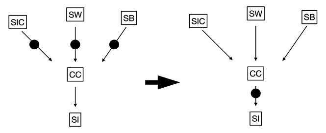

存储任务块的触发规则：所有输入边都存在至少一个数据token时，该结点功能触发，在每个输出边放置一个数据token，并在每个输入边上消除掉一个token，这种操作在转换层的应用主要在于对split和merge等操作的描述，如下图所示:

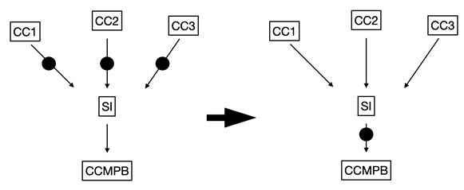

控制任务块的触发规则：所有输入边都存在至少一个token时，控制结点可以进行计算，在每个输出边放置一个Switch token，并在每个输入边删除一个token，如下图所示：

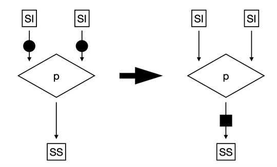

Switch任务块的触发规则：Switch结点的输入边的token状态满足依赖条件且收到一个Switch token时，该结点switch功能触发，依据Switch token指定的连接关系在输出边上放置数据token，并且消除一个switch token以及在相应输入边上消除掉一个数据token。
  
Switch token可以由控制任务块产生，即控制任务块控制Switch任务块的switch模式，进而控制整个数据流图的执行。对于静态Switch任务块，即这些任务块的switch模式或者说每次执行操作时的Switch token是固定的，比如下图左图中的静态3-1 Switch任务块，其Switch token永远都是(1, 1, 1),
我们假定其Switch token的供应是无限的且不需要控制任务块来产生对应的token，并在图上特殊表示这种静态Switch任务块。

在这类静态Switch任务块中，有一种特殊的极为常见的任务块用来表示对数据的复制，比如上图右图中的静态1-2 Switch任务块，其Switch token永远都是(1, 1)，由于这类Switch任务块在一般计算图中的出现过于频繁，我们一般不单独表示出这种Switch任务块，而是直接通过一个存储任务块连出的多条边来直接表示这种复制操作。

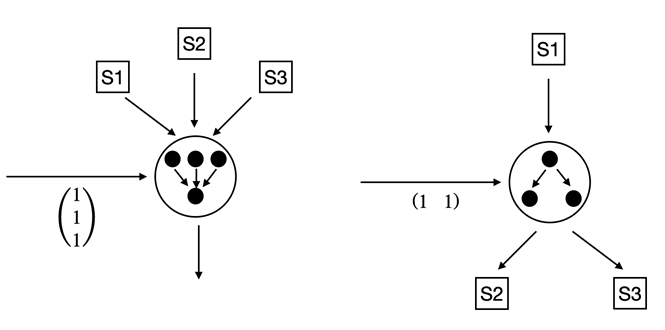

依赖条件是Switch任务块的另一个特殊点。例如在上图左图中的3-1 Switch任务块中，并不是三个输入都收到数据token之后才可以进行Switch操作，而是在三个输入通道中只要有一个通道有数据就可以把这个数据传给输出通道。
我们用谓词的形式表达这样的依赖条件，上图左图中的Switch任务块的依赖条件为：0|1|2，表示0或1或2通道的依赖满足，即可以开始switch操作。在当前版本的IR设计中，依赖条件作为Switch任务块的固定属性。（感觉实际上只可能用到或的关系…）

反向传播机制
########################################

多网络支持
########################################

SNN支持
########################################

SNN的灵活性主要体现在：神经元的灵活性、结构的灵活性和编码方式的灵活性，我们暂不考虑SNN编码方式的灵活性。

为了表示神经元的灵活性，我们在原有的IR设计中加入对某些任务块采用的神经元的描述，如CC和CVM。在当前IR设计中，每个任务块只能使用统一的神经元，本版本IR设计中暂时不考虑Hybrid神经网络的表示问题。任务块的神经元包含两种信息：神经元类型信息，由一个枚举类型指定，包括MP和LIF；神经元的参数信息，MP神经元无特殊参数，目前只有LIF神经元有参数，神经元参数和任务块参数一样通过Attribute来统一描述，在原有的Attribute枚举类型的基础上补充V_REST V_RESET V_EXT V_TH0 VTH_ALPHA VTH_BETA VTH_INCRE TW VLEAKY_ALPHA VLEAKY_BETA TAU_M这些参数类别和对应的参数值。

此外，在SNN中，除了LIF-Conv和LIF-MLP这种有规律的连接以外，神经元之间的相互连接可能会极其复杂，为了表示这种SNN结构上的灵活性，一种通用的表示神经元之间的相互连接的方法是通过0-1矩阵来进行描述，如下图所示：

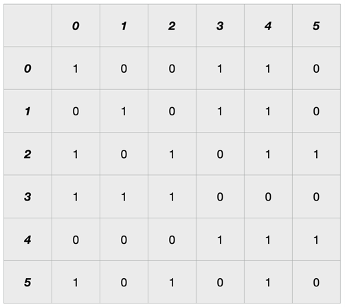

可以注意到的是，上述矩阵表示的拓扑结构已经不是一个有向无环图，而是一个有向有环图。上述矩阵表示的6个神经元组成的神经元团的拓扑结构如下图所示

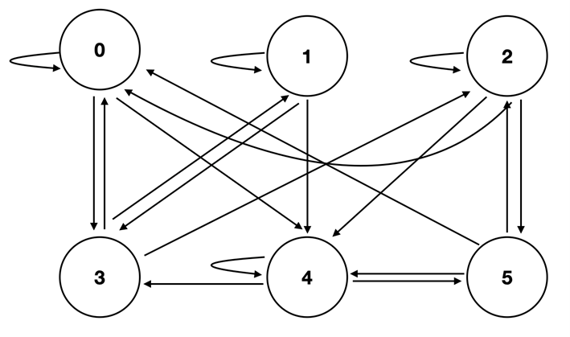
  
对于一个复杂的SNN来说，我们总可以用一个0-1矩阵来表示所有神经元之间的拓扑连接，假设我们有N个神经元，我们就需要一个有N^2个元素的0-1矩阵S来表征一个SNN的拓扑结构。值得注意的是在我们现有的、常用的SNN网络结构中，神经元之间的连接往往是稀疏的，不会出现向上图中6个神经元之间极其复杂的拓扑连接，所以S一般来说会是一个稀疏矩阵。例如在下图中表示的是0/1/2/3号神经元和4/5号神经元之间的卷积，和0/1/2/3号神经元和4/5号神经元之间的全连接

.. image::  _static/snn3.png
   :scale: 60
   :align: center

当N的数量非常大的时候，我们不能通过一个大矩阵来直接对整个网络进行描述，虽然这样的表示完全可以描述一个SNN网络的全部信息，即这样的表示是完备的，但这会给编译器的更底层如映射层造成无法处理的困难。所以我们需要对S矩阵进行拆分，即我们最开始是将一个SNN看成一个巨大的神经元团，而现在我们把一个SNN看成多个神经元团之间的相互连接组成网络，这里神经元团的

概念就类似于传统ANN网络中的层的概念。从这个角度来讲，所有的层都可以用神经元团的概念来描述，但我们还是把一些具有特殊结构特点的神经元团，如LIF-Conv和LIF-MLP提取出来，对于上述的矩阵表示，我们只将其用于复杂神经元团的表示。

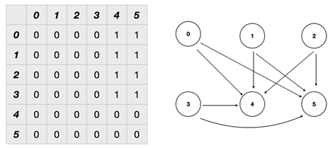

这里就引出了另一个问题，我们应该如何在一个SNN中分离出多个神经元团，并使这些神经元团内部的连接尽量稠密，神经元团之间的连接尽

例如下图表示一个4个神经元组成的SNN：

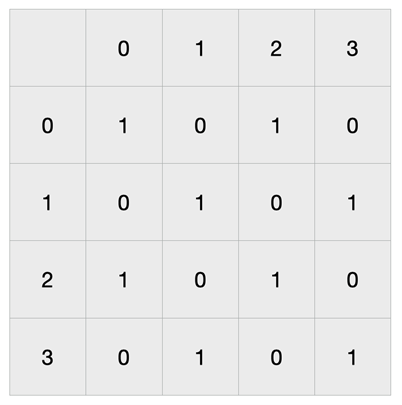

如果我们将0/1神经元作为一组，2/3神经元作为一组，我们可以用矩阵 :math:`\left(\begin{array}{ll}1 & 0 \\0 & 1\end{array}\right)` 来表示这两个神经元团内部的连接，但同时我们在这两个神经元团之间，我们需要在两条边上（0/1神经元团到2/3神经元团的边和2/3神经元团的边到0/1神经元团的边）用矩阵 :math:`\left(\begin{array}{ll}1 & 0 \\0 & 1\end{array}\right)` 表示0/1神经元团到2/3神经元团的连接和2/3神经元团到0/1神经元团的连接。

如果我们仔细观察上述矩阵，我们将1/2行和1/2列交换，我们可以得到如下的新矩阵S^'

.. image::  _static/snn6.png
   :scale: 60
   :align: center

在这个矩阵中，我们很容易可以看到：如果我们将0号神经元和2号神经元作为一团，1号神经元和3号神经元作为一团，我们将只需要用矩阵(■(1&1@1&1))来表征两个神经元团内部的连接，而这两个神经元团之间是没有连接的，如下图所示

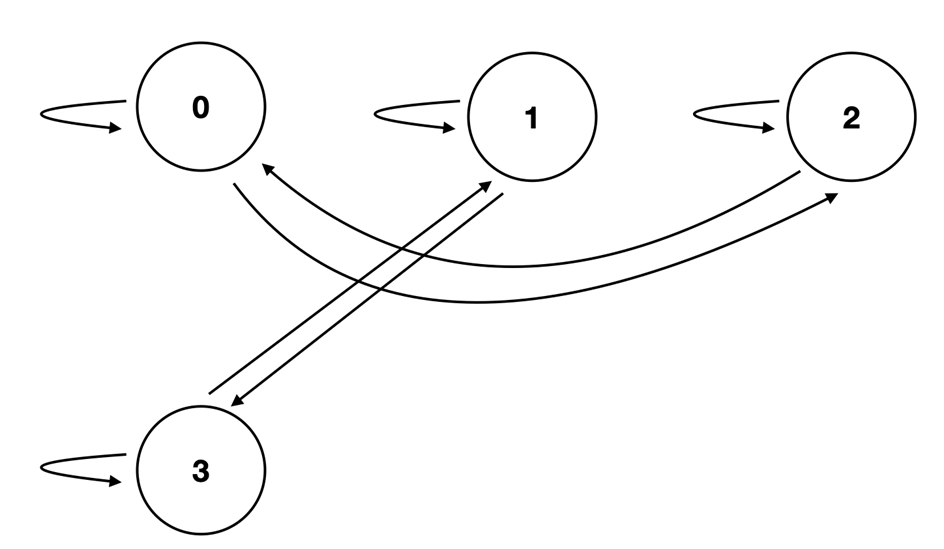

所以在转换层我们可以对SNN表示做的一个重要优化就是对SNN结构矩阵的优化，我们的目标是找到一种神经元团的划分方法，使得表示神经元团内结构矩阵的1的数量尽量多，而表示神经元团与团之间的连接的矩阵中的0的数量尽量多。该问题的数学模型可以被描述为：假设有一个N×N的矩阵S表示一个SNN网络，我们希望找到神经元1到N的一组排列，将N个神经元划分成K组，假设每组神经元的个数为n_1,n_2,...,n_K，第j组神经元团结构矩阵S_j的稀疏度的计算如下：

.. math::
  r_{j}=\frac{\left\|S_{j}\right\|_{0}}{n_{j}^{2}}

SNN结构矩阵整体的优化质量Q可以表示为

.. math::
  Q=\frac{\sum_{j=1}^{K}\left\|S_{j}\right\|_{0}}{N^{2}}

优化目标为使Q的值最大

上述问题显然属于NP，应该是一个NPC问题，待证。

