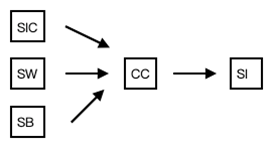
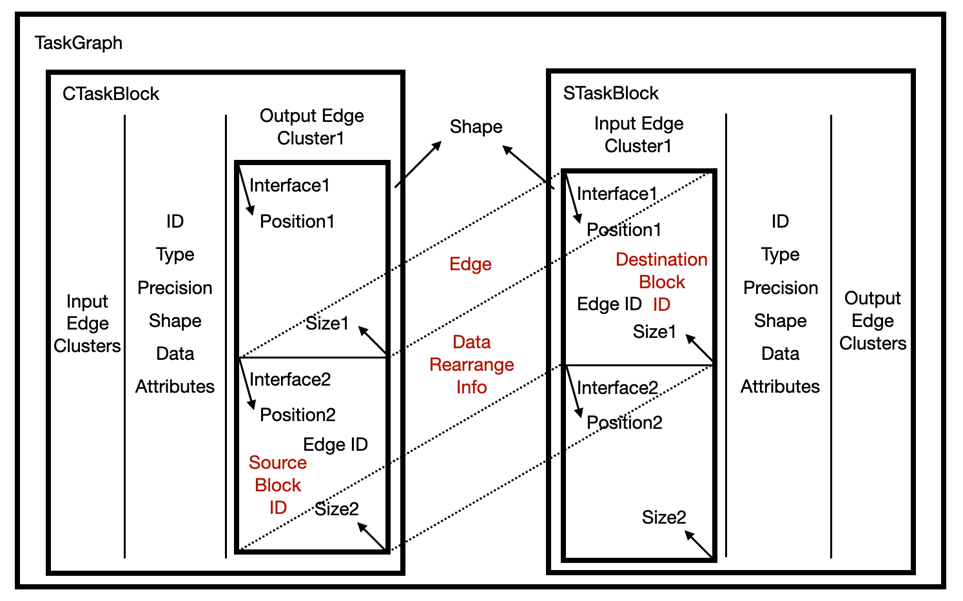
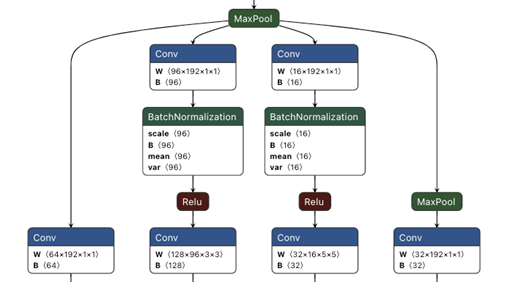
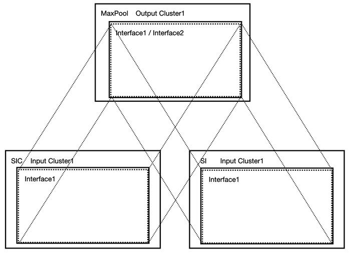
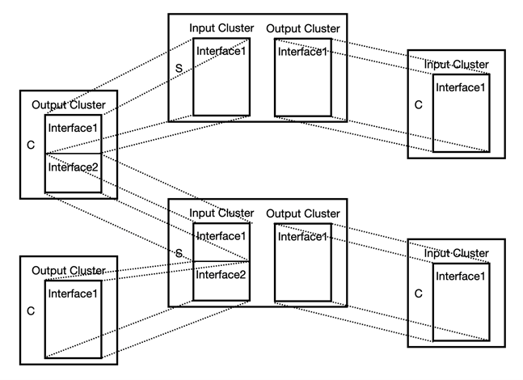
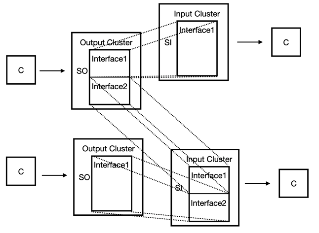

========================================================================
Task IR
========================================================================

Task IR 意义
########################################

Task IR作为转换器的输出、映射器的输入，其作用包括：

- 划定类脑计算系统的直接支持范围，支撑芯片"功能级"探索。

  - 算子类型与模型结构的支持范围。
  - 机制支持范围（如静态图还是动态图，有没有循环链接等等）。
  - 精度支持范围。
- 顶层编译的重要抽象：顶层编译的输出。

  - 对上暴露芯片功能信息，而隐藏芯片架构信息。
  - 对下统一多变的算法模型，解耦快速发展的、无法预测的算法与设计后便固定的硬件架构设计，为映射器提供方便做众核优化的输入。
- 多层验证中的一个验证点。

Task IR 高层次设计原则
########################################

**完备：** 完备的覆盖需求集合。

**图表示：** 众核类脑系统是倾向于资源去中心化的、数据流化的计算架构，所以采用图表示描述其功能性任务。

**映射优化友好，扁平化设计：** 支持在其上做一些分布式的映射优化，如结点拆分、结点融合、结点复制、共享存储、流水优化等等。这一点可能意味着层次化的IR表示不是很好，Task IR目前采用了非常轻量的层次化设计（最多只分了2层），让图的结构更加“扁平化”。

**可组合性与可扩展性：** 因为类脑众核系统本身的层次化与天然的（负载）可扩展性，Task IR层面最好也体现出局部-整体的可组合型与新的Task IR需求的可扩展性。

**统一范式：** 尽可能为Task IR创建统一的、通用的范式，使其较少的结点类型与协调的机制。统一的范式方便理解并潜在减少各种编译动作的难度。缺点在于可能限制了Task IR的针对特定功能的专用高效表达。基于此项原则，Task IR中会出现了一种类型的对象覆盖了多种算法层操作的情况。

**面向机制而不是面向算子：** Task IR的一个机制应该被设计为去通用的支持的一类功能（功能面），而不是一个特定的功能点，使得Task IR起到解耦算法生态与架构设计的作用。比如Tensor计算理论上有无限种，逐一支持常见的算子可以制作一个可用的系统，但是限制了系统灵活性与通用性。更合理的对Tensor计算进行分类，设计机制去支持每个分类。通用的描述类群而不是例子。

**执行与表达的分离：** IR的职责在于表达、传递信息，IR的执行交给应专门的执行引擎，即 :ref:`Task Rabbit` 。

**评估与表达的分离：** Task IR去除了硬件强相关（非功能相关）的一些信息，即不应该包含涉及硬件执行的评估信息，比如评估运行时钟等。通过额外的软件评估IR的统计参数，如参数量、计算量等， 即 :ref:`Task Rabbit` ， 通过额外的软件评估IR在具体芯片架构上运行的资源占用，如占用存储量、运算时钟数、通信数据量等，即 :ref:`资源级仿真器` 。

**类型、精度、维度、结构与机制的解耦：** Task IR从大致五个维度刻画算法模型，即：

  - **类型：** 图中的结点或边所承载的功能，如一般计算图模型中的算子类型。
  - **精度：** 图中结点或边的处理精度。
  - **维度：** 图中结点或边的处理的数据维度。
  - **结构：** 图中结点之间通过边的连接关系。
  - **机制：** 需要对图执行进行控制的机制，如循环执行、异步触发等等。

  这五个方面理论上最好做到互不影响的描述，以实现灵活的组合。

**增加边的复杂性从而降低图结构的复杂性：** Task IR认为一般的计算图或数据流图表示，在一些较为通用的场景中，往往会有较复杂的图结构，如非常多的结点和复杂的连接关系。复杂的图结构可能不方便自动化优化程序做更整体性的优化，并降低人类的可读性与中间层的可编程性。我们认为，在图IR设计中，或许可以适当增加边定义的复杂性（让边完成更多的事情），从而降低图结构的复杂性。

**控制流与数据流的耦合：** （1.0版本未涉及）随着算法发展越来越灵活，控制流的支持是必须的，我们希望将控制流融合进Task IR的图表达之中。

**时间与空间的耦合：** Task IR面向ANN为代表的深度学习算法和SNN为代表的神经科学算法的混合。ANN一般而言倾向于“空间”层面的信息表达与处理，而SNN的编码与运算则涉及时间维度。简单的理解，空间层面，Task IR需要表达计算之间的依赖与并行（图的基本功能），时间层面，Task IR需要做到对状态的维持，并且表达时间-空间之间的编码转换。

Task IR版本
########################################

Task IR分为1.0版本和2.0版本。1.0版本是当前已实现版本，2.0版本是未来规划版本。

1.0版本支持：

- 非循环的由固定任务块类型集组成的ANN
- 非循环的由LIF及其扩展组成的SNN
- 基本的数据重排操作（RESHAPE、PERMUTE、ROTATE、SHIFT、SCALE、SHEAR、REFLECT、AFFINE、PROJECT、SHUFFLE）

2.0版本规划支持：

- 1.0的所有功能
- 不限制维度的Tensor计算
- 循环控制
- 多样的SNN支持
- 反向传播机制
- 控制流（动态图）
- 近似组划分
- 触发控制
- 稀疏表示

下面介绍Task IR的设计与实现。

Task IR以计算图的形式展现，称为TaskGraph，主要由图结点和结点与结点之间的边两部分组成。
在TaskGraph中,我们将结点称为任务块(TaskBlock), 图中目前包含两种任务块:计算任务块(CTaskBlock)和存储任务块(STaskBlock). TaskGraph中的主要两种组件即为TaskBlock和Edge,
一个TaskGraph可以包含1/多个TaskBlock和0/1/多个Edge。

TaskBlock
########################################

每个TaskBlock一定包含:
- ID: 代表TaskBlock在TaskGraph的唯一编号
- Type: TaskBlock的类型,TaskBlock的类型只能在一个枚举类型中选择,现有的类型包括

*CADD: CAdd —> P02*::

    for (oy = 0; oy < noy; oy++) 
        for (ox = 0; ox < nox; ox++)   
            for (f = 0; f < nf; f++)      
                SO[oy][ox][f] = SB[f] (or constant_b) 
                for (kx = 0; kx < 1; kx++)       
                    for (ky = 0; ky < 1; ky++)
                        SO[oy][ox][f] += SI[oy*sy + ky][ox*sx + kx][f]

*CAVG: CAveragePool —> P02*::

    for (oy = 0; oy < noy; oy++) 
      for (ox = 0; ox < nox; ox++)  
        for (f = 0; f < nf; f++)   
          SO[oy][ox][f] = SB[f] (or constant_b)   
          for (kx = 0; kx < nky; kx++)      
            for (ky = 0; ky < nkx; ky++)       
              SO[oy][ox][f] += SI[oy*sy + ky][ox*sx + kx][f]

*CVVH: CVectorVectorHadamard —> P03*::

    for (oy = 0; oy < noy; oy++)
      for (ox = 0; ox < nox; ox++)
        for (f = 0; f < nf; f++)
          SO[oy][ox][f] = bias  [n] + SI[oy][ox][f] * SI2[oy][ox][f]
          
*CVM: CVectorMatrixMultiply —> P04*::

    for (f = 0; f < nf; f++)
      SO[f] = SB[f](or constant_b)
      for (r = 0; r < nr; r++)
        SO[f] += SW[r][f] * SI[r]

*CC: CConv —> P41; CC2D: CConv2D —> P81*::

    for (oy = 0; oy < noy; oy++)
      for (ox = 0; ox < nox; ox++)
        for (f = 0; f < nf; f++)
          SO[oy][ox][f] = SB[f]
          for (r = 0; r < nr; r++)
            for (kx = 0; kx < nkx; kx++)
              for (ky = 0; ky < nky; ky++)
                SO[oy][ox][f] += SI[oy*sy + ky][ox*sx + kx][f] * SW[f][ky][kx][r]

*CAX: CAlphaX —> P43*::

    for (oy = 0; oy < noy; oy++)
      for (ox = 0; ox < nox; ox++)
        for (f = 0; f < nf; f++)
        SO[oy][ox][f] = bias  [n] + A[f] * SI2[oy][ox][f]

*CVS: CVectorScale —> P83*::

    for (oy = 0; oy < noy; oy++)
      for (ox = 0; ox < nox; ox++)
        for (f = 0; f < nf; f++)
          SO[oy][ox][f] = bias  [n] + constant_a * SI2[oy][ox][f]

*CCMPB: CCompareBig —> P05*::

  for (oy = 0; oy < noy; oy++)
    for (ox = 0; ox < nox; ox++)
      for (f = 0; f < nf; f++)
        SO[oy][ox][f] = CMP
        for (kx = 0; kx < nkx; kx++)
          for (ky = 0; ky < nky; ky++)
            SO[oy][ox][f] = max(SI[oy*sy + ky][ox*sx + kx][f], SO[oy][ox][f])

*CCMPS: CCompareSmall —> P25*::

  for (oy = 0; oy < noy; oy++)
    for (ox = 0; ox < nox; ox++)
      for (f = 0; f < nf; f++)
        SO[oy][ox][f] = CMP
        for (kx = 0; kx < nkx; kx++)
          for (ky = 0; ky < nky; ky++)
            SO[oy][ox][f] = min(SI[oy*sy + ky][ox*sx + kx][f], SO[oy][ox][f])

*CLUT -> P07*

*CLIF -> P08*

SI: Sinput  —> 一般输入

SIC: SInputConv —> CC输入

SIC2D: SInputConv2D —> CC2D输入

SIFC: SInputFC —> CVM输入

SW: SWeight —> 一般权重

SWFC: SWeightFC —> CVM权重

SB: Sbias   —> 一般偏置向量/CAlphaX中放缩向量

SO: SOutput —> 一般输出

Precision: TaskBlock的精度，存储任务块的精度由存储数据精度决定，计算任务块的精度由计算任务块输出数据的精度决定，例如

上图中，一般情况下SIC SW精度为INT8，SB精度为INT32，CC的输出SI的精度为INT32，所以CC的精度记为INT32

TaskBlock的精度同样由一个枚举类型决定，现有的精度类型有：INT8，UINT8，INT16，UINT16，INT32，UINT32，FLOAT16，FLOAT32，TERNARY，INT9

Shape：TaskBlock的形状，从原语的功能代码中我们可以看出，一条原语最多包括6层循环，所以我们选择[y, x, f, r, ky, kx]这6个维度来表示所有任务块的形状，在有kernel size且kernel size不为常数的任务块中，补充了iy和ix两个维度，避免无法推理出输入形状

计算任务块的形状完全由对应的原语功能代码决定，即功能代码中有几个维度上的循环，则形状在对应维度上会有具有实际意义的值，形状的其余维度值为-1

=========== ==  ==  ==  ==  ===  ===  ===  ===
计算任务块   y   x   f   r   ky   kx   iy   ix
=========== ==  ==  ==  ==  ===  ===  ===  ===
CADD        ny  nx  nf  -1  1    1    -1   -1
CAVG        ny  nx  nf  -1  nky  nkx  niy  nix
CVVH        ny  nx  nf  -1  -1   -1   -1   -1
CVM         -1  -1  nf  nr  -1   -1   -1   -1
CC/CC2D     ny  nx  nf  nr  nky  nkx  niy  nix
CAX         ny  nx  nf  -1  -1   -1   -1   -1
CVS         ny  nx  nf  -1  -1   -1   -1   -1
CCMPB/CCMPS ny  nx  nf  -1  nky  nkx  niy  nix
CLUT        ny  nx  nf  -1  -1   -1   -1   -1
CLIF        ny  nx  nf  -1  -1   -1   -1   -1
=========== ==  ==  ==  ==  ===  ===  ===  ===

*存储任务块的形状如下表所示*

=========== == == == == === ===
存储任务块  y  x  f  r  ky  kx
=========== == == == == === ===
SI          ny nx nf -1 -1  -1
SIC/SIC2D   ny nx -1 nr -1  -1
SIFC        -1 -1 -1 nr -1  -1
SW          -1 -1 nf nr nky  nkx
SWFC        -1 -1 nf nr -1  -1
SB          -1 -1 nf -1 -1  -1
SO          ny nx nf -1 -1  -1
=========== == == == == === ===

*input  Clusters & Output Clusters*

一个EdgeCluster对应着当前TaskBlock的一个输入或输出，即一个TaskBlock有几个输入就有几个input  edge cluster，
有几个输入就有几个output edge cluster。多输入的情况很普遍，除了CCMPB和CCMPS以外的计算任务块都可能需要多个输入；
多输出的情况比较少见，目前可能见到的多输出存在于C-DFG中的switch结点。EdgeCluster中包含一个Shape和一个或多个Interface，
Shape为当前EdgeCluster对应的输入或输出的形状，Interface可以简单理解为对应着输入或输出的一部分，在下图中，
我们假设左边的计算任务块对应的输出边簇1的形状为3*224*224（忽略了为-1的维度），
2个Interface可以各对应一个形状为3*224*112的部分，
则Interface1的position为(0, 0, 0)，size为(3, 224, 112)，相应的，
Interface2的position为(0, 0, 112)，size为(3, 224, 112)。
不同任务块的Interface与Interface之间会形成边，
所以在每个Interface中还会记录对应边的ID。

以GoogleNet的一部分为例.最上面的MaxPool的会有一个输出边簇，这个输出边簇包含两个Interface，
这是由于与MaxPool相连的一共有4个计算任务块：3个Conv和1个MaxPool，
而卷积的输入对应的存储任务块和MaxPool的输入对应的存储任务块是不同的，
所以最上层的MaxPool输出的数据会对应着两个形状
不同的存储任务块，也就是说MaxPool这个计算结点会连向两个存储任务块，
这就解释了为什么这个计算结点唯一的输出边簇中会有两个Interface。
同时，这两个Interface的position和size是相通的，position为(0, 0, 0)，
size为输出边簇的形状，也就是说这两个Interface完全重叠，且每个Interface对应输出边簇的全部数据，
两个Interface唯一不同的是会对应两条不一样的边，所以存储的Edge ID会不同。这里要注明的是：
最上面的MaxPool连接的两个存储任务块的输入边簇中唯一的Interface的形状和对应的MaxPool输出边簇中的Interface形状是相同的，
接下来要连接卷积的存储任务块的输出边簇的Interface的形状会因下一个计算结点是卷积而发生改变。上述过程可以通
过下图来解释：

下面的表格对所有计算任务块和存储任务块输入输出边簇的形状进行说明：

*CADD*

输入簇

======  ==  ==  ==  ==  ==  ==
name    y   x   f   r   ky  kx
======  ==  ==  ==  ==  ==  ==
input1  ny  nx  nf  -1  -1  -1
input2  ny  nx  nf  -1  -1  -1
inputn  ny  nx  nf  -1  -1  -1
bias    -1  -1  nf  -1  -1  -1
======  ==  ==  ==  ==  ==  ==

输出簇

======  ==  ==  ==  ==  ==  ==
name    y   x   f   r   ky  kx
======  ==  ==  ==  ==  ==  ==
output  ny  nx  nf  -1  -1  -1
======  ==  ==  ==  ==  ==  ==

*CAVG*

输入簇

======  ==  ==  ==  ==  ==  ==
name    y   x   f   r   ky  kx
======  ==  ==  ==  ==  ==  ==
input   ny  nx  nf  -1  -1  -1
bias    -1  -1  nf  -1  -1  -1
======  ==  ==  ==  ==  ==  ==

输出簇

======  ==  ==  ==  ==  ==  ==
name    y   x   f   r   ky  kx
======  ==  ==  ==  ==  ==  ==
output  ny  nx  nf  -1  -1  -1
======  ==  ==  ==  ==  ==  ==

*CVVH*

输入簇

======  ==  ==  ==  ==  ==  ==
name    y   x   f   r   ky  kx
======  ==  ==  ==  ==  ==  ==
input1  ny  nx  nf  -1  -1  -1
input2  ny  nx  nf  -1  -1  -1
bias    -1  -1  nf  -1  -1  -1
======  ==  ==  ==  ==  ==  ==

输出簇

======  ==  ==  ==  ==  ==  ==
name    y   x   f   r   ky  kx
======  ==  ==  ==  ==  ==  ==
output  ny  nx  nf  -1  -1  -1
======  ==  ==  ==  ==  ==  ==

*CVM*

输入簇

======  ==  ==  ==  ==  ==  ==
name    y   x   f   r   ky  kx
======  ==  ==  ==  ==  ==  ==
input   -1  -1  -1  nr  -1  -1
weight  -1  -1  nf  nr  -1  -1
bias    -1  -1  nf  -1  -1  -1
======  ==  ==  ==  ==  ==  ==

输出簇

======  ==  ==  ==  ==  ==  ==
name    y   x   f   r   ky  kx
======  ==  ==  ==  ==  ==  ==
output  -1  -1  nf  -1  -1  -1
======  ==  ==  ==  ==  ==  ==

*CAX*

输入簇

===== == == == == == ==
name  y  x  f  r  ky kx
===== == == == == == ==
input ny nx nf -1 -1 -1
alpha -1 -1 nf -1 -1 -1
bias  -1 -1 nf -1 -1 -1
===== == == == == == ==

输出簇

====== == == == == == ==
name   y  x  f  r  ky kx
====== == == == == == ==
output ny nx nf -1 -1 -1
====== == == == == == ==

*CC/CC2D*

输入簇

======  ==  ==  ==  == ===  ===
name    y   x   f   r  ky   kx
======  ==  ==  ==  == ===  ===
input   ny  nx  -1  nr -1   -1
weight  -1  -1  nf  nr nky  nkx
bias    -1  -1  nf  -1 -1   -1
======  ==  ==  ==  == ===  ===

输出簇

====== ==  ==  ==  == ==  == 
name   y   x   f   r  ky  kx
====== ==  ==  ==  == ==  == 
output ny  nx  nf  -1 -1  -1
====== ==  ==  ==  == ==  ==

*CVS*

输入簇

====== ==  ==  ==  ==  ==  ==
name   y   x   f   r   ky  kx
====== ==  ==  ==  ==  ==  ==
input  ny  nx  nf  -1  -1  -1
bias   -1  -1  nf  -1  -1  -1
====== ==  ==  ==  ==  ==  ==

输出簇

====== ==  ==  ==  ==  ==  ==
name   y   x   f   r   ky  kx
====== ==  ==  ==  ==  ==  ==
output ny  nx  nf  -1  -1  -1
====== ==  ==  ==  ==  ==  ==

*CCMPB/CCMPS*

输入簇

====== ==  ==  ==  ==  ==  ==
name   y   x   f   r   ky  kx
====== ==  ==  ==  ==  ==  ==
input  ny  nx  nf  -1  -1  -1
====== ==  ==  ==  ==  ==  ==

输出簇

====== ==  ==  ==  ==  ==  ==
name   y   x   f   r   ky  kx
====== ==  ==  ==  ==  ==  ==
output ny  nx  nf  -1  -1  -1
====== ==  ==  ==  ==  ==  ==

*CLUT*

输入簇

====== ==  ==  ==  ==  ==  ==
name   y   x   f   r   ky  kx
====== ==  ==  ==  ==  ==  ==
input  ny  nx  nf  -1  -1  -1
====== ==  ==  ==  ==  ==  ==

输出簇

====== ==  ==  ==  ==  ==  ==
name   y   x   f   r   ky  kx
====== ==  ==  ==  ==  ==  ==
output ny  nx  nf  -1  -1  -1
====== ==  ==  ==  ==  ==  ==

*CLIF*

输入簇
 
====== ==  ==  ==  ==  ==  ==
name   y   x   f   r   ky  kx
====== ==  ==  ==  ==  ==  ==
input  ny  nx  nf  -1  -1  -1
====== ==  ==  ==  ==  ==  ==

输出簇

====== ==  ==  ==  ==  ==  ==
name   y   x   f   r   ky  kx
====== ==  ==  ==  ==  ==  ==
output ny  nx  nf  -1  -1  -1
====== ==  ==  ==  ==  ==  ==

*SI*

输入簇

====== ==  ==  ==  ==  ==  ==
name   y   x   f   r   ky  kx
====== ==  ==  ==  ==  ==  ==
input  ny  nx  nf  -1  -1  -1
====== ==  ==  ==  ==  ==  ==

输出簇

====== ==  ==  ==  ==  ==  ==
name   y   x   f   r   ky  kx
====== ==  ==  ==  ==  ==  ==
output ny  nx  nf  -1  -1  -1
====== ==  ==  ==  ==  ==  ==

*SIC/SIC2D*

输入簇

====== ==  ==  ==  ==  ==  ==
name   y   x   f   r   ky  kx
====== ==  ==  ==  ==  ==  ==
input  ny  nx  nf  -1  -1  -1
====== ==  ==  ==  ==  ==  ==

输出簇

====== ==  ==  ==  ==  ==  ==
name   y   x   f   r   ky  kx
====== ==  ==  ==  ==  ==  ==
output ny  nx  -1  Nr  -1  -1
====== ==  ==  ==  ==  ==  ==

*SIC/SIC2D*

输入簇

====== ==  ==  ==  ==  ==  ==
name   y   x   f   r   ky  kx
====== ==  ==  ==  ==  ==  ==
input  ny  nx  nf  -1  -1  -1
====== ==  ==  ==  ==  ==  ==

输出簇

====== ==  ==  ==  ==  ==  ==
name   y   x   f   r   ky  kx
====== ==  ==  ==  ==  ==  ==
output ny  nx  -1  Nr  -1  -1
====== ==  ==  ==  ==  ==  ==

*SIFC*

输入簇

====== ==  ==  ==  ==  ==  ==
name   y   x   f   r   ky  kx
====== ==  ==  ==  ==  ==  ==
input  -1  -1  nf  -1  -1  -1
====== ==  ==  ==  ==  ==  ==

输出簇

====== ==  ==  ==  ==  ==  ==
name   y   x   f   r   ky  kx
====== ==  ==  ==  ==  ==  ==
output -1  -1  -1  nr  -1  -1
====== ==  ==  ==  ==  ==  ==

*SW*

输入簇

====== ==  ==  ==  ==  ===  ===
name   y   x   f   r   ky   kx
====== ==  ==  ==  ==  ===  ===
input  -1  -1  nf  nr  nky  nkx
====== ==  ==  ==  ==  ===  ===

====== ==  ==  ==  ==  ===  ===
name   y   x   f   r   ky   kx
====== ==  ==  ==  ==  ===  ===
output -1  -1  nf  nr  nky  nkx
====== ==  ==  ==  ==  ===  ===

*SWFC*

输入簇

===== ==  ==  ==  ==  ==  ==
name  y   x   f   r   ky  kx
===== ==  ==  ==  ==  ==  ==
input -1  -1  nf  nr  -1  -1
===== ==  ==  ==  ==  ==  ==

输出簇

======  ==  ==  ==  ==  ==  ==
name    y   x   f   r   ky  kx
======  ==  ==  ==  ==  ==  ==
output  -1  -1  nf  nr  -1  -1
======  ==  ==  ==  ==  ==  ==

*SB*

输入簇

===== ==  ==  ==  ==  ==  ==
name  y   x   f   r   ky  kx
===== ==  ==  ==  ==  ==  ==
input -1  -1  nf  -1  -1  -1
===== ==  ==  ==  ==  ==  ==

输出簇

====== ==  ==  ==  ==  ==  ==
name   y   x   f   r   ky  kx
====== ==  ==  ==  ==  ==  ==
output -1  -1  nf  -1  -1  -1
====== ==  ==  ==  ==  ==  ==

*SO*

SO的输入簇形状和上一个任务块的输出簇形状一样，SO没有输出簇

另一种对Input Clusters和Output Clusters的设计（V2版本）

现有的存储模式下，计算任务块和存储任务块都具有输入输出边簇可能存在一定的冗余。例如在当前IR设计下，我们有下图中展示的一个TaskGraph
如果只让存储任务块中有输入/输出边簇，上述TaskGraph也可以表示为

每个TaskBlock可能包括：

Data: SW SWFC SB三种任务块会包含数据，数据的存储包含三种信息：张量的形状，形状只包含六面体形状中不为-1的维度，即SW中存储数据的形状为[nf, nr, nky, nkx]，SWFC中存储数据形状为[nf, nr]，SB中存储数据形状为[nf]；张量的数据精度，精度必须从TaskBlock精度的枚举类型中取值；张量的数据，存储的数据为一维格式，将高维张量展成一维向量时的顺序为张量形状的顺序，根据张量的数据类型不同，在proto文件中的存储容器不同，TERNARY INT8 INT9 INT16 INT32的存储容器为int32_data，UINT8 UINT16 UINT32的存储容器为uint32_data，FLOAT16 FLOAT32的存储容器为float_data，通过不同容器存储的原因是protobuf中有一套预定义的数据类型，不同的数据类型打包方式不同

Attributes：任务块的属性或参数，每一个attribute会包含类型和值，attribute的类型只能在一个枚举类型中取值，现有的attribute类型包括：

- KERNEL_X KERNEL_Y （适用于CAVG CC CC2D CCMPB CCMPS）
- STRIDE_X STRIDE_Y（适用于CAVG CC CC2D CCMPB CCMPS）
- PAD_UP PAD_DOWN PAD_LEFT PAD_RIGHT （适用于CAVG CC CC2D CCMPB CCMPS）DILATION_X
- DILATION_Y（适用于CC CC2D）
- CMP（适用于CCMPB CCMPS）
- CONST_A（适用于CVS）
- CONST_B（适用于CVM CAVG）
- Attribute的值是对应的参数值，参数值有两个容器，整数参数值存储在int_value中，浮点数参数值存储在float_value中

Edge
########################################

每条Edge一定包含：

- ID：代表Edge在TaskGraph的唯一编号
- Source Block ID：代表边上数据来源的任务块，一定为存储任务块的编号
- Destination Block ID：代表边上数据目的地的任务块，一定为存储任务块的编号
- Data Rearrange Info：数据重排信息，每一条数据重排信息会包含数据重排的类型和数据重排对应的函数转换，数据重排的类型只能在一个枚举类型中取值，现有的数据重排类型包括（下面的举例只考虑二维平面，因为三维不好画，图中的编号指的是在内存中的地址）：

  + IDENTITY 不进行数据重排
  + RESHAPE Reshape操作，例如将二维矩阵展成一维向量，将4*3的矩阵转成3*4的矩阵，这里我们只将不改变数据读取顺序的操作称为RESHAPE.假设变换前的HW为 :math:`(h_1,w_1)`，变换后的HW为(h_2,w_2)
 
  .. image:: _static/edge1.png
    :scale: 70
    :align: center

  + PERMUTE 转置操作，例如二维矩阵的转置

  .. image:: _static/edge2.png
   :scale: 70
   :align: center

  + SHIFT 平移操作，平移操作可分为两种，循环平移和补零平移，图中展示了向左循环平移和向左上循环平移
  
  .. image:: _static/edge3.png
    :scale: 70
    :align: center
     
  + 复合循环平移操作可以拆解为多个单方向循环平移操作，单方向循环平移操作可以通过矩阵初等行列变化实现：
  
    + 向左循环平移一个单位：假设原矩阵为 :math:`V∈R^{m×n}`，变换矩阵为右乘一个n×n的0-1矩阵，其中矩阵的(j+1,j)j=0,1,...,n-2位置为1，(0,n-1)位置为1，其余位置为0
    + 向右循环平移一个单位：假设原矩阵为 :math:`V∈R^{m×n}`，变换矩阵为右乘一个n×n的0-1矩阵，其中矩阵的(j,j+1)j=0,1,...,n-2位置为1，(n-1,0)位置为1，其余位置为0
    + 向上循环平移一个单位：假设原矩阵为 :math:`V∈R^{m×n}`，变换矩阵为左乘一个m×m的0-1矩阵，其中矩阵的(j,j+1)j=0,1,...,m-2位置为1，(m-1,0)位置为1，其余位置为0
    + 向下循环平移一个单位：假设原矩阵为 :math:`V∈R^{m×n}`，变换矩阵为左乘一个m×m的0-1矩阵，其中矩阵的(j+1,j)j=0,1,...,m-2位置为1，(0,m-1)位置为1，其余位置为0

  + 补零平移：

    + 向左补零平移一个单位：x=u-1,y=v，当x=m时，补零
    + 向右补零平移一个单位：x=u+1,y=v，当x=0时，补零
    + 向上补零平移一个单位：x=u,y=v-1，当y=n时，补零
    + 向下补零平移一个单位：x=u,y=v+1，当y=0时，补零
  
  + ROTATE 旋转操作，只考虑以90度为间隔的旋转，如逆时针旋转90度，旋转180度

  .. image:: _static/edge4.png
    :scale: 70
    :align: center

  二维的旋转可表示为

  .. math::
    \left(\begin{array}{l}
    x \\
    y
    \end{array}\right)=\left(\begin{array}{cc}
    \cos \theta & -\sin \theta \\
    \sin \theta & \cos \theta
    \end{array}\right)\left(\begin{array}{l}
    u \\
    v
    \end{array}\right)

  + SCALE 放缩操作，只考虑整数倍的放大（上采样）或缩小（下采样）

    .. image:: _static/edge5.png
      :scale: 70
      :align: center
    ..

    假设放大倍数为(k,l)倍，放大前矩阵大小为(m,n)，放大后矩阵的大小即为(km,ln)

    下面的公式说明x/y到u/v是单射，但u/v到x/y不是单射

    x=ku，当x%k=0

    当x%k≠0，u=⌊x/k⌋

    y=lv，当y%l=0

    当y%l≠0，v=⌊y/l⌋

  + 缩小的操作类似于池化，我们可以用MaxPool或者AveragePool来实现

    .. image:: _static/edge6.png
      :scale: 70
      :align: center

    图中这种CenterPool（我自己起的名）暂时不考虑
  
  + SHEAR 剪切操作，剪切操作也包括两种，循环剪切和补零剪切，下图中间结果为向右的补零剪切, 右边结果为展示了向右的循环剪切

    .. image:: _static/edge7.png
      :scale: 70
      :align: center

    二维的剪切可表示为

    .. math::
      \left(\begin{array}{l}
      x \\
      y
      \end{array}\right)=\left(\begin{array}{ll}
      1 & a \\
      b & 1
      \end{array}\right)\left(\begin{array}{l}
      u \\
      v
      \end{array}\right)

    假设原有矩阵的形状为m×n，则按照补零剪切得到的新矩阵大小为(m+an,n+mb)，除了原来m×n矩阵对应的元素以外的位置补0。
    循环剪切太麻烦了，也没什么用，这里先不讨论了…

  + REFLECTION 镜像操作，只考虑上下翻转和左右翻转。上下翻转和左右翻转的的镜像矩阵分别为

    .. image:: _static/edge8.png
      :scale: 70
      :align: center

    .. math::
      \left(\begin{array}{l}
      x \\
      y
      \end{array}\right)=\left(\begin{array}{cc}
      1 & 0 \\
      0 & -1
      \end{array}\right)\left(\begin{array}{l}
      u \\
      v
      \end{array}\right)

      \left(\begin{array}{l}
      x \\
      y
      \end{array}\right)=\left(\begin{array}{cc}
      -1 & 0 \\
      0 & 1
      \end{array}\right)\left(\begin{array}{l}
      u \\
      v
      \end{array}\right)

    另一种表示方法仍然是通过初等行列变换实现

    对于左右翻转，假设原矩阵为:math:`V∈R^(m×n)`，变换矩阵为右乘一个n×n的0-1矩阵，其中矩阵的(i,n-i-1)i=0,1,...,n-1位置为1，其余位置为0

    对于上下翻转，假设原矩阵为:math:`V∈R^(m×n)`，变换矩阵为左乘一个m×m的0-1矩阵，其中矩阵的(i,m-i-1)i=0,1,...,m-1位置为1，其余位置为0

  + AFFINE 仿射变换操作，SHIFT + ROTATE + SCALE + SHEAR + RELECTION = AFFINE

  + PROJECT 透视变换操作

      仿射变换是透视变换的一种特殊情形
      
      一般的仿射变换可以写成

    .. math::

      \begin{aligned}
      &x=a_{11} u+a_{12} v+b_{1} \\
      &y=a_{21} u+a_{22} v+b_{2} \\
      &\left(\begin{array}{l}
      x \\
      y
      \end{array}\right)=\left(\begin{array}{lll}
      a_{11} & a_{12} & b_{1} \\
      a_{21} & a_{22} & b_{2}
      \end{array}\right)\left(\begin{array}{l}
      u \\
      v \\  
      1
      \end{array}\right)
      \end{aligned}

    一般的透视变换可以写成

    .. math::

      \begin{aligned}
      &x=a_{11} u+a_{12} v+b_{1} \\
      &y=a_{21} u+a_{22} v+b_{2} \\
      &z=a_{31} u+a_{32} v+b_{3} \\
      &\left(\begin{array}{l}
      x \\
      y \\
      z
      \end{array}\right)=\left(\begin{array}{lll}
      a_{11} & a_{12} & b_{1} \\
      a_{21} & a_{22} & b_{2} \\
      a_{31} & a_{32} & b_{3}
      \end{array}\right)\left(\begin{array}{l}
      u \\
      v \\
      1
      \end{array}\right) \\
      &x^{\prime}=x / z \\
      &y^{\prime}=y / z
      \end{aligned}

    仿射变换后平行四边形的各边仍保持平行，透视变换后四边形的各边可以不保持平行

    + SHUFFLE Shuffle操作，最一般的情况可以做到任意点之间的shuffle，但我们常用的还是有规律的shuffle，下图中展示的为一个二维矩阵列之间的shuffle

      .. image:: _static/edge9.png
        :scale: 70
        :align: center

      上述操作可以通过矩阵的初等行列变换实现
      可以给原矩阵右乘

      .. math::
        \left(\begin{array}{llll}
        0 & 0 & 1 & 0 \\
        1 & 0 & 0 & 0 \\
        0 & 0 & 0 & 1 \\
        0 & 1 & 0 & 0
        \end{array}\right)

      如果是任意点之间的shuffle，如下图中的例子

      .. image:: _static/edge10.png
        :scale: 70
        :align: center

      一种想法是先将原矩阵A与下面的0-1矩阵B按元素相乘

      .. math::
        \begin{aligned}
        &B=\left(\begin{array}{llll}
        0 & 0 & 0 & 0 \\
        0 & 1 & 0 & 0 \\
        0 & 0 & 0 & 1
        \end{array}\right) \\
        &C=A \circ B \\
        &D=A-C
        \end{aligned}

      将C进行初等行列变换

      .. math::
        \begin{aligned}
        &P_{1}=\left(\begin{array}{lll}
        1 & 0 & 0 \\
        0 & 0 & 1 \\
        0 & 1 & 0
        \end{array}\right) \\
        &P_{2}=\left(\begin{array}{llll}
        1 & 0 & 0 & 0 \\
        0 & 0 & 0 & 1 \\
        0 & 0 & 1 & 0 \\
        0 & 1 & 0 & 0
        \end{array}\right) \\
        &E=P_{1} C P_{2} \\
        &F=D+E
        \end{aligned}

      另一种思路是通过判断来表示::

        If u == 1 and v == 1:
          x = 2
          y = 3
        If u == 2 and v == 3:
            x = 1
            y = 1
        else
            x = u
            y = v

多输出问题
########################################

TaskGraph通过边簇的概念可以很容易地支持多输出，不同的边簇代表不同的输出，同一边簇的不同接口可以用来表示数据的复制，所以不存在多输出和复制的混淆问题。