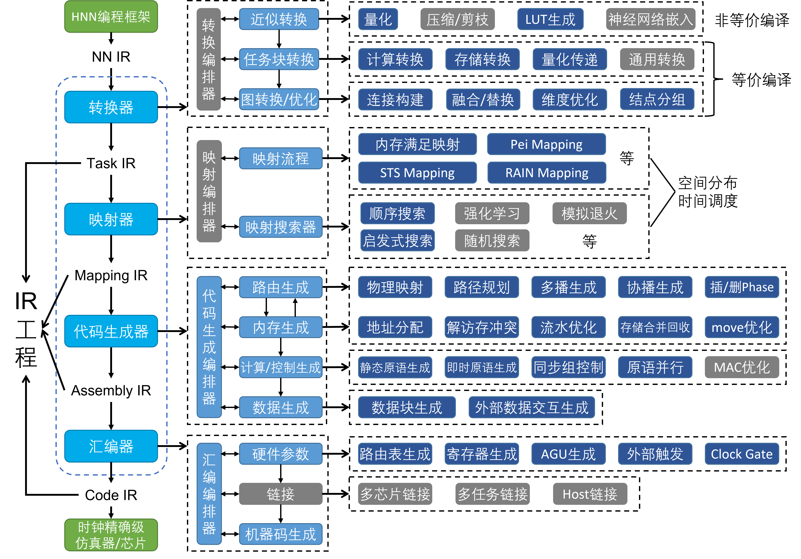
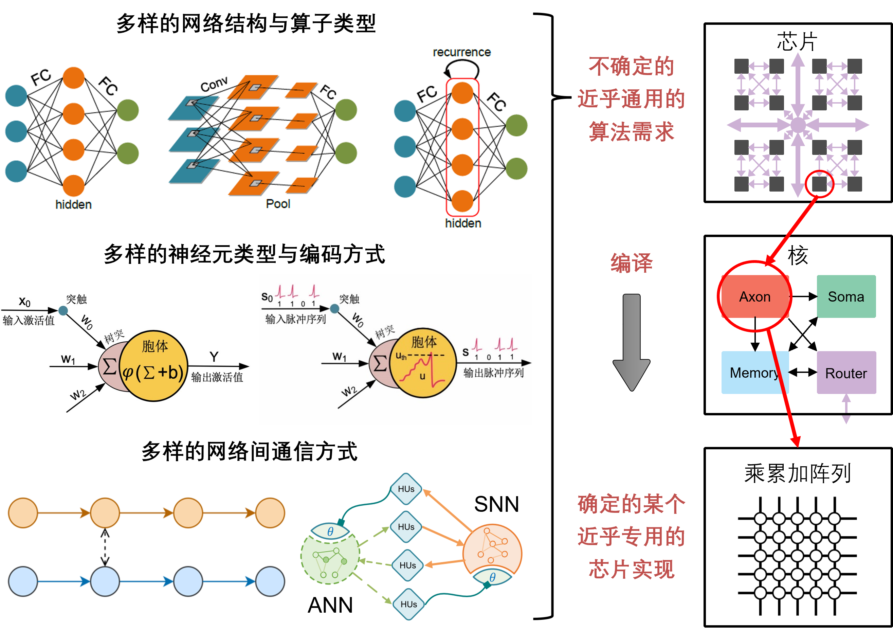
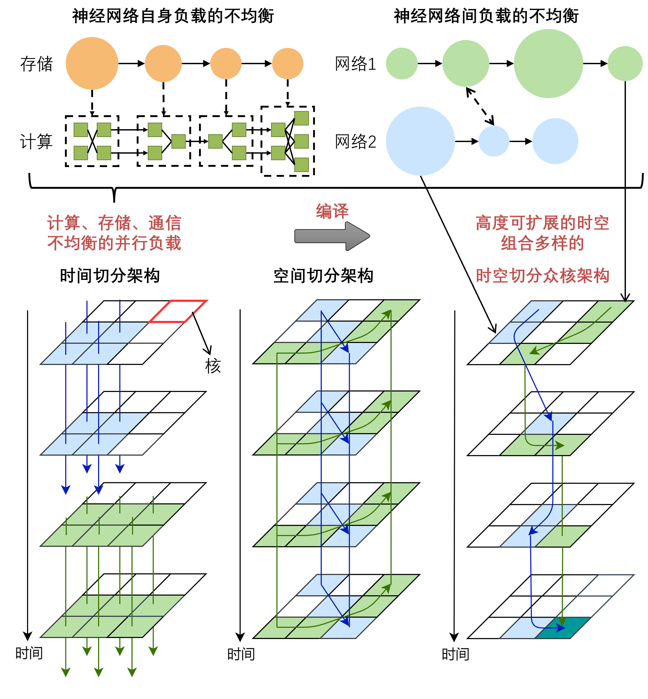
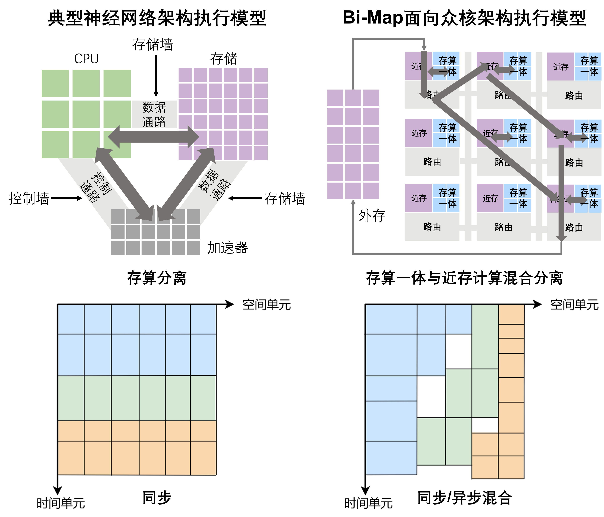
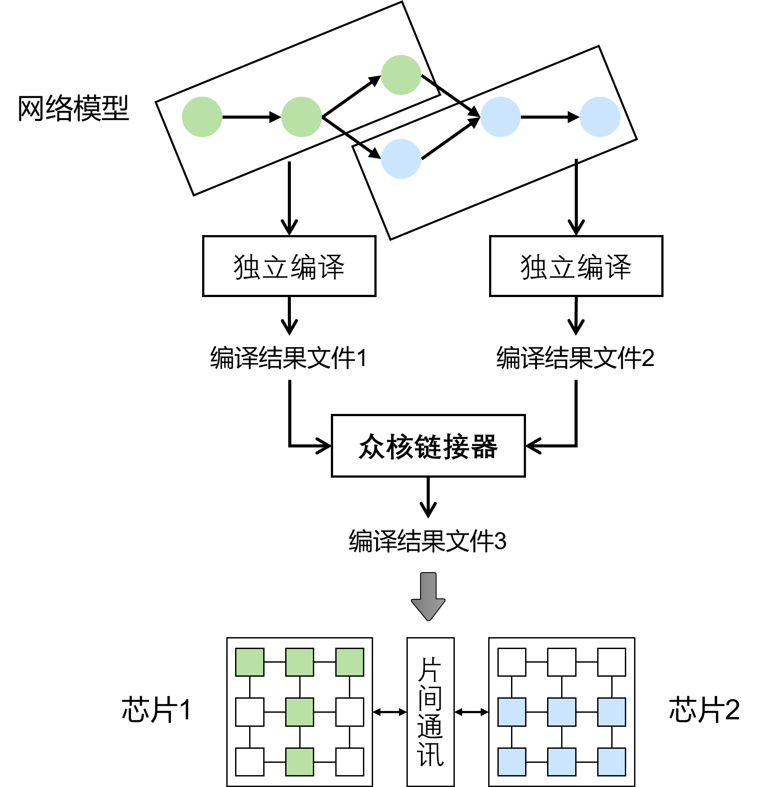
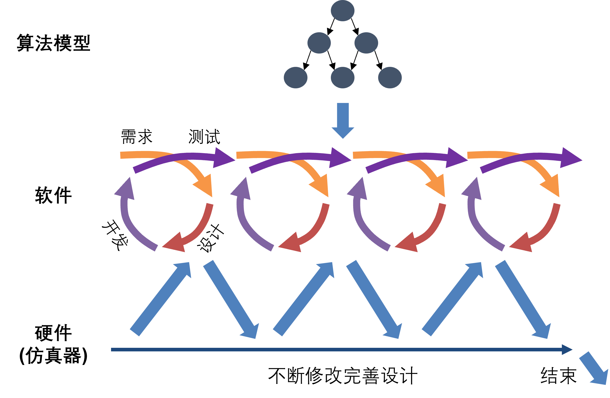

编译栈
========

灰色部分对于一个完整的编译架构也非常重要，但未在本工程中实现。

Bi-Map中的类脑编译栈需要解决如下挑战：

**在高效的专用硬件上部署更通用的算法模型**

众核类脑编译器面向多样的且在不断变化中的类脑模型，这些模型的多样性体现在：

- **神经网络结构：** 全连接、卷积、循环神经网络、Transformer等等。在某些SNN模型中，神经元之间的连接可能是稀疏且无规律的。
- **神经网络算子：** 最基本的神经网络算子包括各种张量的线性操作，如矩阵乘、卷积等，以及基础的非线性操作，如ReLU。但随着神经网络的发展，五花八门的算子被用到了神经网络中，实际上没有规定什么样的计算不能被用到神经网络中。算子的多样性也体现在算子计算的精度上，神经网络加速硬件可能会采用低精度的方式（整型精度）进行计算，网络中也可能会出现混合精度的情况。
- **多样的神经元类型：** Bi-Map面向ANN、SNN和二者的混合（HNN）。ANN和SNN采用不同的神经元类型，其中SNN神经元本身种类又丰富多彩，从最基础的LIF神经到生物置信度高的HH模型。这些神经元模型的差异性巨大，而且可能在网络中混合的出现。
- **编码方式：** 一般而言，ANN和SNN采用不同的编码方式，ANN采用幅值近似连续但时间离散的编码方式，SNN往往采用时间维度近似连续但幅值离散的编码方式。SNN本身也存在多种编码方式，如Rate Coding、Temporal Coding、Burst Coding等。
- **网络间通信：** 在多网络的情境中，网络之间经常会有通信的要求，其可以进一步分为同步的通信与异步的通信。在HNN中，需要做到两种编码方式的转换，以完成通信。
- **控制流与数据流的融合：** 随着神经网络模型越来越灵活，动态神经网络模型也不断出现，很多类脑范式的应用（具有类脑模型的特点，但不是神经网络）也希望可以在类脑架构上的发挥潜力。这些任务在大量的数据流过程中，也包含了多样的控制流操作，也应当纳入类脑系统，尤其是旨在发展通用性的类脑系统的考虑。目前，Bi-Map还无法处理控制流，我们希望未来可以加入这方面的支持。

深度学习和类脑计算的算法模型在不断发展，它们的多样性给计算系统带来了一个要求：要具备近似通用的能力，但在“类脑范式”的模型上有更好的性能。然而，在具体的计算系统中，硬件通常是固定的，且通常是以较为专用的方式设计的。因此，编译器需要建立模型多样性与硬件专用性之间的桥梁。我们将通过 :ref:`IR工程`  和 :ref:`转换器` 来解决这一挑战。

**充分利用众核硬件复杂的时空资源**

多样的算法模型之中，有很多模型拥有非常不均衡的计算、存储、路由负载，这为高性能的部署类脑模型带来了困难。举例来说，众核架构以核为单位完成计算，核内的存算一体单元，存储计算比一般固定，而高效的近存计算存储大小也有限。这意味着如果核内负载的存储计算比过高，则核的计算利用率会比较低，造成整体吞吐下降；存储计算比过低，则该核可能浪费了很多宝贵的片上存储单元。因此，针对各种模型的通用负载均衡映射方案就显得尤为重要。

一般的神经架构采用时间切分的方式执行不同操作，而很多传统的类脑计算很多采用空间切分方式，即一个核只能部署一个任务，任务切换往往意味着长时间的重配置过程。Bi-Map面向时空资源可灵活切分的架构，即同一时刻，可以有多个不同的并行负载运行，同一个核也可以快速的在不同任务间进行切换。这样的时空切分架构提供了更灵活的时空资源利用方式，为负载均衡奠定了硬件基础，同时也使硬件具有高度的可扩展性。但时空资源组合的多样性也为编译器提出了更高的要求，我们将在 :ref:`映射器` 介绍如何充分利用众核时空切分硬件的能力。

**提供编译策略的试验和创造工厂**

Bi-Map的编译探索框架应该允许人们实验各种各样的编译策略，且提供易用的探索环境创造出新的编译策略，该部分内容见 :ref:`映射器` 。

**针对分布式存储-路由协同、同步异步混合的执行模型进行编译优化**

Bi-Map针对的类脑众核架构的 :ref:`执行模型` 与典型的神经网络加速架构执行模型有所不同，其中比较突出的是：

- **分布式近存计算与存算一体混合：** 每个核通过存算一体单元（存算比固定）进行高速并行运算，通过近存计算（存算比可变）实现灵活的任务执行，通过层次化共享存储实现资源复用（图中未画）。核之间通过路由网络连接分布式的资源。在这种架构下的任务执行中，计算-存储-路由三个执行模块会紧密耦合，任何一方的变动都会影响整体性能。在 :ref:`代码生成器` 层面，存储-路由协同优化变得极为重要，二者需看作一个整体优化。
- **同步与异步的混合：** 在任务执行时，不同的核可以划分到不同的同步组与异步组中。同步/异步造成的时空资源利用问题，会在 :ref:`映射器` 中解决，而同步/异步造成的一些控制问题，则会在 :ref:`代码生成器` 中解决。

**构建可扩展的众芯片链接过程**

类脑众核芯片往往会组成芯片阵列，以发挥其可扩展性实现大规模算力服务。而针对多个芯片的编译流程往往运行速度慢，且优化空间巨大。所以和传统CPU系统一样，提供智能算力服务的众核架构也存在多芯片或多任务分别编译，之后链接在一起的需求。Bi-Map目前没有实现众核链接，但在 :ref:`汇编器` 中进行了部分讨论。 

**建立类脑软硬件敏捷开发流程**

众核编译器需要基于众核部署与策略探索框架建立一套软硬协同开发的标准化流程，用软件的快速迭代在各个层次驱动硬件的设计。

-------------------

.. toctree::
   :maxdepth: 3
   :caption: 目录:

   IR工程/index
   转换器/index
   映射器/index
   代码生成器/index
   汇编器/index

.. Indices and tables
.. ==================

.. * :ref:`genindex`
.. * :ref:`modindex`
.. * :ref:`search`
