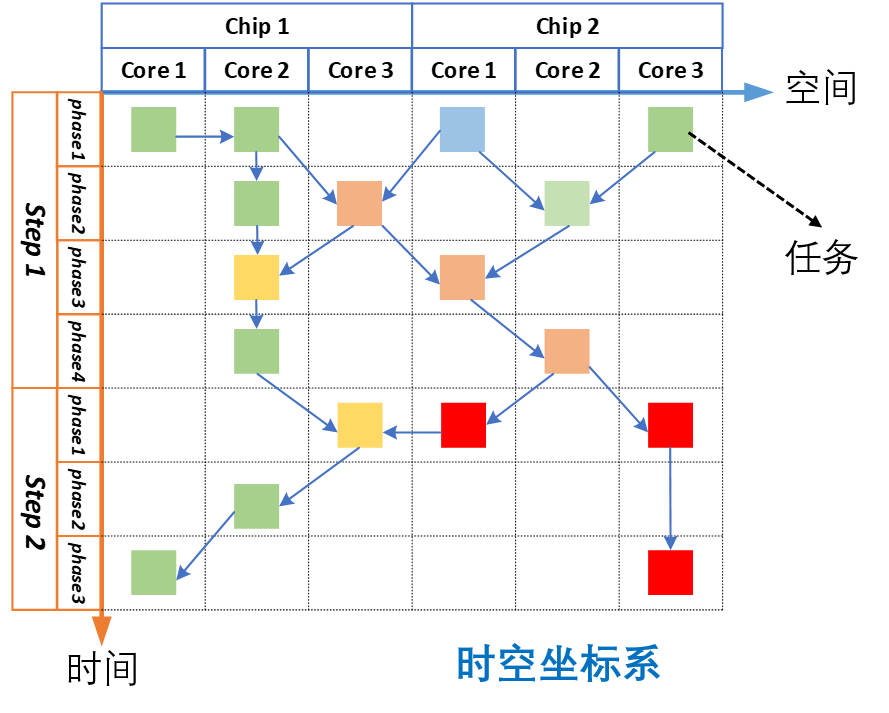
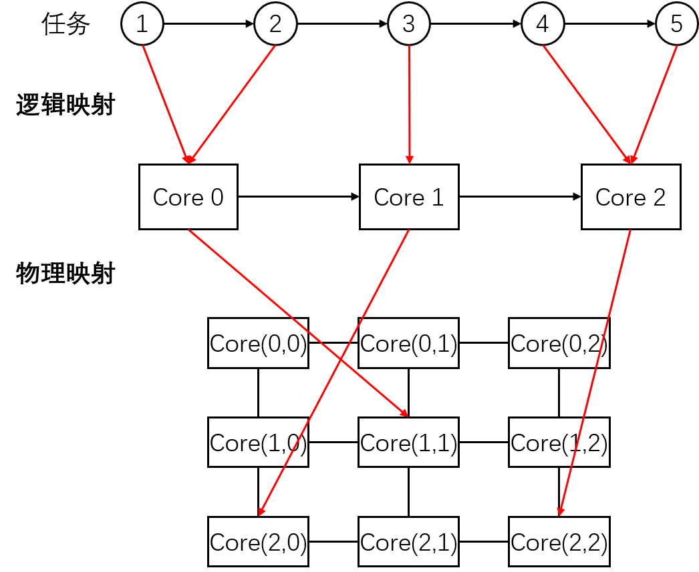
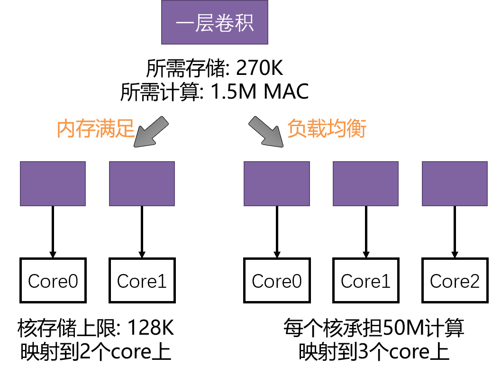
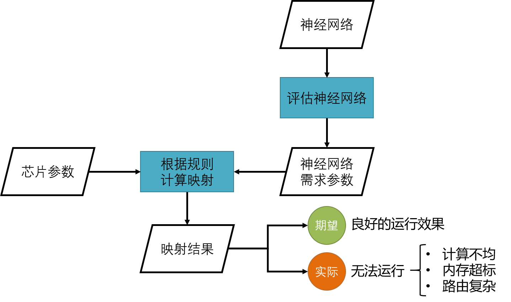
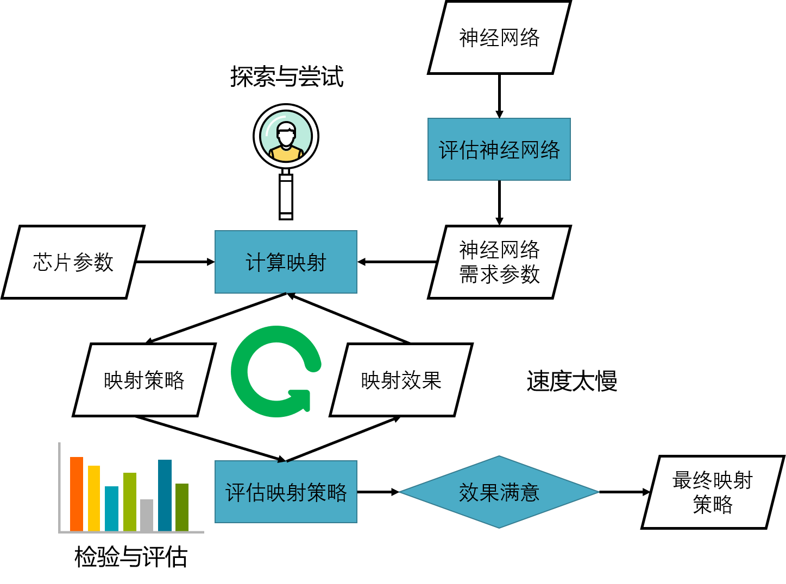
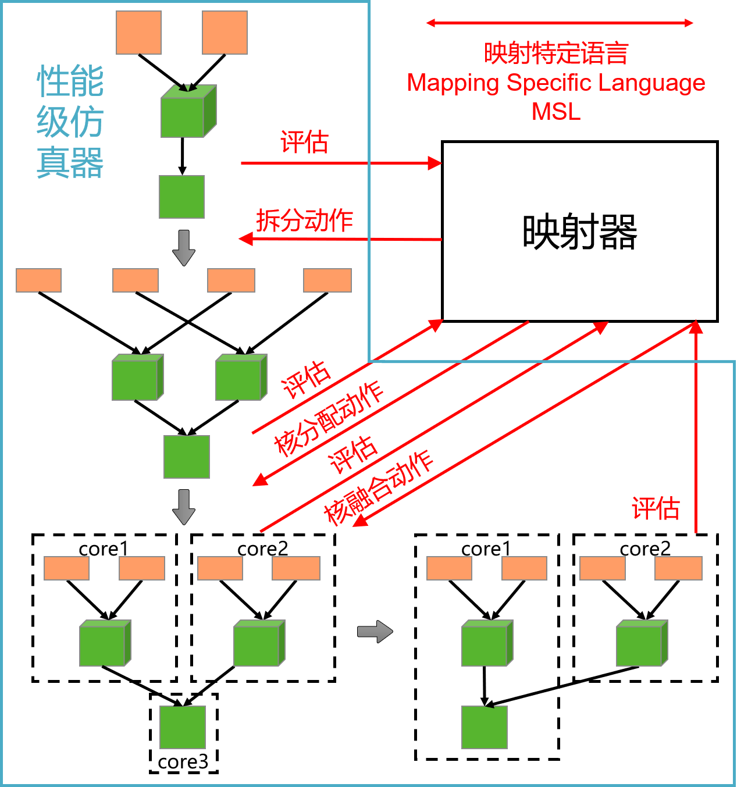
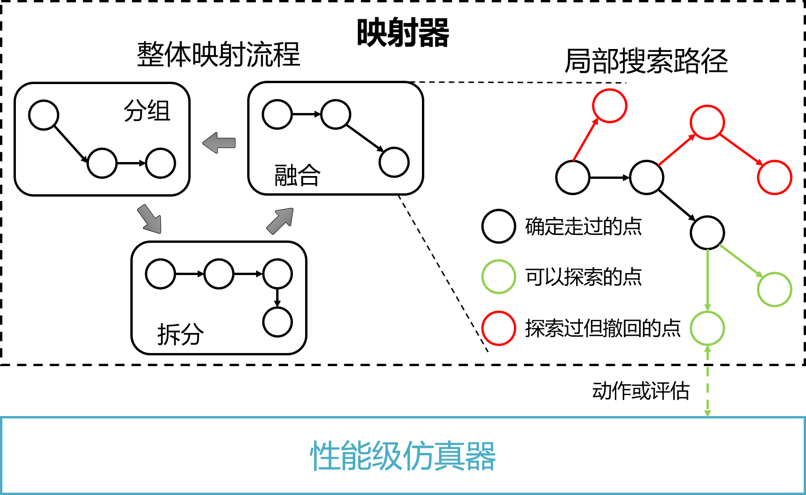
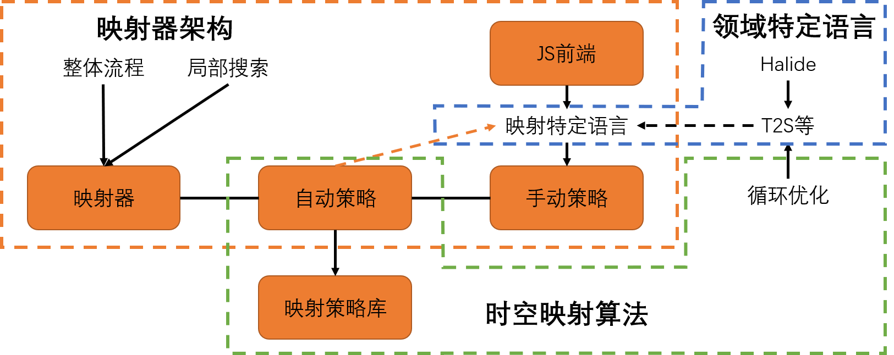

========================================================================
映射器整体介绍
========================================================================

映射问题定义
########################################

映射器解决映射问题，映射问题指一个或多个任务图，找到一种相应众核架构上时空分布策略（每个硬件组件在每个时刻做什么事），使得任务图在该策略的分配下达到某个执行目标。即从Task IR得到Mapping IR。当前版本只计划实现单任务图的映射。其中的执行目标是根据任务的性能需求变化的，举几个例子：

- 提高计算利用率（负载均衡、减少延迟、增加吞吐）
- 提高存储利用率
- 减少路由通信量
- 实现的容错计算
- 减少处理时功率
- 增加数据局部性
- 以上目标的组合

任务图中的每个结点可以等价为一系列嵌套的for循环表示多面体，多面体的每一个点表示构成该任务的最基本元素。任务ID加上，基本任务元素在多面体中的位置构成了基本任务元素唯一的坐标表示：如(任务1, 3, 1)，我们把这些坐标定义的空间称为任务坐标系，如下图所示。

而众核架构的硬件资源，可以对应到 :term:`时空图` 代表的层次化时空坐标系中。在时空坐标系中，一个维度表示空间， 如空间维度上的某个具体坐标表示某个chip→某个core→crossbar上的某个点。另一个维度表示时间，同样也是层次化的。

映射，即建立任务坐标系到时空坐标系的映射关系，如下图所示。

根据空间坐标是否对应真是的硬件物理位置，映射可以分为逻辑映射与物理映射。逻辑映射只将任务分配到虚拟编号的硬件资源上，而物理映射将虚拟编号的硬件资源对应到真实的硬件位置，如下图。在映射过程中，可以一步到位直接将任务分配到真实位置的物理资源上; 也可以将逻辑映射与物理映射分开执行。在本工程中，这两种方式均支持。

映射的特点与难点
########################################

- 需求的多样性
    - **算子种类、计算图结构、计算图负载的多样性：** 其中一般而言，算子种类是有限的，计算图结构是无限的。
    - **性能需求的多样性：** 所谓性能需求，即任务对于延时、吞吐、并发数、功耗等等的需求。

- 策略的多样性，搜索空间大
    - **可选择的优化动作多，优化参数多：** 针对一个具体的任务图，每个任务结点及任务结点之间，存在多样的优化选择，如结点的拆分、复制，结点间的流水等等。针对同一类型的优化动作，也存在大量的可选择参数，比如结点拆分为两份还是三份。
    - **时空分布多样：** 针对同样的任务图，在不改变其本身结构的情况下，也可以存在不同的时空分布策略。如，多个结点可以放到一个核上执行，也可以放到多个核上执行。

    .. image::  _static/mapping_analysis1.png
       :width: 100%
       :align: center

    - **层次化的策略空间：** 映射策略需要包含多个层次，如芯片→核→MAC阵列。
    - **优化流程长：** 神经网络往往有很多层数，这造成了映射过程中长长的优化链，不同阶段的优化也很难考虑到其它阶段的优化情况。

- 各种层面的强耦合
    - 时间与空间的耦合: 时间和空间维度上的映射策略会相互影响，如下图时间维度上增加一个其它任务结点，那当前映射策略就可能需要发生改变。映射时往往需要将时间和空间看作一体。

    .. image::  _static/mapping_analysis2.png
       :width: 100%
       :align: center

    - 层次之间的耦合: 映射策略在不同的时空层次，如芯片层次和核层次也会相互影响。一个层次的映射策略发生改变，其他层次的映射策略可能需要发生巨大的改变。

    .. image::  _static/mapping_analysis3.png
       :width: 60%
       :align: center

    - 计算、存储、路由的耦合：映射时需要综合考虑计算、存储、路由等因素。

- **非线性与不光滑：** 映射策略的性能提升与优化方向上的动作呈现非线性的关系，即可能做了很多优化动作后，性能并没有什么变化，也可能一个微小的调整导致性能发生大幅度。假设所有可行的（不会违背硬件资源限制的）映射策略组成合法映射空间，则改映射空间也是非常不光滑的，微小的改变可能导致合法的策略变得无法部署。

基于规则与基于代价的映射
########################################

可以想到一些很直接的方式。如希望满足内存约束（映射后的任务不会超过每个核的内存上限），当我们拿到一层待映射的卷积之后，可以计算该层卷积的数据量。每个核的内存上限是一个常数，两者相除即得到运行此层卷积所需要的最小核数，将卷积平均拆分成这些份，便得到了一个“满足”内存的映射方案，如下图。如果想要达到负载均衡，也是同样计算卷积的计算量。

该方式可以总结为``基于规则的映射``（Rule-base）。当我们获得一个待映射的神经网络任务后，可以分析该网络本身的数据量（如参数量+激活值量）、计算量（如乘累加个数）等。再根据已有的芯片参数，直接根据某个规则计算出合理的映射策略。这个规则可以时一套复杂的公式，也可以是一套设计好的流程。

因为前面我们分析的类脑众核众核映射映射各部分耦合度高、非线性、不光滑等特点。基于规则的映射在事实上很可能是不可行的，一个映射策略的得出可能需要众多复杂的变化，一个映射策略的实际运行效果也可能也是复杂的。一个很简单的例子，假设一个所需270K存储的任务结点，其按某种方式平均拆分两份之后，每份任务运行时所需的大小可能不是135K。通过根据已有参数的简单公式计算得到的映射结果，其实际运行可能并不符合预期。计算量的偏差可能导致负载均衡的效果变差，而内存占用的偏差可能直接导致某个核的内存溢出，生成的映射策略完全无法运行。我们只能不断增加这个“公式”的复杂性，使其达到理想的映射效果，但是这个过程很可能逐渐的超过我们一般能承受的实现能力。

一个很显然的想法，是将映射问题看为一个搜索/迭代优化问题，如下图所示。首先仍然根据待映射任务的基本评估与芯片的参数，得到一个初始映射策略，将该策略放入一个映射策略评估模块，得到改映射策略的执行性能评估。计算映射的部分根据这个性能评估调整映射策略，得到一个代价更小的映射策略。不断迭代，得到最终效果满意的映射策略。我们称这种方式为``基于代价的映射``（Cost-base）。

针对复杂任务与系统的部署，基于代价的映射比基于规则的映射有更好的可实现性。但直接基于代价的映射也有一定的问题，因为类脑众核映射需求多样和搜索空间大的特点，要尝试的映射策略会特别多，不断这样迭代会导致映射速度特别慢。

基于可交互资源级仿真器的映射优化
########################################

为了解决上述问题，我们设计了基于可交互资源级仿真器的映射优化框架。 相比于直接的映射策略评估模块，可交互性能拥有如下特点：

- **维持一个Context：** 这个Context包含任务图与任务图在时空图上的分布。该Context在整个映射周期内一直存在，资源级仿真器根据Context中的任务图映射给出评价结果。
- **可交互：** 资源级仿真器并不接收完整的映射策略并给出评估，而是接收映射优化动作。最开始，资源级仿真器的Context获取待映射的任务图和空的描述目标硬件的时空图。随后，映射器向资源级仿真器发出动作或者评估请求。如果资源级仿真器收到动作请求，则在Context中做出相应的动作，如任务的拆分、核的融合等等。如果资源级仿真器收到评估请求，则对Context中的相应部分进行评估，并返回给映射器。在上面的过程中，映射器给出请求序列，资源级仿真器负责处理这些请求。如具体的拆分动作是资源级仿真器实现的，不是映射器实现的。而映射器与资源级仿真器之间沟通的一系列接口/协议，称为映射交互语言（Mapping Specific Language, MSL）。映射器通过映射交互语言不断的与资源级仿真器进行交互，完成映射过程。最终资源级仿真器的Context结果，即为映射结果。下图展示了改过程的一个示例。

- **静态：** 资源级仿真器并不真正运行要仿真的目标，而是针对当前部署的情况，快速的静态计算/统计出资源消耗、性能等评价指标。所以该仿真器也不会输出程序运行结果，无法作为正确性比对的一级。
- **可回退：** 映射器可以给资源级仿真器发送撤销的请求，返回上一步动作之前的Context状态。
- **动时评估：** 资源级仿真器可以只对动作影响到的部分重新进行评估。

结合规则的迭代优化映射器
########################################

针对映射搜索空间大的问题，映射器设计了两级结构：

- **整体映射流程部分：** 该部分利用人指定的规律约束了映射的整体流程，比如先做任务的分组，再做各个任务的拆分，再完成核之间的融合，如果没有完成映射目标，则再次从分组开始迭代，这些流程的基本组成单元称作流程模块。根据不认同的设计，人们可以设计很多这样的映射流程。基于先验的规则，降低搜索空间的大小。
- **局部搜索路径部分：** 再每个流程模块之中，仍有大量的映射动作组合和映射参数需要确定，比如某一个任务块是拆成2份还是拆成3份。这部分有流程模块中特定的搜索器决定，搜索器不断的资源级仿真器交互，探索搜索路径，找到局部合理的映射策略。

下图给出了一个映射器整体构造的示例。最终，可交互的性能仿真器加上结合规则的迭代优化映射器，解决类脑众核的映射难问题。

结合人工参与的映射过程规划
########################################

自动化的映射解决方案也可能无法解决复杂的映射问题或满足非常高性能的需求，此时人工参与是必要的。基于以上框架，人可以通过手动编写映射交互语言的方式，完成手动映射过程（也可以设计尽可能详细的整理映射流程）。在未来，映射交互语言也可以融合Halide的部分设计，使得其支持更完备的映射优化动作。至此，映射器的研究包含三大部分： **映射器架构** 、 **领域特定语言** 与 **时空映射算法**。

而因为 :ref:`映射交互语言` 是资源级仿真器负责实现并提供外部使用接口的，所以该部分放到 :ref:`资源级仿真器<资源级仿真器整体介绍>` 中介绍。

