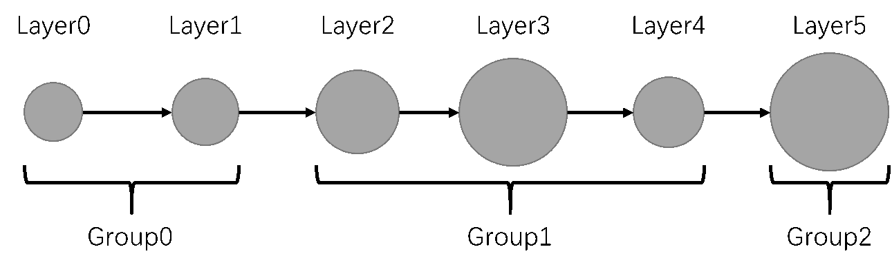
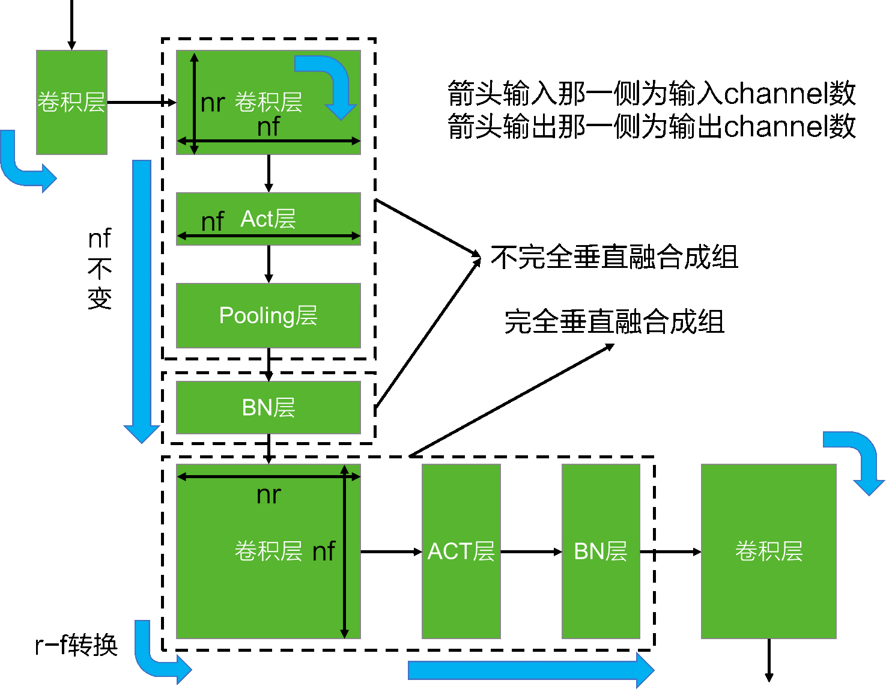
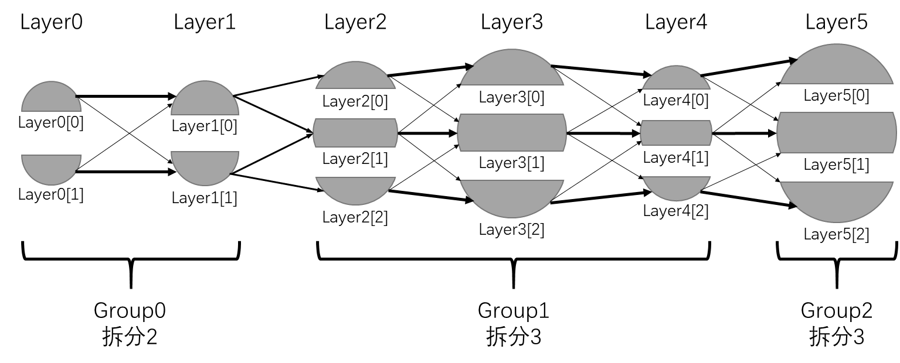
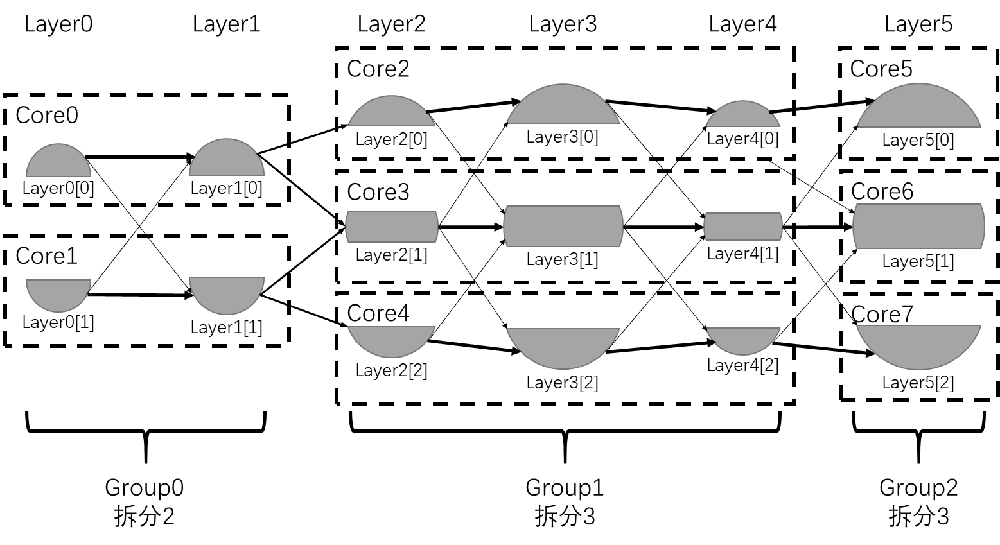
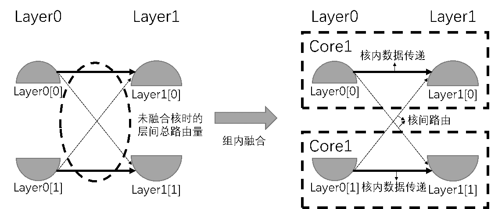
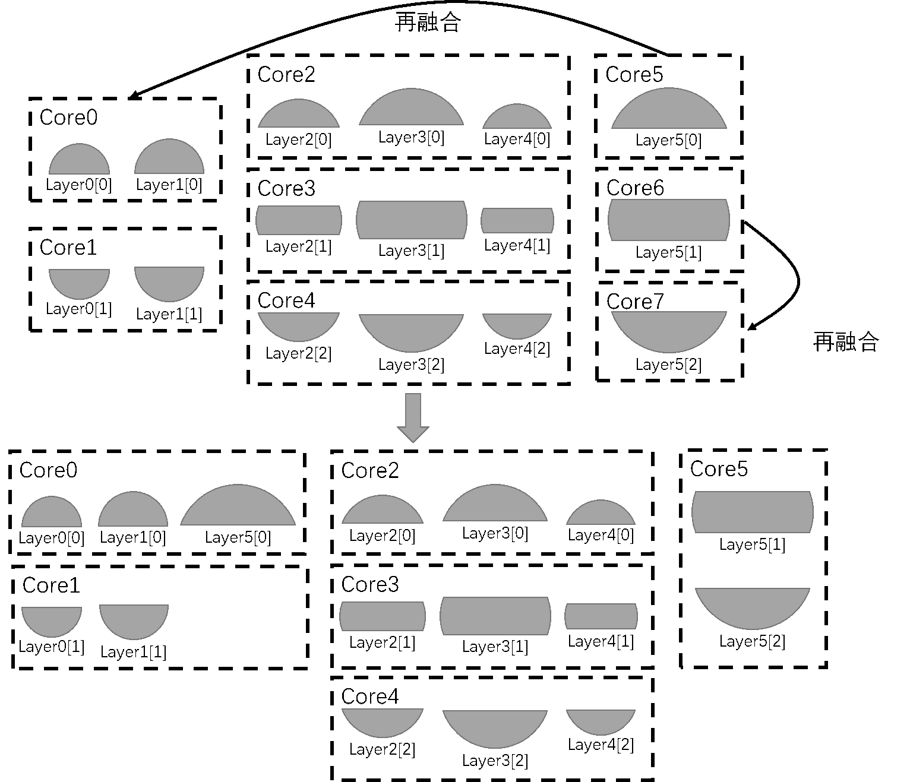

========================================================================
映射流程1-Pei Mapping
========================================================================

该映射流程最初改进自裴老师对于Resnet-50的一套手工映射策略，所以就取名叫Pei Mapping吧。后续经过不断调整、优化，得到了如下流程：

网络分组
########################################

网络分组指的将网络的所有层分为不同的组，同组内的层在连接关系上往往体现为网络上连续的一段（也存在不同的分组策略，如交叉分组策略）。分组的目的在于组内融合。一个网络分组的示例如下图：

一种可能的分组方式是 ``垂直分组``，即卷积层、全连接层这样的 :term:`变速任务` 与Pooling层、Act层、BN层这样 :term:`非变速任务` 融合，如下图。变速任务一般承载了神经网络主要的计算量，非变速任务的计算量、存储量一般都不大，将其放到单独的核里运算很不划算，最好附着在变速任务计算的核中。

组内拆分
########################################

对每组进行拆分（或复制），如果将组拆分为n份，怎组内的每一个任务都会均等的拆分为n份。我们用索引表示原任务拆分之后的任务，即Layer0拆分为2份后得到Layer0[0]与Layer0[1]。下图一个组内拆分的示例。

组内融合
########################################

在每一组中，具有相同索引的层拆分，融合到一个核中。例如，Layer0[0]与Layer1[0]将融合到一个核中，Layer0[1]与Layer1[1]将融合到一个核中，如下图所示。

组内融合时，可能由于网络分组时将一个组分配的过大，组内含有的层数过多，造成无论如何拆分，多层的任务融合后都会超出一个核能负担的资源上限。这时，便需要返回网络分组这一步，重新进行分组，减小这一组内网络层的数量。

组内融合可以极大的减少核之间的路由。以Group0的组内融合为例。融合前，Layer0与Layer1的总路由可以用两个较粗的箭头与两个较细的箭头表示。其中由于神经网络运算的数据局部性，粗箭头代表的路由量一般远大于细箭头代表的路由量（这一点对于全连接神经网络并不成立），如下图所示。经过组内融合之后，粗箭头所代表的路由变为了核内的数据传递，真正的核间路由仅为两个细箭头所代表的路由量，总路由量大大减少。

整体再融合
########################################

在经过以上步骤后，得到若干映射后的核，这些核中可能存在一些“小核”，即占用资源不多，或者说资源利用率较低的核。如果将其中的某些核再融合后没有使原有映射性能降低或超出资源限制，则可以再融合这些核。下图表现了这个过程的示例。

