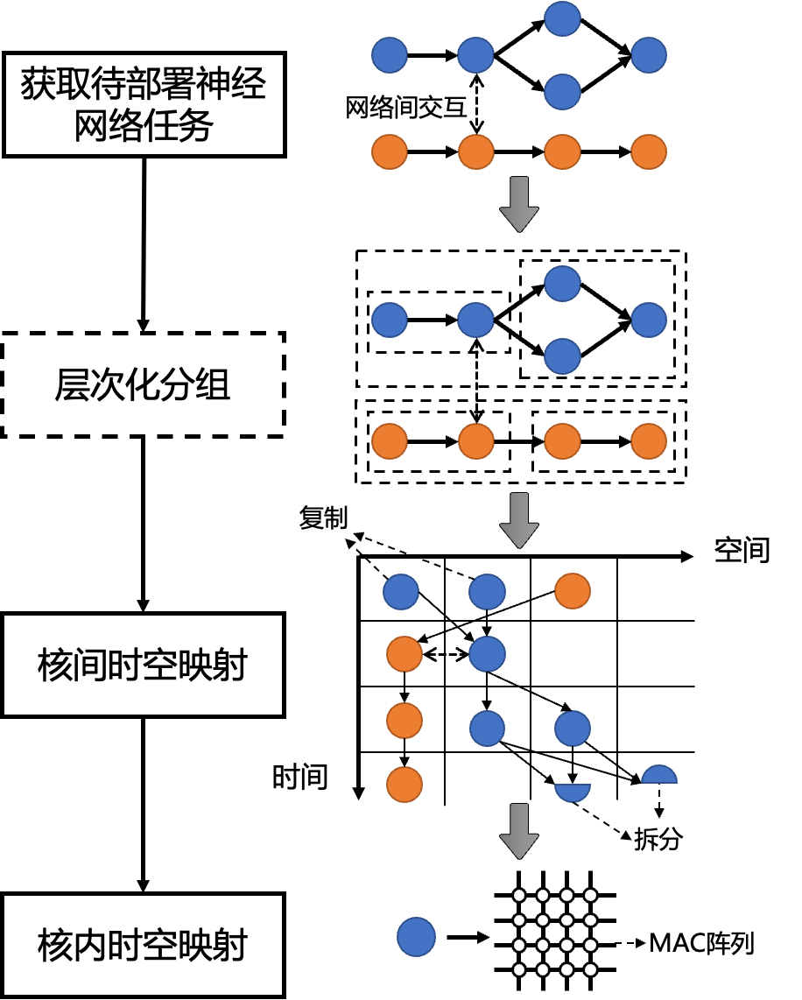
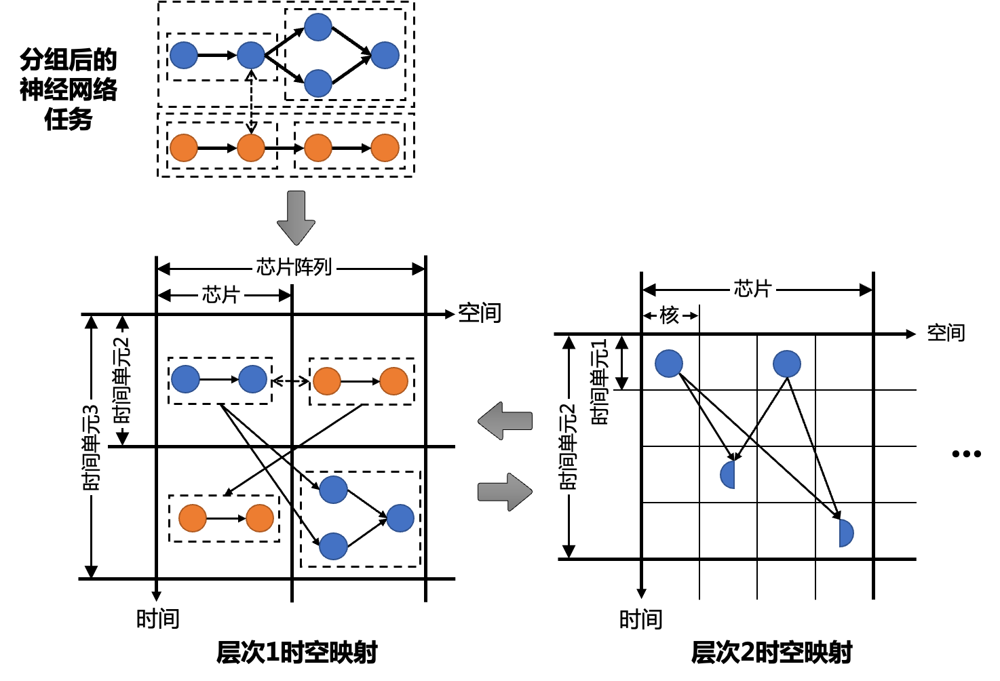

========================================================================
映射流程3-STS Mapping
========================================================================

众核芯片由多个核构成，核内部包括以PE阵列（或MAC阵列）为核心的大规模并行计算组件。而多个芯片又可以构成芯片阵列，以此便形成了芯片阵列→芯片→核→PE阵列的层次化计算体系。这里介绍一种时空层次化映射的大体流程， 如下图所示。

层次化分组（可选）
########################################

神经网络任务中的计算图进行分组，即将计算图中的结点划分为逻辑上的组。而层次化分组指一组内的结点可以进一步分为多个组。分组的依据包括但不限于如下几点：

- 以网络作为分组。
- 以单个结点作为分组。
- 以数据传输量相对较小的边作为分组边界。
- 每一组的计算量不超过或近似等于一提前设好的值。
- 每一组的存储量不超过或近似等于一提前设好的值。
- 每一组呈现出相似的结构或计算模式。

这一步是可选的，如果不进行这一步，则下面步骤中提到的分组指按网络或单个结点组成的默认分组。

核间时空映射
########################################

分配每个核在每个时间单位上执行的计算图中的任务。在分配过程中，可以对结点进行拆分、复制、融合操作。拆分或复制后的，一个结点会变为多个结点，其中每个结点可以映射在不同的时间单元或空间单元上。指定结点映射的位置，对结点进行拆分、复制、融合操作，统称为核间结点映射操作。结点映射操作的依据包括但不限于以下几点：

- 使得神经网络在众核芯片上的运行满足神经网络任务指定的性能需求。
- 使得每个空间单元所部署的结点所消耗的所有资源不超过该空间单元能提供的资源的上限。
- 使得每个时间单元中，不同空间单元所部属的结点的计算时间尽量相等。
- 使得计算系统整体的计算利用率更高（即每个核空闲的时间更少）。
- 使得计算系统整体的存储利用率更高。
- 使得计算系统整体的功耗更低。

进一步的，因为类脑计算系统的多层次特点，众核系统层次化的特点，核间时空映射过程也分为不同的层次，如下图所示。

不同的硬件层次对应 :term:`时空图` 的不同层次，同时也对应了对神经网络计算图作出的层次化分组。例如在芯片阵列层次，我们将计算图的最粗粒度分组，映射到时空图的不同芯片的时空单元2中。这个过程中我们不关心最粗粒度分组中更细粒度分组在时空图的核即时间单元1中的映射。而更细粒度分组在时空图的核即时间单元1中的映射将发生在下一层次的时空映射中，不同层次的时空映射迭代进行，从而达成整体的核间映射目标。

.. sidebar:: 小吐槽一下
    
   累死我了

核内时空映射
########################################

在上步中，我们指定每个核在每个时刻需要完成的任务（需要执行的指令），但任务在核内的PE阵列（或MAC阵列）上仍有复杂多样的执行方式。该步骤优化任务在PE阵列（或MAC阵列）,即一般的神经网络加速器采用的映射优化方式。

在一种可能的策略中，将某个核在某个时刻需要执行的一个或多个神经网络算子表达成多层循环控制的形式，核内时空映射过程表现为对每一层循环进行变换，比如将一层循环变为两层循环、将一层循环完全展开、融合两层循环、倾斜多层循环（skew）、交换两层循环的顺序、改变循环中数据缓存的位置等。这些变换操作会决定这一个或多个算子在PE阵列（或MAC阵列）上的时空映射与数据通路。
