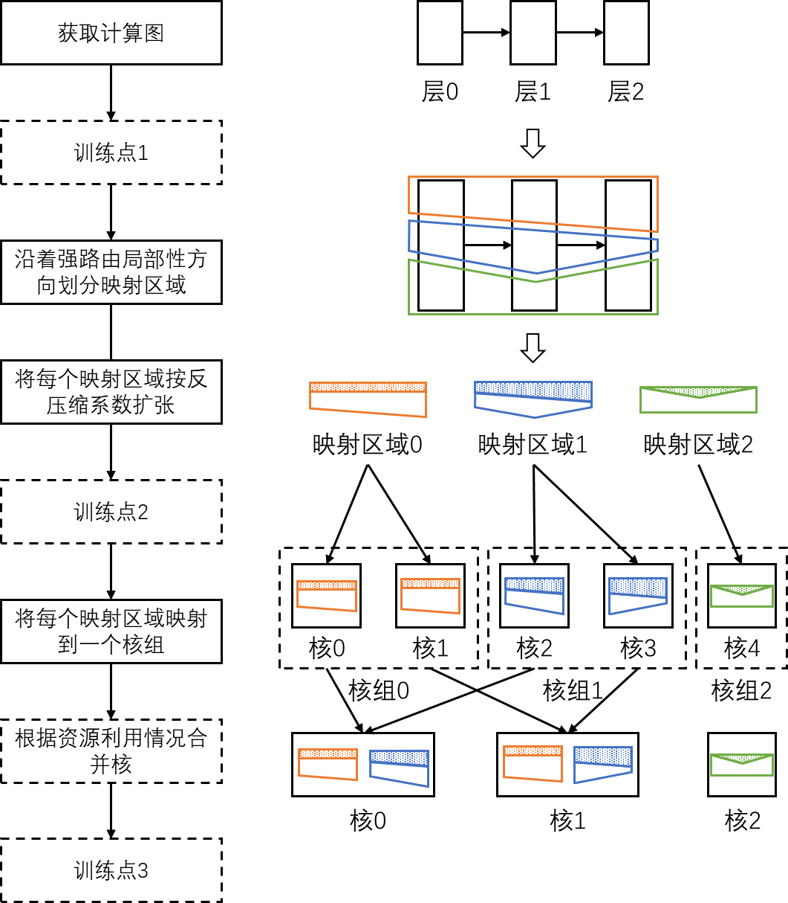
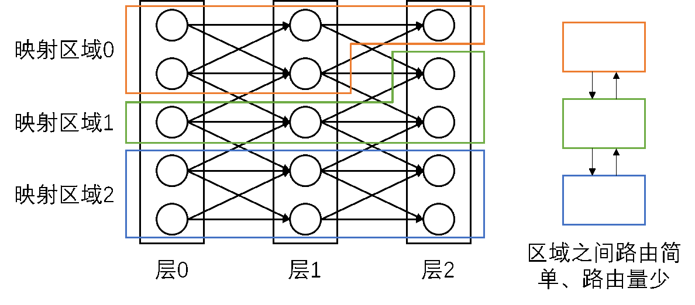
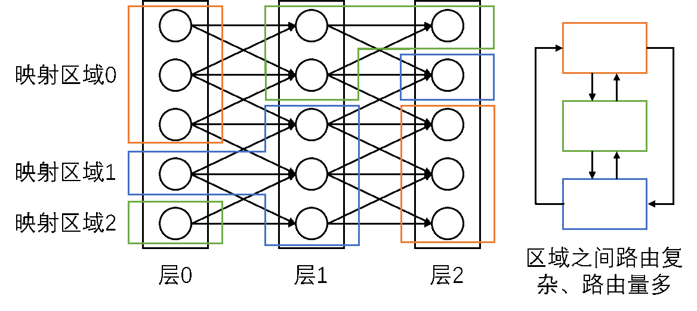
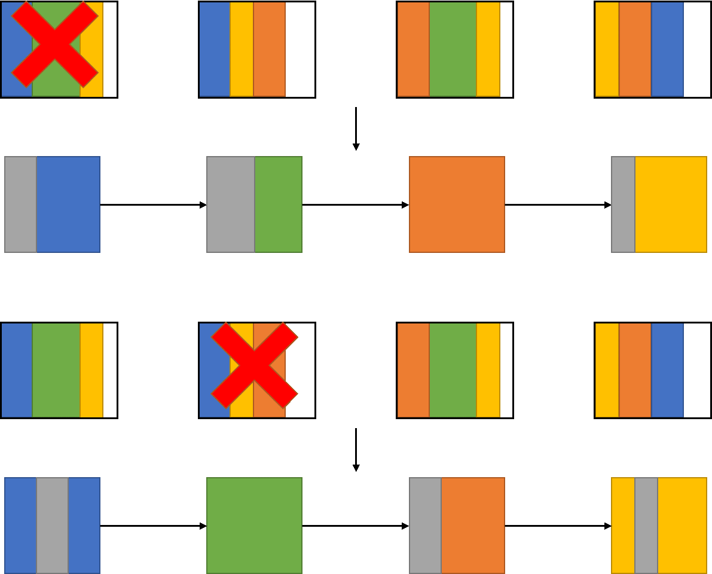

========================================================================
映射流程4-RAIN Mapping
========================================================================

RAIN-Redundant Arrays of Independent Neurons, 模仿RAID的功能，即坏掉一个或多个神经元（神经元核）后，系统仍能正常工作。

RAIN Mapping 即实现此目的映射方案，整体流程可以如下图（具体方法有很多）。

沿强路由局部性方向划分映射区域
########################################

很多计算图具有强的路由局部性，即后层的一部分的计算所需的数据较为集中的来自前层的某个部分。如果一个映射区域同时包含这两个部分，则两个部分之间的数据传输会仅发生在该映射区域的内部，从而达到映射区域间节省路由的目的，如下图：

而完全不受限制的映射区域划分则会造成区域间复杂且大量的路由（不过因为区域划分更分散，不受限制的映射区域往往具备更强的灵活性与更好的鲁棒性）：

反压缩系数扩张
########################################

每个映射区域按反压缩系数扩张。假设每一映射区域的反压缩系数为 :math:`η_i` ，则第i个映射区域扩张后的任务量将变为原来的 :math:`(1+η_i)` 倍。对于反压缩造成的冗余计算，其可用如下方法填充:

- 填充空计算，即完全不进行任何实际功能的计算
- 填充计算图中的其他计算。
- 填充随机计算。
- 利用其他反压缩技术提取出的计算图冗余计算。

之后可以进行神经网络的重训练，随机的去掉某些映射区域，并训练此计算图，不断重复此过程，增强鲁棒性。

核组映射与合并
########################################

将一块映射区域映射到由一个或多个核组成的核组中，核组中核的数量取决于每个核的硬件资源和计算负载均衡。然后将该映射区域根据层一般的众核映射方法映射（如拆分）到该核组的核上。为了进一步节省路由，可以选择物理距离较近的一群核组成核组

可以根据映射后的具体资源利用情况，将某些核的任务合并到一个核。

依次无效掉每个核，即去除掉该核中包含的所有分块，训练计算图，使最终的映射方法实现核级别的鲁棒性，如下图所示：

